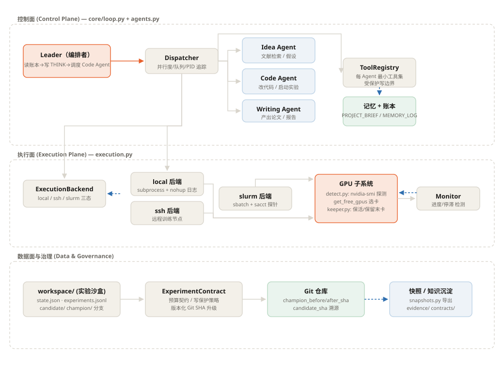
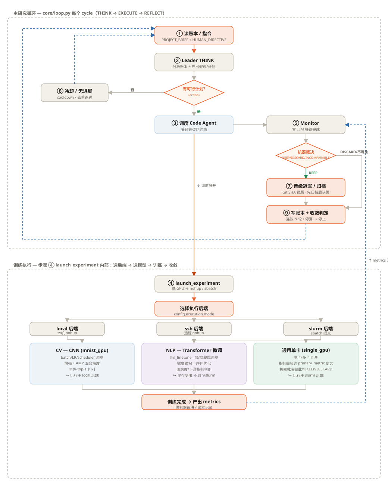

> **设计来源**
> 这是从零开始的独立设计。深度借鉴参考 `autoresearcher` 项目的思路，不隶属于任何外部源码仓库。

<h1 align="center">深度AI建模训练</h1>
<h3 align="center"> 自主深度学习实验 </h3>

<p align="center">
  <strong>在你休息时，由 AI Agent 自主运行你的深度学习实验。</strong>
</p>

<p align="center">
  <a href="README.md">English</a> |
  <a href="docs/README_CN.md">中文</a>
</p>

<p align="center">
  <a href="#快速开始"></a>
  <a href="#架构"></a>
</p>


## 你需要什么

| 需求 | 必须 | 说明 |
|------|------|------|
| Python 3.10+ | 是 | 运行环境 |
| 1+ NVIDIA GPU | 是 | 用于训练 |
| API key | 是 | Anthropic 兼容或 OpenAI 兼容端点 |
| `PROJECT_BRIEF.md` | 是 | 主控制文件 |
| 项目 `config.yaml` | 否 | 仅当你需要覆盖默认值 |
| Obsidian vault | 否 | 若缺失，笔记回退为本地文本文件 |

## 最小可运行示例

可启动的最小项目形如：

```text
my-first-experiment/
├── PROJECT_BRIEF.md
└── workspace/                  # 自动创建
```

最小 `PROJECT_BRIEF.md`：

```md
# Goal
Train a ResNet-50 on CIFAR-100 to reach 80%+ accuracy.

# Codebase
Create the training code from scratch in PyTorch.

# What to Try
- Start with a basic ResNet-50 baseline.
- If accuracy < 75%, improve optimization and schedule.
- If accuracy is 75-80%, try augmentation.
- If accuracy > 80%, stop and report.

# Constraints
- Use GPU 0 only
- Max 100 epochs per run
```

这就是够了。其余都是可选的优化。

## 这个项目擅长什么

这个项目面向**已经知道自己想跑什么实验、但不想守着循环**的人：

- 改代码
- 启动训练
- 监控运行
- 解析日志
- 决定下一个变体
- 在你睡觉时继续

它并不试图取代研究者，而是接管重复的"实验运维层"。

## 它为什么不同于一个简单脚本

- 它不只启动一次运行，而是不断迭代。
- 它不只监控，而是反思并决定下一步。
- 它很便宜，因为训练期监控**零 LLM 调用**。
- 它可被掌控，因为人可以在任意周期覆盖方向。
- 它现在支持在 Obsidian 或本地文本中持久记录进度。

## 你如何保持掌控

你通过三个文件掌控研究方向：

- `PROJECT_BRIEF.md`：稳定的目标、约束、允许的搜索空间
- `HUMAN_DIRECTIVE.md`：下一周期的临时重定向
- `workspace/MEMORY_LOG.md`:结果与决策的滚动记忆

常见控制模式：

```md
# 缩小搜索范围
- 只调数据增强。
- 不改变主干网络。
- 保持训练预算固定。
```

```md
# 让 Agent 停止探索弱势方向
- 若连续 3 次增益低于 0.3 分，停止此分支。
- 回到最近可信基线，换一个想法。
```

```md
# 强制结果复现
- 若结果异常强，用相同 seed + 一个新 seed 重跑。
- 两者都复现前，不得宣称改进。
```

## 你如何查看进度

你永远不该猜 Agent 在做什么。

- `/experiment-status` 显示当前目标、最优结果、周期数、运行状态与近期决策
- `/progress-report` 生成结构化摘要
- `/obsidian-sync` 手动刷新持久笔记
- `workspace/progress_tracking/` 在未配置 Obsidian vault 时保存本地文本

若想要终端之外的仪表盘：

```yaml
obsidian:
  enabled: true
  vault_path: "~/Documents/MyObsidianVault"   # 可选
  auto_append_daily: true
```

若 `vault_path` 为空，同一信息保存到本地：

```text
workspace/progress_tracking/Dashboard.txt
workspace/progress_tracking/Daily/YYYY-MM-DD.txt
```

---

## 💛 为什么我们做这个——以及希望你如何使用它

> **我们的希望很简单：科学保持纯粹，人始终在循环里。**

我们构建这个框架只有一个理由——把运行深度学习实验中**重复、机械**的部分（提交任务、盯 GPU、解析日志、扫超参）从研究者肩上卸下来，让你把更多时间投入到**真正重要的事：思考**。

如果你来这里是因为想少盯着训练跑、多花时间阅读、推理并追逐自己的想法——欢迎，这正是我们做这个的原因。

**我们想与每位使用者分享的一句温柔提醒：**

Agent 很乐意替你跑实验。但请把 *想法*、*解读* 与 *科学判断* 留给你自己。我们不认为自动化与学术诚信相互矛盾——恰恰相反。这个工具省下的时间，是为了投入到**更深的思考**，而不是跳过思考。

因此我们恳请：本项目不要被用于伪造结果、生成"没有人在循环里"的"研究"，或走捷径跳过那些依赖人真正理解自己在做什么的科学环节。那不是我们想帮助建设的未来——我们也不认为那是大多数人想要的未来。

> **科学应保持纯粹。Agent 可以替你跑实验——但想法、解读与责任属于人。**
>
> **学术应当保持纯粹。** Agent 可以替你跑实验，但 idea、判断与责任，请留给人来承担。我们真心希望每一位使用者都能 **human in the loop 地去思考**，把这个工具省下来的时间，投入到真正属于你自己的研究方向里。

我们信任拿起这个工具的人会认真对待这一点——也因为我们相信你们大多已经如此。谢谢你是其中之一。💛

---

## 核心思想

你设计实验。Agent 处理重复循环。

**深度科研 Agent**：

1. **思考（THINK）**——读取项目 brief，分析既往结果，规划下一个实验
2. **执行（EXECUTE）**——修改代码/配置，dry-run，在 GPU 上启动训练
3. **监控（Monitor）**——以**零 LLM 成本**盯训练（仅进程检查 + 日志读取）
4. **反思（REFLECT）**——解析结果，与基线对比，决定下一步
5. **重复（Repeat）**——7×24 无人干预

```
你睡 8 小时     → Agent 跑 3 个实验周期
你去度假       → Agent 探索 50+ 超参配置
你写论文       → Agent 已备好结果表
```

---

## 实测结果

> 不是基准测试。而是数月 7×24 自主运行于研究项目的真实结果。

| 指标 | 结果 |
|------|------|
| 自主完成实验周期 | 500+ |
| 单项目最优提升 | 较基线 +52%（200+ 自动实验） |
| 并行管理项目 | 4 个项目 × 4 台 GPU 服务器 |
| 最长连续自主运行 | 30+ 天无人干预 |
| 每 24h 周期平均 LLM 成本 | ~$0.08 |

---

## 关键创新：零成本监控

7×24 运行 LLM Agent 的头号顾虑：**成本**。

多数 Agent 框架每隔几分钟就调一次 LLM "检查进度"。那要 $50+/天。

实验 Agent 在训练期间"休眠"——零 API 调用。只在训练结束时唤醒 LLM。

```
                    LLM 激活              零成本              LLM 激活
                  ┌────────────┐    ┌─────────────────────┐    ┌────────────┐
                  │   THINK    │    │   TRAIN & MONITOR    │    │  REFLECT   │
                  │ (5-10 min) │    │   (hours/days)       │    │ (5-10 min) │
                  │            │    │                      │    │            │
                  │ • 分析     │    │ • kill -0 $PID       │    │ • 解析     │
                  │ • 规划     │    │ • nvidia-smi         │    │  日志      │
                  │ • 写码     │    │ • tail log           │    │ • 对比     │
                  │            │    │                      │    │ • 决策     │
                  │  ~$0.05    │    │      $0.00           │    │  ~$0.03    │
                  └────────────┘    └─────────────────────┘    └────────────┘
```

**含 8 小时训练的 24h 周期：LLM 调用约 $0.08。**

---

## 架构

> 架构与训练优化流程见下方两张新生成的图，配套说明见 [`docs/diagrams/README.md`](docs/diagrams/README.md)。

### 系统架构图



> 交互式版本：[`docs/diagrams/architecture.html`](docs/diagrams/architecture.html)（在浏览器中打开以获得最佳效果）。

系统分为**控制面 / 执行面 / 数据·治理面**三个平面，形成"编排—执行—治理"的闭环：

- **控制面**（`core/loop.py` + `core/agents.py`）：`ResearchLoop` 驱动 THINK→EXECUTE→REFLECT；`Leader` 读取账本生成计划；`Dispatcher` 管理并行度、任务队列与 PID 追踪；三类 Worker（Idea / Code / Writing）按最小工具集隔离；`ToolRegistry` 对受保护文件施加写边界。
- **执行面**（`core/execution.py` + `gpu/*` + `core/monitor.py`）：三态后端 `local` / `ssh` / `slurm`（slurm 走 `sbatch --parsable` + `sacct` 探针）；GPU 子系统的 `get_free_gpus(reserve_last=True)` 选卡并保留最后一张做保活；`Monitor` 以零 LLM 轮询进度与停滞。
- **数据·治理面**（`workspace/`、`core/experiment_contract.py`、Git、快照）：预算契约 + 写保护；`experiments.jsonl` 只追加账本；Git 冠军分支锁定（"Champion never regresses"）；`snapshots.py` 导出进度快照。

### 训练实验流程图



> 交互式版本：[`docs/diagrams/training_flow.html`](docs/diagrams/training_flow.html)（在浏览器中打开以获得最佳效果）。

**主研究循环**：① 读账本/指令 → ② Leader THINK → 有可行计划?（否→⑧ 冷却/去重退避→回①；是→③ 调度 Code Agent）→ ④ launch_experiment（深橙，进入训练执行）→ ⑤ Monitor → 机器裁决（KEEP/DISCARD/INCOMPARABLE）→ KEEP→⑦ 晋级冠军/归档→⑨ 写账本+收敛判定；DISCARD/不可比→⑨ → 回① 或达收敛停止。

**训练执行展开**（launch 内部）：选择执行后端（local / ssh / slurm）→ 选模型路径（CV-CNN / NLP-Transformer 微调 / 通用单卡）→ 训练 → 产出 metrics → 回流主循环裁决。三类模型在**超参搜索维度、资源策略、判别指标**上有差异（详见配套说明）。

### Leader-Worker Agent 系统

同一时刻只运行一个 Worker。其余零成本空闲。

```
              ┌───────────────┐
              │    Leader     │  周期内持久对话
              │   (Planner)   │
              └───┬───┬───┬───┘
                  │   │   │
          ┌───────┘   │   └───────┐
          ↓           ↓           ↓
    ┌──────────┐ ┌──────────┐ ┌──────────┐
    │   Idea   │ │   Code   │ │ Writing  │
    │  Agent   │ │  Agent   │ │  Agent   │
    │ (5 tools)│ │ (7 tools)│ │ (4 tools)│
    └──────────┘ └──────────┘ └──────────┘
```

### 两层记忆（大小恒定）

```
┌─────────────────────────────────────────┐
│ Tier 1: PROJECT_BRIEF.md               │
│ • 冻结的项目参考                          │
│ • 最大 3,000 字符                        │
├─────────────────────────────────────────┤
│ Tier 2: MEMORY_LOG.md                   │
│ • 关键结果（1200ch 自动压缩）             │
│ • 近期决策（滚动保留最近 15 条）           │
│ • 最大 2,000 字符                        │
├─────────────────────────────────────────┤
│ 总计：约 5K 字符 / 约 1,500 tokens       │
│ 运行 1 天或 6 个月都一样                  │
└─────────────────────────────────────────┘
```

### 成本控制策略（共 8 种）

| # | 策略 | 节省 |
|---|------|------|
| 1 | 训练期零 LLM 监控 | 90%+ 运行时间免费 |
| 2 | 两层记忆自动压缩 | 固定上下文窗口 |
| 3 | Leader 会话在周期内持久 | 每周期只发一次 brief |
| 4 | Anthropic 提示缓存 | 系统/工具缓存 |
| 5 | 每 Agent 最小工具集（4-7，按需） | 更少 schema 开销 |
| 6 | 精简系统提示 | 更少输入 token |
| 7 | 发送前裁剪状态 | 无冗余 |
| 8 | 同一时刻单个 Worker | 无并行 LLM 成本 |

---

## 快速开始（逐步）

> **纯新手？** 逐步走完每一步。约 10 分钟从零到运行实验 Agent。
>
> **偏好 AI 引导？** 在 Claude Code、ChatGPT 或 Codex 中打开 [`AI_GUIDE.md`](AI_GUIDE.md)——AI 会交互式带你走完全过程。

### 第 0 步：你需要的

| 需求 | 为什么 | 如何检查 |
|------|--------|---------|
| Python 3.10+ | 运行环境 | `python3 --version` |
| [Claude Code](https://claude.ai/claude-code) | AI 主干 | `claude --version` |
| 1+ NVIDIA GPU | 训练 | `nvidia-smi` |
| Anthropic API key | LLM 调用 | `echo $ANTHROPIC_API_KEY` |

没有 API key？到 [console.anthropic.com](https://console.anthropic.com/) 获取并设置：
```bash
export ANTHROPIC_API_KEY="sk-ant-xxxxx"
# 加入 ~/.bashrc 或 ~/.zshrc 使其永久生效
```

### 第 1 步：安装

```bash
# 克隆仓库
git clone https://github.com/shaozhongfei001/AutoDL.git
cd AutoDL

# 安装 Python 依赖
pip install -r requirements.txt

# 安装 8 个 Claude 斜杠命令和 8 个 Codex 本地技能
python install.py

# 验证一切正常
python -m core.loop --check
```

### 第 2 步：创建第一个项目

假设你想在 CIFAR-100 上训练 ResNet。创建项目文件夹并写入 `PROJECT_BRIEF.md`：

```bash
mkdir ~/my-first-experiment
cd ~/my-first-experiment
```

现在写 brief——**这是最重要的文件**。它告诉 Agent 你想要什么：

```bash
cat > PROJECT_BRIEF.md << 'EOF'
# Goal
Train a ResNet-50 on CIFAR-100 to reach 80%+ test accuracy.

# Codebase
The agent should create the training code from scratch using PyTorch.
- Use torchvision for the dataset (auto-download)
- Save checkpoints to ./checkpoints/
- Log metrics to ./logs/

# What to Try
- Start with a basic ResNet-50, lr=0.1, SGD, 100 epochs
- If accuracy < 75%, try cosine annealing + warmup
- If accuracy 75-80%, try adding mixup or cutout augmentation
- If accuracy > 80%, the goal is reached

# Constraints
- Use GPU 0 only
- Max 100 epochs per run
- Batch size 128

# Current Status
No experiments run yet. Starting from scratch.
EOF
```

**写好 brief 的技巧：**
- 具体说明目标（指标 + 目标值）
- 告诉它代码/数据在哪（或说"从零创建"）
- 列出约束（用哪张 GPU、最大 epoch 等）
- 给它一棵决策树（"if X, try Y"）——这就像带一个初级学生一样引导 Agent

### 第 3 步：启动 Agent

**方式 A：通过 Claude Code（推荐）**

打开 Claude Code 输入：
```
/auto-experiment --project ~/my-first-experiment --gpu 0
```

**方式 B：直接通过 Python**

```bash
python -m core.loop \
  --project ~/my-first-experiment \
  --gpu 0 \
  --max-cycles 5    # 5 个周期后停止（去掉则无限）
```

### 第 4 步：观察发生了什么

Agent 会自动完成一切。每个周期大致如下：

```
=== Cycle 1 ===

[THINK] 读取 PROJECT_BRIEF.md...
        Goal: ResNet-50 on CIFAR-100, target 80%+
        无既往实验。从基线开始。
        Plan: 基础 ResNet-50, lr=0.1, SGD with momentum, 100 epochs.

[EXECUTE] 创建 train.py...
          创建 config.yaml...
          dry-run（2 步）... ✓ 无错误
          启动训练：nohup python train.py --config config.yaml
          PID: 12345, Log: logs/exp001.log

[MONITOR] 训练进行中...（零 LLM 成本）
          15:00 — PID 存活, GPU 98%, Epoch 12/100, loss=2.34
          15:15 — PID 存活, GPU 97%, Epoch 25/100, loss=1.87
          ...
          18:00 — PID 终止。训练完成。

[REFLECT] 解析日志... test accuracy = 76.3%
          结果：76.3% — 低于 80% 目标
          brief 说："If < 75%, try cosine annealing"
          76.3% > 75%，改为试 augmentation。
          决策：加 mixup augmentation, 保持 lr=0.1 + cosine
          里程碑已记录："Exp001: ResNet-50 baseline, 76.3%"

=== Cycle 2 ===

[THINK] 目前最优：76.3% (Exp001)
        Plan: 加 mixup (alpha=0.2) + cosine annealing schedule
        ...
```

### 第 5 步：随时查看进度

Agent 运行期间，你可以随时查看：

```bash
# 在 Claude Code 中：
/experiment-status --project ~/my-first-experiment

# 或检查 GPU 占用：
/gpu-monitor
```

### 第 6 步：必要时干预

想改变方向？从任何地方都有三种方式：

```bash
# 方式 1：放入指令文件（Agent 下一周期读取）
echo "Stop trying ResNet. Switch to ViT-B/16, start with lr=1e-3" \
  > ~/my-first-experiment/workspace/HUMAN_DIRECTIVE.md

# 方式 2：命令行参数
python -m core.loop --project ~/my-first-experiment \
  --directive "Try label smoothing 0.1"

# 方式 3：直接编辑记忆（用于永久更改）
vim ~/my-first-experiment/workspace/MEMORY_LOG.md
```

## 人机协作手册

把 Agent 当**操作员**，而不是替代研究者。

```text
人类决定：
- 目标
- 约束
- 禁止方向
- 何时转向

Agent 执行：
- 改代码
- 运行
- 监控
- 汇总
```

在 `PROJECT_BRIEF.md` 写稳定规则，在 `HUMAN_DIRECTIVE.md` 写临时转向。

```md
# HUMAN_DIRECTIVE.md
- 不要改变数据集。
- 换主干前先试 label smoothing 0.1。
- 若连续 3 次增益低于 0.3，停止此方向。
- 对照最近可信基线比较，而不只对照最新一次运行。
```

经验法则：让 Agent 处理重复，但方向、解读与责任归人。

### 第 7 步：用 [Happy Coder](https://github.com/slopus/happy) 手机监控（可选）

想在手机上查看实验？安装 [Happy Coder](https://happy.engineering/)（[iOS](https://apps.apple.com/us/app/happy-codex-claude-code-app/id6748571505) / [Android](https://play.google.com/store/apps/details?id=com.ex3ndr.happy)）：

```bash
# 安装 CLI（一次性）
npm install -g happy-coder

# 改用 happy 启动会话
happy

# 会话内启动实验：
/auto-experiment --project ~/my-first-experiment --gpu 0
```

现在你可以在手机上：实验完成或 Agent 需要输入时收到**推送通知**、通勤时**查看结果**、随时随地**发送指令**、在手机与桌面间无缝切换，所有通信**端到端加密**。

### 好的 PROJECT_BRIEF.md 长什么样

brief 是你的主要杠杆。以下针对不同场景的例子：

<details>
<summary><b>例：微调预训练模型</b></summary>

```markdown
# Goal
在 Oxford Flowers-102 上微调 ViT-B/16（在 ImageNet-21K 上预训练）。
Target: 95%+ test accuracy.

# Codebase
- 训练脚本：finetune.py（已存在）
- 配置：configs/vit_flowers.yaml
- 数据：/data/flowers102/（已下载）
- 预训练权重：/models/vit-b16-21k.pth

# What to Try
1. 先：冻结主干，只训分类头（10 epochs, lr=1e-2）
2. 再：解冻全部，端到端微调（30 epochs, lr=1e-4）
3. 若卡在 93% 以下：试层级 lr 衰减（0.65）
4. 若超过 94%：试测试时增强

# Constraints
- GPU 0, batch size 64
- 基于 val accuracy 保存最优 checkpoint
```
</details>

<details>
<summary><b>例：超参搜索</b></summary>

```markdown
# Goal
为 CelebA-HQ 256x256 上的 GAN 找到最佳超参。
Target: FID < 15.

# Codebase
- train_gan.py, configs/celeba_gan.yaml
- Data: /data/celeba_hq_256/
- 评估：eval_fid.py --real_dir /data/celeba_hq_256/val

# Search Space
- Learning rate: [1e-4, 2e-4, 5e-4]
- Beta1: [0.0, 0.5]
- Discriminator steps per generator step: [1, 2, 5]
- Spectral norm: [yes, no]

# Strategy
以 lr=2e-4, beta1=0.0, d_steps=1, spectral_norm=yes 为基线。
一次只改一个变量。每个跑 50K 步。
训练后总是评估 FID。

# Constraints
- GPU 0-1（可用两张）
- 每次最多 50K 步（约 4 小时）
```
</details>

<details>
<summary><b>例：排查训练问题</b></summary>

```markdown
# Goal
找出 transformer 模型为什么在 epoch 20 后发散。
当前：loss 在 epoch 20-25 附近从 0.5 爆炸到 NaN。

# Codebase
- train_transformer.py, model/transformer.py
- Config: configs/base.yaml
- 失败运行日志：logs/failed_run_001.log, logs/failed_run_002.log

# What to Investigate
1. 检查梯度范数——加梯度裁剪（max_norm=1.0）
2. 试更低学习率（当前：1e-3, 试：1e-4, 5e-5）
3. 检查是否特定层——加逐层梯度日志
4. 若还没有，试 warmup（1000 steps）
5. 检查数据——数据集里有没有 NaN/Inf？

# Constraints
- GPU 0, 每个测试跑 30 epochs（足够看出是否发散）
- 每 100 steps 记录梯度范数
```
</details>

### FAQ

<details>
<summary><b>问：运行要多少钱？</b></summary>

约 $0.08 / 24h 周期（如果训练占 8 小时）。秘诀：训练期间零 LLM 调用。只为 THINK 和 REFLECT 阶段付费（各约 10 分钟）。
</details>

<details>
<summary><b>问：它会修改我已有的代码吗？</b></summary>

会。Code Agent 能读、写、修改项目中的任意文件。它会做修改、dry-run 验证，然后启动训练。它不会动受保护文件（`PROJECT_BRIEF.md`、`MEMORY_LOG.md`）。
</details>

<details>
<summary><b>问：Agent 走错方向怎么办？</b></summary>

放一条指令：`echo "Stop. Go back to the ResNet approach" > workspace/HUMAN_DIRECTIVE.md`。Agent 下一周期会以最高优先级读取它。
</details>

<details>
<summary><b>问：能同时跑多个项目吗？</b></summary>

能。在不同终端/tmux 会话启动独立 Agent 实例，各自指向不同项目与 GPU。
</details>

<details>
<summary><b>问：训练崩溃了会怎样？</b></summary>

Monitor 检测到进程死亡，抓取错误日志，传给 REFLECT。Agent 会分析崩溃、修代码、重试。
</details>

<details>
<summary><b>问：能用于 PyTorch / TensorFlow / JAX 吗？</b></summary>

能。Agent 与任何训练框架兼容。它只是启动 shell 命令、读取日志文件——不关心是什么框架产生它们。
</details>

---

## 一键安装（Claude + Codex）

所有功能打包为 Claude Code 斜杠命令和 Codex 本地技能。
**一条命令安装：**

```bash
python install.py
```

安装后你将获得：
- Claude Code 中的 **8 个斜杠命令**
- Codex 中的 **8 个本地技能**（安装后重启 Codex）

### 核心技能

| 命令 | 作用 |
|------|------|
| `/auto-experiment` | 启动 7×24 自主 THINK→EXECUTE→REFLECT 实验循环 |
| `/experiment-status` | 查看运行中的实验：进度、指标、周期数、GPU 占用 |
| `/gpu-monitor` | 快速 GPU 状态：空闲/忙碌、显存、利用率、运行进程 |

### 研究技能

| 命令 | 作用 |
|------|------|
| `/daily-papers` | 每日 arXiv 推荐，自动去重 |
| `/paper-analyze 2312.12345` | 深度论文分析 + 从 arXiv 源码提取真实图表 |
| `/conf-search --venue CVPR2025 --query "motion"` | 检索 CVPR/NeurIPS/ICML/ICLR/AAAI/ECCV... |
| `/progress-report` | 生成带指标的结构化进度报告 |
| `/obsidian-sync` | 刷新 Obsidian 或本地进度笔记 |

### 卸载

```bash
python install.py --uninstall
```

---

## 支持的 LLM 供应商

开箱即用支持 **Anthropic 兼容与 OpenAI 兼容 API**，也能通过本地 CLI 用**包月订阅**而非按 token 计费运行。

| 层级 | Anthropic (Claude) | OpenAI (Codex/GPT) | 最适合 |
|------|-------------------|-------------------|--------|
| **快** | `claude-sonnet-4-6` | `codex-5.3` | 日常实验、迭代 |
| **最强** | `claude-opus-4-6` | `gpt-5.4` | 复杂推理、架构决策 |

### 认证方式：API key 与订阅

| 模式 | `provider` 值 | 计费 | 需要 | 工具调用支持 |
|------|---------------|------|------|--------------|
| API — Anthropic 兼容 | `anthropic` | 按 token，通过 `ANTHROPIC_API_KEY` 或自定义 env | `pip install anthropic` | ✅ 完整 |
| API — OpenAI 兼容 | `openai` | 按 token，通过 `OPENAI_API_KEY` 或自定义 env | `pip install openai` | ✅ 完整 |
| **订阅 — Claude** | `claude_cli` | 包月，用你的 Claude Code/Pro/Max 计划 | 已安装并登录 `claude` CLI | ✅ 完整 |
| **订阅 — ChatGPT** | `codex_cli` | 包月，用你的 ChatGPT Plus/Pro 计划 | 已安装并登录 `codex` CLI | ⚠️ 仅 Leader |

工具执行由注入到 worker 系统提示中的文本 `<tool_call>` 协议驱动。三个"完整"供应商都可强制进入纯文本 oracle 模式以遵守协议（对 `claude_cli`，框架传 `--tools ""` 禁用内建 CLI 工具）。`codex` CLI 目前没有等价 flag——其内部 agentic 循环会绕过协议，框架无法从其启动的实验恢复 PID。因此 `codex_cli` 只用于无需工具的 leader/think 路径。

在 `config.yaml` 中切换供应商：
```yaml
agent:
  # 按 token 付费（需要 API key）：
  # 注：本仓库实际默认已按国产模型定制（provider=openai + Qwen3.6 + 自建 endpoint，
  #     见 config.yaml）；下面是通用示例，按需覆盖即可。
  provider: "anthropic"           # 或 "openai"
  model: "claude-sonnet-4-6"      # 或 "codex-5.3"
  base_url: ""                    # 可选兼容端点覆盖
  api_key_env: ""                 # 可选自定义 key env 变量名
  auth_token_env: ""              # 可选自定义 bearer token env

  # 包月订阅（需 CLI 登录而非 API key）：
  # provider: "claude_cli"        # 或 "codex_cli"
```

兼容 API 示例（本仓库仅作说明——这些端点/模型组合未在此做实弹冒烟测试）：
```yaml
# Qwen / DashScope
agent:
  provider: "openai"
  model: "qwen-plus"
  base_url: "https://dashscope.aliyuncs.com/compatible-mode/v1"
  api_key_env: "DASHSCOPE_API_KEY"

# GLM / BigModel
agent:
  provider: "openai"
  model: "glm-4.5"
  base_url: "https://open.bigmodel.cn/api/paas/v4"
  api_key_env: "ZHIPUAI_API_KEY"

# MiniMax via OpenAI-compatible endpoint
agent:
  provider: "openai"
  model: "MiniMax-M1"
  base_url: "https://api.minimaxi.com/v1"
  api_key_env: "MINIMAX_API_KEY"
```

或用环境变量（仅 API-key 模式）：
```bash
# Anthropic 兼容供应商：
export ANTHROPIC_API_KEY="sk-ant-xxxxx"
export ANTHROPIC_BASE_URL="https://your-anthropic-compatible-endpoint"

# OpenAI 兼容供应商：
export OPENAI_API_KEY="sk-xxxxx"
export OPENAI_BASE_URL="https://your-openai-compatible-endpoint/v1"

# 订阅供应商（claude_cli / codex_cli）：无 env——安装 CLI 并 `claude` 或 `codex login` 登录即可。
```

---

## 配置

默认一切都在 `project.workspace` 内本地运行。若你想让控制器留在笔记本上，而代码、训练、日志、GPU 检查跑在一台远程服务器上，可启用可选的 SSH 执行模式：

```yaml
execution:
  mode: "ssh"
  ssh_host: "user@your-server"
  remote_workspace: "/home/user/my_project/workspace"
  remote_python: "python3"
  ssh_args: []                    # 可选，如 ["-p", "2222"]
```

SSH 模式下控制器状态仍留在本地：
- `PROJECT_BRIEF.md`
- `workspace/MEMORY_LOG.md`
- `workspace/state.json`
- `workspace/HUMAN_DIRECTIVE.md`
- 本地进度 / Obsidian 导出

远程主机只处理工具可见的工作区、训练进程、训练日志、PID 检查与 `nvidia-smi`。

在 **Slurm 集群**上，设 `mode: "slurm"`。控制器仍留在你的笔记本；训练用 `sbatch --parsable` 通过一次瞬时 SSH 调用提交到登录节点并立即退出（登录节点不留任何进程），`sacct` 是唯一存活权威——Slurm 强制 `--time`，因此任务总是被时间限制 + 安全缓冲回收：

```yaml
execution:
  mode: "slurm"
  ssh_host: "user@login-node"
  remote_workspace: "/nfs/home/user/my_project/workspace"
  slurm_partition: "gpu-h200"     # 必需
  slurm_time: "24:00:00"          # 必需 (--time 挂钟上限)
  slurm_gpus_per_job: 1           # -> --gres=gpu:N
  slurm_setup: "module load cuda/12.4"   # 可选 shell 行，前置到任务
```

Slurm 模式下传给 `launch_experiment` 的 `gpu` 参数被忽略——Slurm 通过 `--gres` 分配 GPU，因此 Agent 不钉 `CUDA_VISIBLE_DEVICES`。完整的 `slurm_*` 选项见 `config.yaml`。

```yaml
# config.yaml
project:
  name: "my-research"
  brief: "PROJECT_BRIEF.md"

execution:
  mode: "local"                  # 或 "ssh" / "slurm"
  ssh_host: ""                   # ssh/slurm 模式下必需
  remote_workspace: ""           # ssh/slurm 模式下必需
  remote_python: "python3"
  ssh_args: []

agent:
  provider: "anthropic"           # "anthropic" 或 "openai"
  model: "claude-sonnet-4-6"      # 见上方模型表
  base_url: ""                    # 可选兼容 API 端点覆盖
  api_key_env: ""                 # 可选自定义 API key env
  auth_token_env: ""              # 可选自定义 bearer token env
  max_cycles: -1                  # -1 = 永远运行
  max_steps_per_cycle: 3          # 每周期最大 worker 派发数
  cooldown_interval: 300          # 智能冷却轮询（秒）

memory:
  brief_max_chars: 3000           # Tier 1 上限
  log_max_chars: 2000             # Tier 2 上限
  milestone_max_chars: 1200       # 关键结果上限
  max_recent_entries: 15          # 滚动决策数

gpu:
  auto_detect: true
  reserve_last: true              # 保留最后一张 GPU 做保活

monitor:
  poll_interval: 900              # 训练期间每 15 分钟检查
  zero_llm: true                  # 监控期无 LLM

experiment:
  mandatory_dry_run: true         # 真实训练前总先 dry-run
  max_parallel: 1                 # 并发实验数
```

---

## 对比

| | 深度科研 Agent | [Claude Scholar](https://github.com/Galaxy-Dawn/claude-scholar) | [AI Scientist](https://github.com/SakanaAI/AI-Scientist) | [OpenHands](https://github.com/All-Hands-AI/OpenHands) | [SWE-Agent](https://github.com/princeton-nlp/SWE-agent) |
|--|:--:|:--:|:--:|:--:|:--:|
| **自主运行实验** | ✅ | ❌ | ❌ | ❌ | ❌ |
| **零成本训练监控** | ✅ | ❌ | ❌ | ❌ | ❌ |
| **GPU 管理** | ✅ | ❌ | ❌ | ❌ | ❌ |
| **7×24 持续运行** | ✅ | ❌ | ❌ | ❌ | ❌ |
| **恒定大小记忆** | ✅ | ❌ | ❌ | ❌ | ❌ |
| 论文写作 | 基础 | ✅ | ✅ | ❌ | ❌ |
| 知识管理 | 基础 | ✅ | ❌ | ❌ | ❌ |
| 通用编码 | ❌ | ❌ | ❌ | ✅ | ✅ |

**深度科研 Agent 是唯一为*运行*深度学习研究而构建的框架，而非只写它。**

---

## 项目结构

```
AutoDL/
├── core/                    # 自主实验循环引擎
│   ├── loop.py              # THINK → EXECUTE → REFLECT 循环 + 机器裁决/收敛
│   ├── execution.py         # Local / SSH / Slurm 执行后端
│   ├── memory.py            # 两层恒定大小记忆
│   ├── monitor.py           # 零 LLM 实验监控
│   ├── agents.py            # Leader-Worker Agent 派发
│   ├── tools.py             # 每 Agent 最小工具注册表
│   ├── ledger.py            # 只追加实验账本
│   ├── experiment_contract.py # 预算契约 + 写保护 + 机器裁决
│   └── snapshots.py         # 进度快照导出
├── skills/                  # Claude 斜杠命令 + Codex 本地技能源
├── agents/                  # Agent 提示词定义
│   ├── leader.md            # 中心决策者
│   ├── idea_agent.md        # 文献与假设
│   ├── code_agent.md        # 实验执行
│   └── writing_agent.md     # 报告与写作
├── gpu/                     # GPU 工具
│   ├── detect.py            # 检测与监控
│   └── keeper.py            # 云实例保活
├── examples/                # 可直接运行的演示
├── docs/
│   └── diagrams/            # 架构图 + 训练优化流程图 + 配套说明
├── install.py               # Claude + Codex 技能安装器
├── config.yaml              # 默认配置
└── requirements.txt         # 依赖
```

---

## 贡献

我们欢迎帮助的领域：
- 更多云 GPU 平台（AWS、GCP、Lambda Labs、RunPod）
- 实验追踪器集成（W&B、MLflow、TensorBoard）
- 新研究技能（可视化、结果比较）
- 为更多训练框架做指标提取

参见 [CONTRIBUTING.md](CONTRIBUTING.md)。


<p align="center">
  <strong><i>"实验彻夜运行，结果拂晓而至。"</i></strong>
</p>
