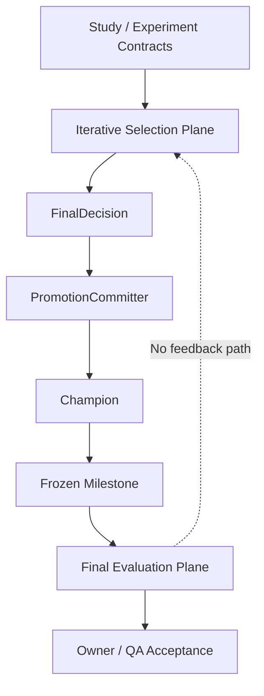
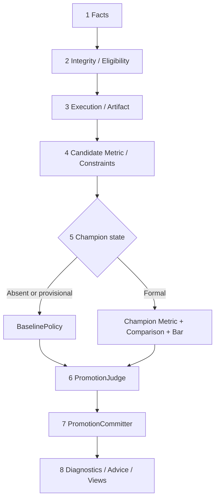
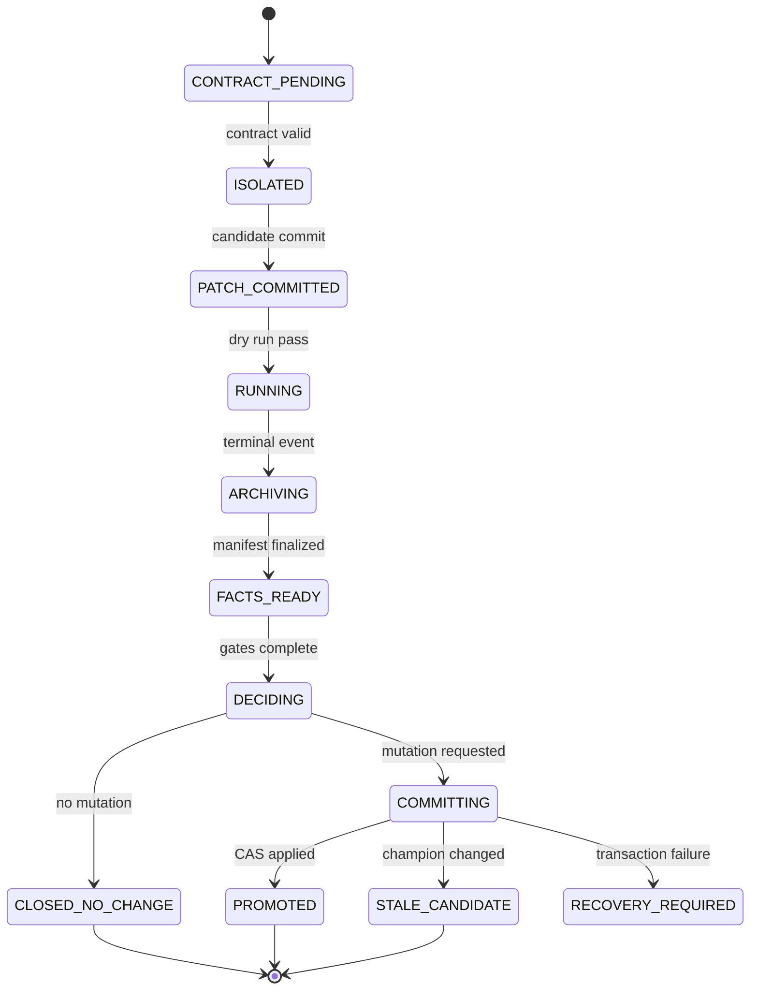

# AutoResearch 机器判定、诊断与晋级最终架构设计 V3.0

**文档编号：** ADR24X7-MVD-FINAL-V3.0  
**文档性质：** 最终技术设计基线候选／技术经理实施依据  
**编制角色：** AutoDL 技术专家／平台架构师／Decision & Promotion Architecture Owner  
**日期：** 2026-08-16  
**状态：** `READY_FOR_OWNER_APPROVAL`  

```text
DESIGN_STATUS=FINAL_ARCHITECTURE_BASELINE_CANDIDATE
DESIGN_DIRECTION=FROZEN_BY_ARCHITECT
OWNER_APPROVED=NO
IMPLEMENTATION_AUTHORIZED=NO
PILOT_AUTHORIZED=NO
PRODUCTION_READY=NO
FROZEN=NO
```

> 本文不是对 V2.2 的继续修补，而是基于最初归因设计、V2/V2.1/V2.2、全部专家评审、AutoResearch 试点事实、autoresearch 机制证据及现有 SDD 治理包重新编制的最终方案。  
> HUMAN_OWNER 批准后，本文成为机器判定子系统的 L2 技术设计基线；V1—V2.2 的设计伪代码全部标记为 `SUPERSEDED_FOR_IMPLEMENTATION`，仅保留为设计演进和审计证据。

---

## 0. 执行摘要

### 0.1 最终方案要解决什么

AutoResearch 需要建立一条可信的无人值守实验闭环：

```text
提出假设 → 隔离修改 → 固定合同运行 → 结构化评估 → 机器裁决
→ 受控晋级/不晋级 → 诊断与建议 → 跨轮记忆 → 下一实验
```

其中最危险的不是“诊断不够聪明”，而是以下基础错误：

- 失败、取消、超时或残留指标被错误晋级；
- minimize/maximize 方向计算错误；
- 无 champion 时被比较逻辑截断；
- test 信息进入逐轮优化；
- 不同数据、评估器、硬件或 checkpoint 被强行比较；
- 缺少重复实验时把随机波动当进步；
- 失败候选污染冠军代码；
- LLM 自述、诊断或建议覆盖机器 verdict；
- 设计声称“类型安全”，实际 Python 运行时仍能构造非法对象。

本方案以“**实验有效性合同＋实验事务合同＋纯函数裁决＋唯一状态写者＋信息流隔离**”解决上述问题。

### 0.2 最终技术裁决

| 决策项 | 最终裁决 |
|---|---|
| 系统承诺 | `Machine Verdict Diagnosis`，不承诺自动因果归因 |
| 首期范围 | 仅 `supervised_holdout`；固定 hardware cohort；`max_parallel=1` |
| Python 合同 | Pydantic v2 strict 运行时验证＋Enum/discriminated union＋pyright strict |
| 方向归一 | 只在 ComparisonBuilder 中执行一次；Comparator 只消费 normalized delta |
| 无 champion | 在 comparison 前进入 BaselinePolicy |
| provisional | 只允许 exact-scope、已批准 Owner record；不得改写 HARD_TIMEOUT 事实 |
| provisional 后续 | 不以 provisional 结果自动 KEEP；下一次完整合法运行建立正式 baseline |
| uncertainty 不足 | 无预先批准 fallback 时固定 `HUMAN_REVIEW` |
| 多目标 | 首期只支持单 primary＋完整 hard constraints；soft/secondary 只展示 |
| 等价结果 | 默认 DISCARD；显著简化可进入 HUMAN_REVIEW，不自动 KEEP |
| test | 独立 schema、namespace、service principal、ACL 和最终评估流水线 |
| verdict 权威 | PromotionJudge 是唯一决策逻辑，保持纯函数 |
| champion 写权 | PromotionCommitter 是唯一状态写者，机械执行 transition |
| Git 策略 | champion protected ref＋每实验独立 worktree；禁止共享树 reset |
| 制品 | Git 外归档；manifest 完成后才允许裁决 |
| 历史 C1 | 当前 Owner 决策仍为 DRAFT，默认不建立 provisional、不修改 champion |

### 0.3 技术经理收到本文后必须做什么

1. 不再从 V1—V2.2 复制任何判定伪代码。
2. 将本文拆成 schema、组件、策略、迁移和测试五类工程任务。
3. 先完成 Gate 0/1/2，禁止直接修改现有 `_machine_judge` 主写路径。
4. 先 shadow/replay，再 single writer；任何时刻只允许一套逻辑写 champion。
5. 未通过本文 P0 测试前，不得开启自动 KEEP，更不得开启 24x7 晋级。

---

## 1. 输入基线、继承与废止

### 1.1 已吸收的输入

本设计吸收以下材料：

- AutoResearch/autoresearch 机制交接与代码证据：固定训练预算、BPB、Git 实验闭环、simplicity、现有 loop/ledger 缺口；
- `ATTRIBUTION_DESIGN_REVIEW.md`：初始 reason/evidence/advice 需求与 C1—C4 试点事实；
- `Machine_Verdict_Diagnosis_Design_V2/V2.1/V2.2`：分层诊断、八阶段流水线、唯一 Judge、MetricComparison、test 隔离与强类型化演进；
- 四轮专家评审：因果降级、决策互斥、baseline、execution、metric identity、约束完整性、test 非干扰、Python 类型边界；
- `ADR24X7-SDD-GOVERNANCE-V0.1`：项目契约、约束、角色、Gate 0—6、实验状态机、QA 规则；
- Qwen2.5-0.5B 试点事实：C1 `FAILED/HARD_TIMEOUT + partial validation_loss=1.1466`，C2 `1.0128`，C3 `1.1557`，C4 `1.0105`。

### 1.2 保留的设计思想

- 机器事实高于 LLM 自述；
- validation 选优，test 独立验收；
- verdict、diagnostics、advice、memory 分层；
- runner 结构化事件高于日志启发式；
- metric 必须携带完整 identity；
- BUDGET_REACHED 与 HARD_TIMEOUT 不可互换；
- candidate/champion 使用配对重复统计；
- 制品先归档、后裁决；
- champion 分支不被失败候选污染；
- capability/profile 控制适用范围，不按 domain 名称猜逻辑。

### 1.3 明确废止的设计

以下做法不得进入实现：

- 单一 `reason` 同时充当 execution/outcome/diagnostic/verdict；
- `train_metric > 0` 判断指标是否存在；
- 把 `HARD_TIMEOUT` 配置重命名为 `BUDGET_REACHED`；
- 无 champion 仍强制构造 MetricComparison；
- 对 raw candidate/champion estimate 固定执行 `candidate - champion`；
- 用 `dict/list[dict]` 承载 P0 裁决字段；
- 用 frozen dataclass、Literal 或类型提示单独宣称“编译期不可构造”；
- 在决策表中写 `DISCARD 或 HUMAN_REVIEW` 等非唯一输出；
- 让 DiagnosticEngine、AdvicePolicy、Reflect Agent 修改 verdict；
- 在共享工作树执行 reset/clean 回退；
- 在循环中读取 test，再依赖 Publisher 过滤字段；
- 将 `IMPLEMENTED_PROFILE` 在代码和测试完成前标为已实现。

### 1.4 冲突优先级

本文经 Owner 批准后，冲突按以下顺序处理：

```text
L0 Human Owner Decision
L1 已批准 SDD 总契约、约束、角色、Study Contract
L2 本 Final Architecture V3.0、配套 ADR/schema
L3 Experiment Contract、Change Request
L4 实现代码、策略配置、自动化测试
L5 运行事件、ledger、artifact
L6 Agent prompt、记忆、自述
```

低层不得反向覆盖高层。发现冲突必须 fail closed 并提交 Finding。

---

## 2. 范围、非目标与支持声明

### 2.1 V3.0 首期范围

```text
AUTHORIZED_FIRST_IMPLEMENTATION_PROFILE=supervised_holdout
IMPLEMENTED_PROFILE=NONE
MAX_PARALLEL=1
HARDWARE_COHORT=fixed_per_study
AUTO_KEEP=DISABLED_UNTIL_GATE_4_PASS
TEST_FEEDBACK_TO_ITERATIVE_LOOP=FORBIDDEN
```

`supervised_holdout` 可承载：

- 分类任务的 validation accuracy/AUC/NLL；
- 深度学习 validation loss/accuracy；
- 语言模型微调的 validation loss 或已批准 BPB evaluator；
- 相同 seed 集合下的 candidate/champion 配对比较。

### 2.2 非目标

V3.0 不承诺：

- 跨 Study、跨任务或跨 metric 的全局分数比较；
- 不同 GPU 代际、GPU 数、功耗配置或软件栈间的墙钟公平；
- cross-validation、time-series、RL、unsupervised 的自动晋级；
- 用普通 train/validation gap 诊断 RL；
- 自动因果归因；
- Pareto 多目标自动晋级；
- 缺少统计证据时自动 KEEP；
- 在 Gate 6 前进行无人值守 24x7 自动晋级。

### 2.3 后续 profile 状态

| Profile | V3.0 状态 | 进入实现的前置条件 |
|---|---|---|
| supervised_holdout | AUTHORIZED_FIRST_IMPLEMENTATION | 本设计批准、Gate 3 通过 |
| cross_validation | DESIGN_ONLY | fold/nested CV 专项 SDD、replay、QA |
| time_series | DESIGN_ONLY | cutoff/window/leakage 专项 SDD |
| language_modeling 专项 | DESIGN_ONLY | token weighting/tokenizer/corpus/BPB 专项合同；普通 holdout 可先使用 |
| reinforcement_learning | DESIGN_ONLY | environment/episode/IQM/bootstrap/cost/reward-hacking 专项合同 |
| unsupervised | NOT_DESIGNED | 重新立项 |

---

## 3. 系统不变量

技术经理必须把以下不变量编号写入代码、测试和追踪矩阵。

| ID | MUST 不变量 |
|---|---|
| MVD-P0-001 | 只有 PromotionJudge 能产生 FinalDecision。 |
| MVD-P0-002 | 只有 PromotionCommitter 能修改 champion 引用或提交 promotion ledger 事务。 |
| MVD-P0-003 | `KEEP` 只可能发生在正式 champion 存在、全部硬门禁通过且 outcome=IMPROVED 时。 |
| MVD-P0-004 | CRASH、OOM_FATAL、HARD_TIMEOUT、BUDGET_EXCEEDED、CANCELLED 永不自动 KEEP。 |
| MVD-P0-005 | 无 champion 时不构造 MetricComparison，必须进入 BaselinePolicy。 |
| MVD-P0-006 | metric 方向只归一一次；normalized delta 正数恒表示 candidate 更好。 |
| MVD-P0-007 | 合法 metric 可为 0 或负数；缺失不得以 0 占位。 |
| MVD-P0-008 | candidate/champion metric identity 不完全一致时不得排序。 |
| MVD-P0-009 | hard constraint 缺失、重复、未评估或单位不匹配时不得 KEEP。 |
| MVD-P0-010 | Artifact Manifest 未原子完成时不得进入判定。 |
| MVD-P0-011 | test 数据及其派生信息不得进入 iterative facts、verdict、diagnostics、advice 或 memory。 |
| MVD-P0-012 | provisional baseline 只能由 exact-scope APPROVED Owner record 建立，且不改写 execution 事实。 |
| MVD-P0-013 | provisional champion 不能作为自动 KEEP 的正式比较基准。 |
| MVD-P0-014 | uncertainty 不足且无预批 fallback 时进入 HUMAN_REVIEW，不得自动 KEEP。 |
| MVD-P0-015 | 非法 policy/schema/未知 enum 进入 BLOCKED，不得默认为 DISCARD 或 KEEP。 |
| MVD-P0-016 | 诊断、建议、发布和记忆策略变化不得追溯修改历史 verdict。 |
| MVD-P0-017 | DISCARD/BLOCKED/INCOMPARABLE/HUMAN_REVIEW/STALE_CANDIDATE 均不得改变 champion。 |
| MVD-P0-018 | candidate parent SHA 与当前 champion 不一致时不得提交，必须 STALE_CANDIDATE。 |
| MVD-P0-019 | test、evaluator、dataset、合同、policy、protected paths 均不能由 Code Agent 修改。 |
| MVD-P0-020 | 所有状态迁移均可由 append-only ledger 和 artifacts 解释、重放和恢复。 |

---

## 4. 最终目标架构

### 4.1 两个平面

系统分为两个物理/权限隔离平面：

1. **Iterative Selection Plane**：validation 驱动的逐轮研究闭环；产生机器判定、诊断、建议和记忆。
2. **Final Evaluation Plane**：候选冻结后的 test 独立验收；只向 Human Owner/QA 发布，不回流逐轮 Agent 和 memory。



图中的虚线表示被明确禁止的回流路径。

### 4.2 Iterative Selection Plane 的八阶段

| 阶段 | 组件 | 权威输出 | 禁止职责 |
|---|---|---|---|
| 1 | OutcomeFactsBuilder | 已验证、带血缘的 SelectionFacts | 不判断 verdict，不读取 test |
| 2 | IntegrityAndEligibilityGate | integrity、profile、contract、parent SHA 结果 | 不修复合同，不比较 metric |
| 3 | ExecutionAndArtifactGate | execution variant、artifact gate result | 不判断 KEEP |
| 4 | MetricAndConstraintGate | candidate metric variant、hard constraint aggregate | 不读取 champion 后猜 delta |
| 5 | ChampionRouter | `BaselineCandidateInput` 或 `ComparableCandidateInput` | 无 champion 时不得调用 Comparator |
| 6 | PromotionJudge | immutable FinalDecision | 不写 Git、champion、ledger transaction |
| 7 | PromotionCommitter | PromotionResult、champion mutation、commit event | 不改变 Judge 结论，不重新算指标 |
| 8 | Diagnostic/Advice/Feedback | findings、recommendations、typed views、memory events | 不改 FinalDecision，不读取 test |

### 4.3 分支架构



关键约束：Comparator 只存在于 formal champion 分支。

### 4.4 组件边界

推荐代码布局：

```text
core/mvd/
  contracts/
    enums.py
    models.py
    schemas/
  facts/
    builder.py
    provenance.py
  gates/
    integrity.py
    eligibility.py
    execution.py
    artifact.py
    metric.py
    constraints.py
  decision/
    champion_router.py
    baseline_policy.py
    comparison.py
    decision_bar.py
    promotion_judge.py
  commit/
    promotion_committer.py
    optimistic_lock.py
  diagnostics/
    engine.py
    detectors/
  advice/
    policy.py
    adapters/
  publish/
    views.py
    memory_writer.py
  events/
    ledger.py
    schemas/
```

现有 `_machine_judge` 最终只能成为 orchestration adapter，不得保留业务判断。

---

## 5. 合同执行技术选型

### 5.1 三层保障

| 层 | 最终选型 | 作用 |
|---|---|---|
| 静态类型 | `Enum`、discriminated union、`pyright --strict`、`assert_never` | 捕获未穷尽分支和字段误用 |
| 运行时 schema | Pydantic v2 strict/frozen models＋model validators＋JSON Schema | 阻止非法对象和非法事件进入系统 |
| 权限边界 | service principal、ACL、namespace、protected paths | 防止绕过 Python 类型读取 test 或写 champion |

禁止在生产代码使用 `model_construct()` 绕过 Pydantic 校验；CI 必须静态扫描。

所有运行时合同继承统一基类：

```python
from pydantic import BaseModel, ConfigDict

class StrictFrozenModel(BaseModel):
    model_config = ConfigDict(
        strict=True,
        frozen=True,
        extra="forbid",
        validate_default=True,
    )
```

### 5.2 版本策略

每个外部事件和持久化对象必须有：

```text
schema_version
policy_version 或 policy_bundle_hash
producer_principal
source_event_id
created_at
```

schema 变更遵循：

- compatible additive：小版本；
- 枚举语义、状态机或 required field 变化：大版本＋迁移器＋replay；
- 历史对象按原 schema/policy 解释，不默认套用最新版本。

### 5.3 不使用可伪造资格布尔

以下字段不得由调用者自由填写：

- `eligible_for_promotion`；
- `valid_pair`；
- `complete`；
- `comparable`；
- `mutation_authorized`。

改用 discriminated union；资格由 variant 本身表达。

---

## 6. 核心枚举与数据合同

### 6.1 ExecutionResult

```python
class CompletedReason(str, Enum):
    NATURAL_COMPLETION = "NATURAL_COMPLETION"
    BUDGET_REACHED = "BUDGET_REACHED"
    EARLY_STOP_PLATEAU = "EARLY_STOP_PLATEAU"
    EARLY_STOP_DIVERGENCE = "EARLY_STOP_DIVERGENCE"

class FailedReason(str, Enum):
    HARD_TIMEOUT = "HARD_TIMEOUT"
    BUDGET_EXCEEDED = "BUDGET_EXCEEDED"
    OOM_FATAL = "OOM_FATAL"
    CRASH = "CRASH"

class CancelReason(str, Enum):
    USER_CANCELLED = "USER_CANCELLED"
    SYSTEM_CANCELLED = "SYSTEM_CANCELLED"

ExecutionResult = CompletedExecution | FailedExecution | CancelledExecution
```

合法组合由类型定义，不能存在 `COMPLETED + HARD_TIMEOUT`。

语义：

- `BUDGET_REACHED`：训练 adapter 按合同主动结束且 finalization 成功；
- `HARD_TIMEOUT`：runner 兜底杀死未按时退出的进程；
- `BUDGET_EXCEEDED`：资源/预算已违反，而非正常预算结束；
- early stop 是成功终止原因，不自动决定 outcome。

### 6.2 MetricObservation

```python
class ObservationStatus(str, Enum):
    OBSERVED = "OBSERVED"
    MISSING = "MISSING"
    PARSE_ERROR = "PARSE_ERROR"
    NON_FINITE = "NON_FINITE"

class MetricEligibility(str, Enum):
    VALID = "VALID"
    PARTIAL_VALID = "PARTIAL_VALID"
    STALE = "STALE"
    INCOMMENSURATE = "INCOMMENSURATE"
    WRONG_SPLIT = "WRONG_SPLIT"
    WRONG_CHECKPOINT = "WRONG_CHECKPOINT"
    INSUFFICIENT_SAMPLE = "INSUFFICIENT_SAMPLE"

class MetricIdentity(StrictFrozenModel):
    metric_id: str
    unit_registry_id: str
    direction: Direction
    split_role: Literal["validation"]
    evaluator_hash: Sha256
    dataset_fingerprint: Sha256
    preprocess_hash: Sha256
    aggregation_policy_id: str
    checkpoint_selection_policy_id: str
    study_contract_hash: Sha256
    hardware_cohort_id: str

class SelectionMetricObservation(StrictFrozenModel):
    schema_version: Literal["selection-metric/v1"]
    identity: MetricIdentity
    observation_status: ObservationStatus
    eligibility: MetricEligibility
    value: float | None
    evaluation_sample_count: int
    checkpoint_id: str
    checkpoint_artifact_sha256: Sha256
    source_event_id: str
    observed_at: datetime
```

运行时不变量：

- `OBSERVED` 必须有 finite value；
- MISSING/PARSE_ERROR/NON_FINITE 不得伪造 0；
- 0 和负值在 OBSERVED 下完全合法；
- STALE/INCOMMENSURATE 可以保留真实 observed value，但不得进入 comparison；
- split_role 固定 validation，test 使用另一套 schema。

### 6.3 CandidateMetricState

```python
CandidateMetricState = (
    CompleteValidCandidateMetric
    | PartialValidCandidateMetric
    | InvalidCandidateMetric
)

ChampionMetricState = ValidFormalChampionMetric | InvalidChampionMetric
```

`PartialValidCandidateMetric` 只允许进入 BaselinePolicy，永远不进入正式 champion comparison。

### 6.4 ChampionState

```python
ChampionState = ChampionAbsent | ProvisionalChampion | FormalChampion
```

字段至少包括：

- champion SHA；
- champion kind；
- source decision ID；
- metric bundle/manifest 引用；
- study/policy hash；
- provisional authorization 与 expiry（若适用）。

### 6.5 ConstraintEvaluation

```python
class ConstraintResult(StrictFrozenModel):
    constraint_id: str
    metric_id: str
    unit_registry_id: str
    hardness: Hardness
    comparator: ConstraintComparator
    threshold: float
    observed_value: float | None
    status: ConstraintStatus
    policy_version: str
    evidence_event_id: str

ConstraintEvaluation = CompleteConstraintSet | IncompleteConstraintSet
```

完整性规则：

- expected IDs 与 unique result IDs 必须完全相等；
- duplicate、extra、missing、contract hash 不一致均为 `IncompleteConstraintSet`；
- HARD NOT_EVALUATED → BLOCKED；
- HARD VIOLATED → DISCARD_CONSTRAINT；
- 所有 HARD PASS 才可继续；
- SOFT 首期只进入显示和诊断，不参与自动晋级。

### 6.6 OwnerDecisionRecord

```python
class OwnerDecisionRecord(StrictFrozenModel):
    schema_version: Literal["owner-decision/v1"]
    decision_id: str
    status: OwnerDecisionStatus
    scope: frozenset[str]
    facts_hash: Sha256
    decision_type: OwnerDecisionType
    payload: ProvisionalBaselineAuthorizationPayload | HumanReviewPayload
    approver_identity: str
    approver_role: Literal["HUMAN_OWNER"]
    approved_at: datetime | None
    effective_at: datetime | None
    expires_at: datetime | None
    revocation_rule_id: str
    audit_event_id: str
    policy_version: str
```

DRAFT/REJECTED/REVOKED/EXPIRED 不能转换为 `ApprovedAuthorization` variant。校验必须覆盖 status、scope、facts hash、时间、decision type 和签署事件。

### 6.7 FinalDecision 与 PromotionResult

```python
class FinalDecision(StrictFrozenModel):
    schema_version: Literal["final-decision/v1"]
    decision_id: str
    study_id: str
    experiment_id: str
    decision: Decision
    decision_mode: DecisionMode       # AUTO / HUMAN_AUTHORIZED
    reason_codes: tuple[ReasonCode, ...]
    expected_champion_before_sha: str | None
    candidate_sha: str
    requested_transition: StateTransition
    requested_champion_after_sha: str | None
    input_bundle_hash: Sha256
    policy_bundle_hash: Sha256
    evidence_refs: tuple[str, ...]
    idempotency_key: str
    created_at: datetime

class PromotionResult(StrictFrozenModel):
    schema_version: Literal["promotion-result/v1"]
    decision_id: str
    status: CommitStatus              # APPLIED / NOOP / STALE_CANDIDATE / COMMIT_BLOCKED
    champion_before_observed_sha: str | None
    champion_after_sha: str | None
    transaction_id: str
    ledger_event_id: str
    committed_at: datetime
```

Judge 只提出 transition；实际 champion_after 由 Committer 在乐观锁事务后记录。

---

## 7. Budget、Artifact 与事实血缘

### 7.1 双层预算

```text
训练 adapter：使用 monotonic clock 执行 active_train_seconds 自终止
Runner：执行 hard_wall_clock_limit，杀死失控进程树
Monitor：等待/采集/通知，不承担精确预算
```

必须记录：

- queue_seconds；
- setup_seconds；
- compile_seconds；
- warmup_seconds；
- active_train_seconds；
- evaluation_seconds；
- artifact_finalize_seconds；
- total_wall_seconds。

不同 hardware cohort 不得自动比较。`poll_interval` 改变不能影响训练预算，只影响发现延迟。

### 7.2 Artifact Manifest

任何执行终态，包括 CRASH/HARD_TIMEOUT，都必须先尽最大可能归档：

- stdout/stderr/traceback；
- structured runner events；
- selection metric events；
- resource events；
- candidate diff/commit；
- environment、contract、policy hashes；
- checkpoint/model（如存在）；
- manifest 自身 SHA-256。

Manifest 使用临时文件＋fsync＋原子 rename 发布。只有 `FINALIZED` manifest 可进入 Judge。

### 7.3 字段血缘矩阵

| 字段组 | 唯一权威来源 | 质量/冲突规则 | 禁止 fallback |
|---|---|---|---|
| study/experiment contract | Contract Registry | APPROVED、hash 匹配 | prompt/brief 猜测 |
| champion/candidate SHA | Workspace/Promotion Manager | Git object 存在、父子关系校验 | Agent 自述 |
| execution | Runner terminal event | 唯一 terminal event、合法 union | 日志关键字冒充 HIGH |
| budget timings | Runner/train adapter | monotonic、分项完整 | monitor poll 推算 |
| metric | Selection Evaluator | schema、identity、finite、event ID | 自然语言解析 |
| checkpoint selection | Evaluation Contract＋Manifest | policy/event/artifact digest 一致 | 文件名猜测 |
| dataset/evaluator | Contract＋Manifest | hash 完全匹配 | 路径名 |
| constraints | Constraint Evaluator | expected/result ID 完全一致 | 空列表表示 PASS |
| artifact integrity | Artifact Manager | finalized＋manifest hash | 文件存在即完整 |
| test access | Access Audit | authenticated principal | Agent 自报 |
| policy | Policy Registry | bundle hash、effective time | 默认最新版本 |
| Owner approval | Owner Decision Ledger | status/scope/facts/time/signature | prompt 中写 approved |

冲突时不得静默选择；返回 BLOCKED/INCOMPARABLE 并记录全部 findings。

---

## 8. MetricComparison 与统计政策

### 8.1 配对差值

首期只支持相同 seed 集合的配对：

```python
def normalized_pair_delta(cand: float, champ: float, direction: Direction) -> float:
    if direction is Direction.MINIMIZE:
        return champ - cand
    if direction is Direction.MAXIMIZE:
        return cand - champ
    raise PolicyInvalid("unknown direction")
```

`normalized_delta > 0` 永远表示 candidate 更好。

```python
class PairedDelta(StrictFrozenModel):
    pair_key: str
    candidate_observation_id: str
    champion_observation_id: str
    candidate_raw_value: float
    champion_raw_value: float
    normalized_delta: float

class MetricComparison(StrictFrozenModel):
    identity: ComparableMetricIdentity
    pairs: tuple[PairedDelta, ...]
    normalized_delta: float
    candidate_raw_estimate: float
    champion_raw_estimate: float
    aggregation_method: Literal["PAIRED_MEAN"]
    uncertainty: UncertaintyEstimate
```

`normalized_delta` 必须由 pairs 派生；调用方不得自由传入与 pairs 不一致的值。

### 8.2 不确定性

首期自动晋级默认要求：

- candidate/champion 使用相同 seeds；
- `n >= StudyContract.statistics.minimum_repeats`，建议默认至少 3，但实际值由 Study 冻结；
- 使用 paired delta standard error；
- 方法、置信度和倍数由 Statistical Policy 版本化。

```text
SE = sample_std(paired_deltas) / sqrt(n)
uncertainty_margin = multiplier(policy, n, alpha) × SE
decision_bar = max(min_practical_delta, uncertainty_margin)
```

V3.0 允许 bootstrap 作为后续方法，但首期不同时实现两套统计路径。

### 8.3 DecisionBarResolution

```python
BarResolution = BarReady | InsufficientEvidence | PolicyInvalid
```

- `BarReady`：bar 有限正数，metric/unit/policy 一致；
- `InsufficientEvidence`：repeats 不足或 uncertainty unavailable，且没有 Study 预批 fallback；
- `PolicyInvalid`：NaN、负值、单位/方法/hash 错误或未知 enum。

唯一映射：

| BarResolution | FinalDecision |
|---|---|
| BarReady | 进入 outcome |
| InsufficientEvidence | HUMAN_REVIEW |
| PolicyInvalid | BLOCKED |

fallback bar 必须在实验开始前写入已批准 Study Contract；不得针对已看到的结果临时调阈值。

### 8.4 Outcome

```text
normalized_delta >= +bar → IMPROVED
normalized_delta <= -bar → REGRESSION
-bar < normalized_delta < +bar → EQUIVALENT_OR_INCONCLUSIVE
```

bar 必须有限且大于 0。等号语义固定如上。

---

## 9. ChampionRouter 与 BaselinePolicy

### 9.1 为什么必须先分 champion

无 champion 时不存在两方比较对象；强行构造 comparison 会制造虚假可比性。因此 ChampionRouter 在任何比较之前执行。

### 9.2 ChampionAbsent

| execution/metric | Owner authorization | decision | transition |
|---|---|---|---|
| COMPLETED＋CompleteValid | 不需要 | BASELINE_ESTABLISHED | SET_FORMAL_BASELINE |
| FAILED/HARD_TIMEOUT＋PartialValid | exact APPROVED | PROVISIONAL_BASELINE_ESTABLISHED | SET_PROVISIONAL_BASELINE |
| FAILED/HARD_TIMEOUT＋PartialValid | 无效/缺失 | BASELINE_REQUIRED | NO_CHANGE |
| FailedExecution(reason=OOM_FATAL/CRASH/BUDGET_EXCEEDED) | 任意 | DISCARD | NO_CHANGE |
| CANCELLED | 任意 | DISCARD | NO_CHANGE |
| metric missing/parse/non-finite | 任意 | DISCARD | NO_CHANGE |

Integrity、artifact 或 hard constraint 失败在进入本表前已结束。

### 9.3 ProvisionalChampion

V3.0 的安全简化规则：

- provisional metric 可用于诊断展示，不作为自动 KEEP 的正式基准；
- 下一次 `COMPLETED + CompleteValid` 运行直接建立正式 baseline：`BASELINE_ESTABLISHED + SET_FORMAL_BASELINE`；
- partial/failed candidate 不自动替换另一个 provisional；需要人工处理；
- provisional 被撤销时，相关 diagnostic/memory 标记 INVALIDATED；正式、独立建立的后续 baseline 不受影响。

这避免“临时事实衍生一长串自动冠军”的风险。

### 9.4 FormalChampion

只有此分支进入：

```text
execution completed
candidate complete valid
champion metric complete valid
metric identity fully comparable
comparison + decision bar
PromotionJudge
```

### 9.5 Cycle 1—4 规范重放

当前没有正式批准的 Cycle 1 Owner record，因此真实历史的规范解释为：

| Cycle | 机器事实 | V3.0 规范结果 |
|---|---|---|
| C1 | FAILED/HARD_TIMEOUT，partial val_loss=1.1466 | BASELINE_REQUIRED，NO_CHANGE |
| C2 | 若 COMPLETED＋完整合法 val_loss=1.0128 | BASELINE_ESTABLISHED，成为首个正式 baseline |
| C3 | 1.1557 vs C2 1.0128 | normalized delta=-0.1429；在 fixture bar=0.05 下 REGRESSION→DISCARD |
| C4 | 1.0105 vs C2 1.0128 | normalized delta=+0.0023；在 fixture bar=0.05 下 EQUIVALENT→DISCARD |

说明：

- C2 的历史标签可以保留为 legacy KEEP，但 V3.0 replay 应记录规范映射为 `BASELINE_ESTABLISHED`；最终 champion SHA 结果一致。
- `bar=0.05` 仅是历史 replay fixture，不自动成为生产 Study Policy。
- 若 Owner 后续批准 C1 provisional，C2 完整运行仍转为正式 baseline，而不是沿 provisional 链自动 KEEP。

---

## 10. PromotionJudge 最终决策语义

### 10.1 Decision 枚举

```text
KEEP
DISCARD
DISCARD_CONSTRAINT
BLOCKED
INCOMPARABLE
HUMAN_REVIEW
BASELINE_REQUIRED
BASELINE_ESTABLISHED
PROVISIONAL_BASELINE_ESTABLISHED
STALE_CANDIDATE
```

### 10.2 状态迁移映射

| Decision | requested_transition | mutation requested |
|---|---|---:|
| KEEP | REPLACE_FORMAL_CHAMPION | yes |
| BASELINE_ESTABLISHED | SET_FORMAL_BASELINE | yes |
| PROVISIONAL_BASELINE_ESTABLISHED | SET_PROVISIONAL_BASELINE | yes |
| 其他 | NO_CHANGE | no |

FinalDecision validator 根据该固定表派生 transition，禁止调用方传入矛盾组合。

### 10.3 Comparable 分支的确定规则

所有前置 gate 已通过，formal champion 存在后：

| 条件 | Decision |
|---|---|
| parent SHA 已过期 | STALE_CANDIDATE |
| BarResolution=PolicyInvalid | BLOCKED |
| BarResolution=InsufficientEvidence | HUMAN_REVIEW |
| outcome=REGRESSION | DISCARD |
| outcome=EQUIVALENT，普通复杂度 | DISCARD |
| outcome=EQUIVALENT，显著简化 | HUMAN_REVIEW |
| outcome=IMPROVED，复杂度/软风险超过 review threshold | HUMAN_REVIEW |
| outcome=IMPROVED，全部政策通过 | KEEP |

不存在“或”。每个输入 variant 只能有一个结果。

### 10.4 非 comparable 终态

| 原因 | Decision |
|---|---|
| test/security/protected boundary violation | BLOCKED；experiment QUARANTINED |
| contract/profile/policy/schema invalid | BLOCKED |
| manifest incomplete/corrupt | BLOCKED |
| hard constraint missing/NOT_EVALUATED | BLOCKED |
| hard constraint violated | DISCARD_CONSTRAINT |
| execution failed/cancelled（非 provisional 特例） | DISCARD |
| candidate metric missing/non-finite/parse error | DISCARD |
| champion metric、identity、cohort 不可交换 | INCOMPARABLE |

### 10.5 HUMAN_REVIEW 的处理

`HUMAN_REVIEW` 不修改 champion。Human Review 只能解决：

- uncertainty 不足；
- 微小提升与复杂度债务；
- 等价但显著简化；
- 已定义的非安全例外。

不得人工覆盖 test 泄漏、安全违规、protected boundary、artifact corruption 或 hard constraint violation。

人工决定形成 `OwnerDecisionRecord`，DecisionEngine 使用同一 immutable input bundle 重新裁决并生成新的 FinalDecision：

```text
decision_mode=HUMAN_AUTHORIZED
reason_codes 含 HUMAN_REVIEW_RESOLVED
```

Human Owner 或 UI 不得直接调用 PromotionCommitter。

### 10.6 参考伪代码

```python
def adjudicate(facts: SelectionFacts, policy: PolicyBundle) -> FinalDecision:
    integrity = integrity_gate(facts)
    if isinstance(integrity, BlockedIntegrity):
        return blocked(integrity)

    eligibility = eligibility_gate(facts, policy.profile)
    match eligibility:
        case BlockedEligibility():
            return blocked(eligibility)
        case IncomparableEligibility():
            return incomparable(eligibility)
        case Eligible():
            pass
        case _ as unreachable:
            assert_never(unreachable)

    artifact = artifact_gate(facts)
    if not isinstance(artifact, FinalizedArtifact):
        return blocked(artifact)

    execution = execution_gate(facts)
    candidate_metric = candidate_metric_gate(facts, policy.metric)
    constraints = constraint_gate(facts, policy.constraints)

    if isinstance(constraints, IncompleteConstraintSet):
        return blocked(constraints)
    if constraints.has_hard_not_evaluated:
        return blocked(constraints)
    if constraints.has_hard_violation:
        return discard_constraint(constraints)

    champion = champion_router.resolve(facts)

    if isinstance(champion, ChampionAbsent | ProvisionalChampion):
        return baseline_policy.decide(
            champion=champion,
            execution=execution,
            candidate_metric=candidate_metric,
            artifact=artifact,
            constraints=constraints,
            owner_record=facts.owner_decision,
            policy=policy.baseline,
        )

    if not isinstance(execution, CompletedExecution):
        return discard_execution(execution)
    if not isinstance(candidate_metric, CompleteValidCandidateMetric):
        return discard_metric(candidate_metric)

    champion_metric = champion_metric_gate(champion, facts, policy.metric)
    if not isinstance(champion_metric, ValidFormalChampionMetric):
        return incomparable(champion_metric)

    if facts.champion_before_sha != champion.current_sha:
        return stale_candidate(facts, champion)

    comparison = comparison_builder.build(candidate_metric, champion_metric, policy.metric)
    bar_resolution = decision_bar_factory.build(comparison, policy.statistics)

    match bar_resolution:
        case PolicyInvalid():
            return blocked(bar_resolution)
        case InsufficientEvidence():
            return human_review(bar_resolution)
        case BarReady(bar=bar):
            outcome = outcome_comparator.compare(comparison.normalized_delta, bar)
        case _ as unreachable:
            assert_never(unreachable)

    return promotion_judge.decide_comparable(
        outcome=outcome,
        complexity=complexity_gate(facts, policy.complexity),
        facts=facts,
        policy=policy,
    )
```

### 10.7 ReasonCode 受控分类

FinalDecision 必须至少包含一个受控 ReasonCode；禁止只写自由文本。首期分类如下：

| 类别 | ReasonCode 示例 |
|---|---|
| Integrity | TEST_ACCESS_VIOLATION、PROTECTED_BOUNDARY_VIOLATION、SECURITY_VIOLATION |
| Contract/Profile | CONTRACT_INVALID、POLICY_INVALID、PROFILE_UNSUPPORTED、SCHEMA_UNSUPPORTED |
| Artifact | ARTIFACT_NOT_FINALIZED、ARTIFACT_HASH_MISMATCH |
| Execution | EXECUTION_CRASH、OOM_FATAL、HARD_TIMEOUT、BUDGET_EXCEEDED、CANCELLED |
| Metric | METRIC_MISSING、METRIC_PARSE_ERROR、METRIC_NON_FINITE、METRIC_STALE、WRONG_CHECKPOINT |
| Comparability | METRIC_IDENTITY_MISMATCH、HARDWARE_COHORT_MISMATCH、PARENT_CHAMPION_MISMATCH |
| Statistics | INSUFFICIENT_REPEATS、UNCERTAINTY_UNAVAILABLE、INVALID_DECISION_BAR |
| Constraint | CONSTRAINT_SET_INCOMPLETE、HARD_CONSTRAINT_NOT_EVALUATED、HARD_CONSTRAINT_VIOLATED |
| Baseline | NO_FORMAL_CHAMPION、PROVISIONAL_AUTHORIZATION_REQUIRED、PROVISIONAL_AUTHORIZATION_APPROVED |
| Outcome | PRACTICAL_IMPROVEMENT、REGRESSION、EQUIVALENT_OR_INCONCLUSIVE |
| Complexity | COMPLEXITY_REVIEW_REQUIRED、SIMPLIFICATION_REVIEW_REQUIRED |
| Concurrency | STALE_CANDIDATE_PARENT |

ReasonCode 枚举和 decision→allowed reason categories 必须版本化并有合同测试。自由文本解释只能由 code＋事实派生，不得替代 code。

---

## 11. PromotionCommitter 与 Git 事务

### 11.1 唯一写者

PromotionCommitter 使用独立 service principal，唯一拥有：

- champion ref compare-and-swap；
- promotion transaction ledger append；
- champion metadata 更新。

PromotionJudge、Code Agent、Reflect Agent、Publisher、legacy adapter 均无这些权限。

### 11.2 提交算法

```text
1. 验证 FinalDecision schema/signature/input hash/policy hash
2. 验证 decision 请求 mutation
3. 读取当前 champion ref
4. compare current ref == expected_champion_before_sha
5. 不相等 → STALE_CANDIDATE，NO_CHANGE
6. 验证 candidate commit、manifest、contract 仍存在且匹配
7. 以事务/原子 CAS 更新 champion ref
8. append PromotionResult
9. 重复 idempotency_key → 返回原结果，不重复迁移
```

### 11.3 Git/worktree 规则

- 每个 experiment 从 `champion_before_sha` 创建独立 worktree/branch；
- Code Agent 只写 allowlist；
- candidate 在运行前形成 commit；
- 模型、checkpoint、日志不进入 Git；
- DISCARD/CRASH/TIMEOUT 不 reset champion，只清理候选 worktree；
- 清理前保存 candidate SHA 或 patch、manifest、ledger；
- shared tree 禁止 reset/clean/force push；
- 任何 dirty user changes 不被 Agent 修改、暂存或删除。

---

## 12. Test 信息流隔离

### 12.1 数据与事件隔离

```text
SelectionFactsEnvelope
  schema_id=selection-facts/v1
  namespace=selection
  producer=evaluator-selection

FinalTestFactsEnvelope
  schema_id=final-test-facts/v1
  namespace=final-test
  producer=evaluator-final
```

二者使用不同 DTO、topic/table/object prefix 和读取凭证。

### 12.2 权限矩阵

| 组件 | selection read | test read | decision write | champion write | iterative memory write |
|---|---:|---:|---:|---:|---:|
| FactsBuilder | yes | no | no | no | no |
| Metric/Diagnostic/Advice | yes | no | no | no | Advice/MemoryWriter 受限 |
| PromotionJudge | 仅验证后的 selection | no | yes | no | no |
| PromotionCommitter | no metric raw read | no | no | yes | no |
| FinalEvalReader | no | yes | no | no | no |
| Leader/Code/Reflect | typed view only | no | no | no | no direct write |
| QA/Owner final report | 按批准 | yes | no | no | no iterative write |

`producer_id` 字符串不能替代身份认证；权限必须绑定真实 service principal。

### 12.3 非干扰性质

在 selection facts 完全相同时，只改变 test 数据：

```text
FinalDecision 不变
PromotionResult 不变
DiagnosticFinding 不变
ActionRecommendation 不变
Memory events 不变
CodeAgentView 不变
IterativeLeaderView 不变
iterative 日志摘要与错误码不变
```

只有 FinalEvaluationReport 允许变化。

### 12.4 泄漏处置

test 访问尝试或泄漏：

```text
experiment_state=QUARANTINED
decision=BLOCKED
champion=NO_CHANGE
affected facts/diagnostics/advice/memory=INVALIDATED
QA/SEC finding=BLOCKER
```

Access Audit 不可用时 fail closed。

---

## 13. 诊断、建议与记忆

### 13.1 权威分层

| 层 | 内容 | 是否可改 verdict |
|---|---|---:|
| FACT | contracts、execution、metrics、constraints、artifact | no |
| DECISION | eligibility、outcome、FinalDecision、PromotionResult | 仅 Judge/Committer 各自权限 |
| DIAGNOSTIC | 多标签 finding | no |
| ADVICE | 下一实验候选动作 | no |
| MEMORY | 事实、假设、dead end、recipe、causal evidence | no |

### 13.2 DiagnosticFinding

```python
class DiagnosticFinding(StrictFrozenModel):
    code: DiagnosticCode
    applicability: Applicability
    evidence_strength: EvidenceStrength
    detector_version: str
    evidence_refs: tuple[str, ...]
    observed_values: Mapping[str, JsonValue]
    limitations: tuple[str, ...]
    causal_claim_level: CausalClaimLevel
```

诊断可多标签。`primary_reason` 只可由结构派生用于展示，不作为权威存储。

### 13.2.1 首期 detector 范围

| DiagnosticCode | 适用前提 | 机器证据 | 明确限制 |
|---|---|---|---|
| OVERFIT_SIGNAL | supervised_holdout；train/validation 指标天然可比；存在 profile 标定 gap | standardized gap、曲线、checkpoint、重复结果 | 不使用跨领域固定 `gap_ratio=0.2`；无标定则 UNAVAILABLE |
| UNDERFIT_SIGNAL | 存在 chance/reference baseline；训练曲线与预算完整 | 相对 reference 的位置、训练改善斜率、预算使用 | 不能仅以“loss 高/accuracy 低”判断 |
| PLATEAU | learning curve 可用 | early-stop event、窗口斜率、best checkpoint | early stop 不覆盖 outcome |
| HIGH_VARIANCE | repeats 达到 detector 最低数 | seed/fold dispersion、区间 | 单次运行不可判断 |
| OPTIMIZATION_DIVERGENCE | 结构化 loss/gradient 事件可用 | NaN、爆炸、持续恶化、EARLY_STOP_DIVERGENCE | 与普通 regression 分开 |
| TRAINING_INSTABILITY | 多 step/epoch 或 repeats 可用 | oscillation、异常方差、恢复事件 | 日志关键词只能 LOW |
| EVAL_ANOMALY | evaluator 结构化证据 | split/sample/checkpoint/hash 变化、指标越界、评估未执行 | validation 不单调本身不是异常 |
| RESOURCE_REGRESSION | 相同 cohort、资源指标可比 | peak VRAM、active time、model size | 跨 cohort 不比较 |
| DATA_QUALITY_SIGNAL | 数据审计事件可用 | schema、分布、缺失、污染事件 | 不由 LLM 猜测数据问题 |

首期不启用 RL reward hacking、time-series leakage、cross-validation variance 等专项 detector；它们随 profile 专项 SDD 引入。

### 13.3 evidence_strength

区分：

- `fact_reliability`：结构化事件的完整性、权威性和冲突；
- `diagnostic_evidence_strength`：detector 在该 profile 上的校准程度。

结构化事实可靠不等于 OVERFIT 等诊断必为 HIGH。HIGH 需要 profile-specific replay/calibration、detector 版本、适用范围和已知误报/漏报。

### 13.4 AdvicePolicy

Advice 只输出 action code，不输出伪因果事实：

```text
REDUCE_MEMORY_FOOTPRINT
VERIFY_EVALUATION_PIPELINE
RESTORE_CHAMPION_AND_ABLATE_DIFF
ADJUST_OPTIMIZATION_SCHEDULE
INCREASE_REGULARIZATION_STRENGTH
IMPROVE_DATA_COVERAGE
RUN_REPEATED_SEEDS
REQUEST_NEW_STUDY
```

每条 recommendation 包含：

- rationale finding refs；
- prerequisites；
- allowed change scope；
- expected evidence；
- risk；
- requires_new_study；
- requires_human_review；
- policy version/hash。

涉及 dataset、split、evaluator、reward、primary metric、budget mode 或 protected paths 的动作必须走 Change Request/新 Study。

首期 reason/finding 到 action code 的安全映射：

| 输入 | 候选 ActionCode | 默认权限 |
|---|---|---|
| OOM_FATAL/RESOURCE_REGRESSION | REDUCE_MEMORY_FOOTPRINT | 仅 change scope 内参数；不得改硬约束 |
| CRASH/PARSE_ERROR | VERIFY_EVALUATION_PIPELINE 或修复候选代码 | evaluator/protected path 仍不可写 |
| HARD_TIMEOUT/BUDGET_EXCEEDED | ADJUST_OPTIMIZATION_SCHEDULE | 不得提高 Study 预算；变更预算需 CR |
| REGRESSION | RESTORE_CHAMPION_AND_ABLATE_DIFF | 新 Experiment，禁止从失败 worktree 继续污染 |
| EQUIVALENT | 提出更大机制变化或 SIMPLIFICATION review | 默认不自动 KEEP |
| OVERFIT_SIGNAL | INCREASE_REGULARIZATION_STRENGTH | 仅在 detector applicable 时 |
| HIGH_VARIANCE/INSUFFICIENT_REPEATS | RUN_REPEATED_SEEDS | 不改变已运行结果阈值 |
| EVAL_ANOMALY | VERIFY_EVALUATION_PIPELINE | 若涉及 evaluator，转人工/新 Study |

AdvicePolicy 只提出受控实验动作，不保证动作一定改善。

### 13.5 Memory 分层

| Memory layer | 写入条件 |
|---|---|
| FACT | 权威事件与 manifest 完整 |
| DIAGNOSTIC_HYPOTHESIS | 规则 finding，保留限制和版本 |
| DEAD_END | 相同方向经可比、重复实验验证失败；不能把多参数变化拆成每个参数的因果 dead end |
| RECIPE | 完整候选配方和合同，不拆成未经验证的因果参数 |
| CAUSAL_EVIDENCE | 受控消融＋重复达到批准门槛 |

每条记录带 source event IDs、study、policy、validity、superseded_by、expires_at。provisional 撤销或 detector policy 更新时机械传播 invalidation/supersession。test 永不写 iterative memory。

### 13.6 消费者视图

- `CodeAgentView`：validation facts、decision、diagnostics、advice、champion diff、allowlist；无 test、无 promotion 权限。
- `IterativeLeaderView`：研究轨迹、validation、dead ends、资源余量；无 test。
- `MemoryWriterView`：已批准 memory event；无原始 test。
- `OwnerQAView`：治理、完整 findings、必要时最终 test 报告。
- `FinalEvaluationView`：仅冻结后 test；不投递给 Agent。

---

## 14. Ledger、状态机与恢复

### 14.1 关键事件

```text
experiment_proposed
contract_validated
workspace_isolated
candidate_committed
run_started
run_terminal
artifact_finalized
selection_facts_built
gates_evaluated
metric_bundle_validated
comparison_built              # 仅 formal champion
decision_issued
promotion_applied / promotion_stale / promotion_noop
diagnostics_emitted
advice_emitted
feedback_published
memory_written
final_evaluation_started      # 独立平面
final_evaluation_completed
```

每个事件为 append-only，带 schema、actor principal、input/output hashes、policy、evidence refs 和 idempotency key。

### 14.2 实验状态机



异常终态仍必须尽可能经过 ARCHIVING；manifest 不完整则进入 `ARCHIVE_FAILED`，不得进入 DECIDING。

### 14.3 恢复规则

- 同一 idempotency key 重放返回原结果；
- event 写成功、champion 未更新：Committer 依据 transaction ID 恢复；
- champion 更新、result event 未写：读取 CAS transaction 恢复 result，不重复更新；
- artifact 半写：不可见或 `INCOMPLETE`；
- ledger 中断：暂停新晋级，重放到唯一状态；
- 未知状态：RECOVERY_REQUIRED，禁止自动猜测。

---

## 15. Profile Registry 与 Study Contract

### 15.1 Registry

```python
class ProfileDefinition(StrictFrozenModel):
    profile_id: str
    support_state: SupportState
    required_fact_schema_ids: frozenset[str]
    forbidden_capability_combinations: frozenset[str]
    metric_adapter_ids: frozenset[str]
    detector_ids: frozenset[str]
    aggregation_method: AggregationMethod
    uncertainty_method: UncertaintyMethod
    minimum_repeats: int
    minimum_replay_suite_id: str
    advice_policy_id: str
```

Registry.validate 必须检查：support state、required facts、禁止组合、metric adapter、detector 证据、minimum repeats 和 replay suite。返回 `ValidatedProfile`；失败不得启动 Study。

### 15.2 Study Contract 最低字段

```yaml
study:
  schema_version: study-contract/v1
  study_id: REQUIRED
  status: APPROVED
  profile_id: supervised_holdout

budget:
  mode: active_train_seconds
  limit_seconds: REQUIRED
  hard_wall_clock_limit_seconds: REQUIRED
  timing_policy_id: REQUIRED
  hardware_cohort_id: REQUIRED

data:
  dataset_fingerprint: REQUIRED
  validation_split_fingerprint: REQUIRED
  preprocess_hash: REQUIRED
  tokenizer_hash: OPTIONAL_BY_ADAPTER

evaluation:
  primary_metric_id: REQUIRED
  direction: MINIMIZE_OR_MAXIMIZE
  unit_registry_id: REQUIRED
  evaluator_hash: REQUIRED
  aggregation_policy_id: PAIRED_MEAN_V1
  checkpoint_selection_policy_id: REQUIRED

statistics:
  seeds: REQUIRED_LIST
  minimum_repeats: REQUIRED
  uncertainty_method: PAIRED_SE_V1
  confidence_policy_id: REQUIRED
  min_practical_delta: REQUIRED_POSITIVE_FINITE
  fallback_bar: OPTIONAL_PREAPPROVED
  insufficient_evidence_action: HUMAN_REVIEW

constraints:
  hard: REQUIRED_LIST_OR_EXPLICIT_EMPTY
  soft: OPTIONAL_DISPLAY_ONLY

baseline:
  allow_provisional: BOOLEAN
  allowed_partial_reason: [HARD_TIMEOUT]
  provisional_requires_owner_record: true

change_scope:
  allowlist: REQUIRED
  protected_paths: REQUIRED
  dependency_change_allowed: false_by_default

access:
  selection_namespace: REQUIRED
  test_namespace: REQUIRED_SEPARATE
  iterative_principal: REQUIRED
  final_eval_principal: REQUIRED
```

brief 只引用 study_id，不维护第二份预算或阈值。

---

## 16. 迁移现有 `_machine_judge`

### 16.1 原则

- 不在旧函数内继续增加 if/else；
- 不长期双写；
- 新流水线异常 fail closed，不回退到旧静默 KEEP；
- 任何阶段幂等；
- 迁移前保护用户工作树和历史 ledger。

### 16.2 四阶段迁移

| 阶段 | 行为 | 唯一写者 |
|---|---|---|
| M0 Schema/Replay | 新模型和纯逻辑离线重放，不接生产 loop | 旧路径 |
| M1 Shadow | 新路径读取新实验，输出 ShadowReport，不写 verdict/champion | 旧路径 |
| M2 Single Writer Cutover | 新 Judge＋Committer 成为唯一写者；旧函数变 adapter | 新路径 |
| M3 Retirement | 删除旧业务逻辑，仅保留短期兼容签名或完全移除 | 新路径 |

### 16.3 legacy adapter

```python
def decide_verdict_compat(request: LegacyRequest) -> LegacyResponse:
    validated = legacy_request_adapter.validate_and_translate(request)
    decision = mvd_orchestrator.adjudicate(validated)
    return legacy_response_adapter.render(decision)
```

adapter：

- 不拼装 FinalDecision；
- 不重新计算 delta/bar；
- 不写 champion/ledger；
- 有明确删除版本和日期；
- CI 禁止出现旧 outcome/verdict 业务分支。

---

## 17. 测试与形式化门禁

### 17.1 Contract rejection

- 非法 execution/reason union；
- MISSING＋value=0；
- unknown direction/status/schema；
- Decision 与 transition 不一致；
- duplicate/missing constraint ID；
- test envelope 注入 selection builder；
- unsupported profile；
- policy/hash/unit mismatch；
- direct model construct 绕过尝试。

### 17.2 判定 golden cases

| Test ID | 场景 | 唯一期望 |
|---|---|---|
| MVD-JDG-001 | minimize 1.1466→1.0128，bar=0.05 | IMPROVED |
| MVD-JDG-002 | maximize 0.70→0.82，bar=0.05 | IMPROVED |
| MVD-JDG-003 | delta=-bar | REGRESSION |
| MVD-JDG-004 | delta=+bar | IMPROVED |
| MVD-JDG-005 | delta=0，bar>0 | EQUIVALENT |
| MVD-JDG-006 | bar=0/NaN/Inf/负 | BLOCKED |
| MVD-JDG-007 | uncertainty unavailable，无 fallback | HUMAN_REVIEW |
| MVD-JDG-008 | hard NOT_EVALUATED | BLOCKED |
| MVD-JDG-009 | hard VIOLATED | DISCARD_CONSTRAINT |
| MVD-JDG-010 | CANCELLED＋残留 improved metric | DISCARD |
| MVD-JDG-011 | test leak＋无 champion | BLOCKED/QUARANTINED |
| MVD-JDG-012 | unsupported RL profile | BLOCKED at contract |

### 17.3 Baseline cases

| Test ID | 场景 | 唯一期望 |
|---|---|---|
| MVD-BSL-001 | absent＋COMPLETED＋CompleteValid | BASELINE_ESTABLISHED，不构造 comparison |
| MVD-BSL-002 | absent＋HARD_TIMEOUT＋PartialValid＋DRAFT | BASELINE_REQUIRED，NO_CHANGE |
| MVD-BSL-003 | 同上＋exact APPROVED | PROVISIONAL_BASELINE_ESTABLISHED |
| MVD-BSL-004 | approved 但 scope/hash/expiry 不匹配 | BASELINE_REQUIRED，NO_CHANGE |
| MVD-BSL-005 | provisional＋下一次完整合法 run | BASELINE_ESTABLISHED/SET_FORMAL_BASELINE |
| MVD-BSL-006 | provisional＋另一个 partial run | BASELINE_REQUIRED；不自动替换 provisional |

V3.0 固定 `MVD-BSL-006=BASELINE_REQUIRED`，不自动替换 provisional。

### 17.4 性质测试

```text
KEEP ⇒ formal champion present
KEEP ⇒ normalized_delta >= validated positive bar
KEEP ⇒ completed execution
KEEP ⇒ candidate/champion complete, valid and comparable
KEEP ⇒ artifact finalized
KEEP ⇒ hard constraints complete and all PASS

SET_FORMAL_BASELINE ⇒ champion absent/provisional and candidate complete legitimate
SET_PROVISIONAL_BASELINE ⇒ exact approved Owner authorization
NO_CHANGE ⇒ PromotionResult.champion_after == before

changing only diagnostics/advice policy ⇒ historical FinalDecision unchanged
changing only test facts ⇒ all iterative outputs unchanged
increasing bar cannot turn EQUIVALENT into IMPROVED
direction/value/bar equivalent transform preserves outcome
```

### 17.5 枚举穷尽

先由严格模型生成所有合法 union variants，再做组合决策测试；非法组合单独做 construction rejection。禁止对自由 bool 做大笛卡尔积后在测试中猜“哪些合法”。

`assert_never` 与 pyright strict 确保新增 variant 必须显式处理。

### 17.6 故障与恢复

- manifest 半写；
- ledger 写前/写后崩溃；
- CAS 前后崩溃；
- candidate 运行中 champion 变化；
- shared tree dirty；
- runner hard timeout；
- evaluator hash 被修改；
- test access denied；
- duplicate idempotency key；
- artifact hash 错；
- service credential 缺失/伪造。

### 17.7 真实 Cycle 回放

- C1 使用真实 DRAFT 状态，断言 champion 不变；
- C2 作为正式 baseline 建立；
- C3/C4 使用明确 fixture policy 重放；
- 追加至少一组 maximize、多 seed、OOM、CANCELLED、invalid metric、best-vs-last；
- replay 输出 input bundle hash、policy hash、decision、transition 和 champion diff。

---

## 18. SDD Gate 与实施路线

### 18.1 Gate 状态纪律

文档定义测试不等于测试已经通过：

```text
TEST_SPEC_DEFINED=YES
TEST_EXECUTED=NO
RUNTIME_ACL_VERIFIED=NO
PROFILE_IMPLEMENTED=NONE
```

### 18.2 实施阶段

| 阶段 | 技术经理交付物 | 退出条件 |
|---|---|---|
| F0 Owner Baseline | 本文批准、C1 decision 保持 DRAFT 或另行裁决、Study 模板冻结 | Gate 1 PASS |
| F1 Contracts | Pydantic schemas、Enum/union、JSON Schema、policy bundle、pyright strict | 非法构造/JSON 全部拒绝 |
| F2 Core Logic | facts/gates/router/baseline/comparison/bar/Judge 纯函数 | P0 unit/property/golden 全绿 |
| F3 Transaction | worktree/artifact/ledger/Committer/idempotency/recovery | 故障注入全绿，single writer 可证明 |
| F4 Isolation | selection/test namespace、principals、ACL、typed views | 非干扰与越权测试全绿 |
| F5 Replay/Shadow | C1—C4＋历史 ledger replay；新旧 shadow diff | 差异全部有 reason，shadow 无写权 |
| F6 Cutover | 新路径唯一写者；legacy adapter | Gate 4 PASS，受控 pilot candidate |
| F7 Diagnosis | calibrated detectors、AdvicePolicy、Memory governance | 不改 verdict、不读 test、风险动作门禁 |
| F8 Pilot | 单 Study、固定 cohort、单并发 | KEEP/DISCARD/故障/恢复均有真实证据 |
| F9 Unattended | 熔断、配额、通知、kill switch、撤销演练 | Gate 6 Owner/QA/SEC 授权 |

### 18.3 禁止跨越

- F1 未完成不得编码 Judge 业务逻辑；
- F2 未通过不得接入真实 loop；
- F3/F4 未通过不得自动 mutation；
- F5 未通过不得切 single writer；
- Gate 5 未通过不得申请 24x7；
- Gate 6 未通过不得称为 production/unattended ready。

---

## 19. 角色与工作包

### 19.1 技术经理责任

项目技术经理承担 `ARCH-01 + Delivery Tech Lead`：

- 按本文拆任务、冻结接口、维护追踪矩阵；
- 不自行改变 Study 指标、C1 Owner 决策或安全边界；
- 不兼任独立 QA 最终签署；
- 每个 P0 任务必须有失败用例、实现、回归证据；
- 任何设计偏离提交 ADR/Change Request。

### 19.2 工作包

| WP | Owner 角色 | 内容 | 强制证据 |
|---|---|---|---|
| WP-01 Contract Runtime | DEV-CORE-01 | strict models、schema、registry、policy bundle | rejection tests、schema diff |
| WP-02 Runner/Budget | DEV-RUN-01 | 双层预算、terminal events、timings | timeout/clock/backend tests |
| WP-03 Evaluation/Stats | DEV-EVAL-01 | metric identity、paired delta、uncertainty、bar | minimize/maximize、多 seed tests |
| WP-04 Workspace/Artifact | DEV-VCS-01 | worktree、manifest、protected paths | dirty tree、atomic artifact tests |
| WP-05 Decision | DEV-CORE-01＋ARCH-01 | router、baseline、Judge | exhaustive decision report |
| WP-06 Commit | DEV-VCS-01 | CAS、idempotency、ledger transaction | stale/recovery tests |
| WP-07 Isolation/Security | SEC-01＋DEV-EVAL-01 | test namespaces、principals、ACL | denial/noninterference evidence |
| WP-08 Diagnostics/Advice | 独立功能开发角色 | findings、policy、views、memory | no-verdict-write/no-test tests |
| WP-09 Migration | DEV-CORE-01＋DEV-VCS-01 | replay/shadow/cutover/retire | diff report、single-writer proof |
| WP-10 Independent QA | QA-01 | 合同、架构、负向、E2E、Gate | QA report/finding matrix |

### 19.3 人类必须介入

| 时点 | 人类决定 |
|---|---|
| 本文批准 | 是否接受最终架构与首期范围 |
| 首个 Study 冻结 | 预算、metric、seeds、bar、constraints、protected paths |
| C1 historical decision | 是否允许 exact provisional baseline；默认 DRAFT 不生效 |
| fallback bar | 是否预先批准单次/低重复比较；不得看结果后批准 |
| HUMAN_REVIEW | uncertainty/complexity 的受控裁决 |
| Gate 5 | 是否进入受控 pilot |
| Gate 6 | 是否开启有限 24x7 |

---

## 20. 验收门禁

### 20.1 Design Gate

本文经 Owner 批准并吸收到 SDD 后：

```text
DESIGN_GATE=PASS_FOR_BUILD_READINESS
IMPLEMENTATION_AUTHORIZED=SUBJECT_TO_GATE_3
PRODUCTION_READY=NO
```

### 20.2 Build Gate

必须全部满足：

- schemas/Enums/unions 和 JSON Schema 已版本化；
- pyright strict、unit、contract、property tests 全绿；
- requirements→design→code→test 追踪矩阵完整；
- protected paths/tool policy 可执行；
- QA-01=`BUILD_READY`。

### 20.3 Pilot Gate

- shadow/replay 无未解释差异；
- 只有一个 writer principal；
- test 非干扰和 ACL denial 通过；
- artifact/ledger/CAS 故障恢复通过；
- 正式 baseline 重复策略完成；
- 一个 KEEP、一个 DISCARD、一个失败/恢复场景；
- QA-01 PASS，Owner 批准。

### 20.4 24x7 Gate

- 总资源/日资源/单实验配额；
- 连续失败、重复假设、长期无提升熔断；
- kill switch、暂停、排空、恢复；
- 通知与人工撤销；
- artifact/ledger retention；
- SEC/QA/Owner 全部 PASS。

---

## 21. 残余风险与控制

| 风险 | 等级 | 控制 |
|---|---|---|
| 单任务 bar 标定不可靠 | HIGH | 多 seed baseline、Study 预批 policy、HUMAN_REVIEW fallback |
| 固定墙钟受系统负载影响 | HIGH | active training time＋hardware cohort＋分项计时 |
| provisional 形成错误知识 | HIGH | 不作为自动比较基准；撤销传播 invalidation |
| test 旁路泄漏 | HIGH | namespace/principal/no-mount＋非干扰＋审计 |
| policy 演进改变历史解释 | HIGH | policy bundle hash、按原版本 replay |
| Judge 正确但 commit 竞态 | HIGH | CAS、idempotency、PromotionResult 分离 |
| LLM advice 诱导越界变更 | HIGH | action scope、protected paths、Change Request |
| 诊断被误当因果 | MEDIUM | causal claim level、memory 分层、消融门槛 |
| 复杂度规则过早阻碍创新 | MEDIUM | 首期仅触发 HUMAN_REVIEW，不自动否决大提升 |
| profile 被误标 implemented | HIGH | Registry fail closed、实现证据和 QA Gate |

---

## 22. 技术经理执行清单

技术经理提交实施计划时必须逐项回答：

1. 哪个 commit/包实现每个 `MVD-P0-*` 不变量？
2. Pydantic strict、pyright strict 和 JSON Schema 在 CI 中如何强制？
3. 哪些 union variant 构成完整输入代数？未知 variant 如何失败关闭？
4. minimize/maximize 在何处唯一归一？如何证明没有第二次翻转？
5. 无 champion 为什么不会构造 comparison？
6. C1 DRAFT、APPROVED、EXPIRED 三种状态如何测试？
7. provisional 为什么不能成为自动 KEEP 基准？
8. hard constraint completeness 如何防 missing/duplicate/extra？
9. uncertainty unavailable 与 policy invalid 如何区分？
10. 哪个 principal 能写 champion？如何证明其他角色不能写？
11. test namespace 是否对 iterative 容器完全不可见？
12. manifest、ledger、CAS 每个崩溃点如何恢复？
13. legacy 何时删除？cutover 如何确保永不双写？
14. 历史 C1—C4 replay 的 golden bundle 在哪里？
15. 独立 QA 的测试和证据位置在哪里？

任一问题无法给出代码、配置、测试或审计证据时，不得宣称对应工作包完成。

---

## 23. Owner 批准记录

| 决策项 | 当前值 | 决策人 | 日期 |
|---|---|---|---|
| Final Architecture V3.0 | PENDING | HUMAN_OWNER | PENDING |
| 首期 profile=supervised_holdout | PENDING | HUMAN_OWNER | PENDING |
| C1 provisional authorization | DRAFT / NOT_EFFECTIVE | HUMAN_OWNER | PENDING |
| uncertainty unavailable=HUMAN_REVIEW | PENDING | HUMAN_OWNER | PENDING |
| test 独立 namespace/principal | PENDING | HUMAN_OWNER＋SEC-01 | PENDING |
| 允许进入 Gate 3 编码 | NO | HUMAN_OWNER＋MAIN-00＋QA-01 | PENDING |

Owner 批准建议使用：

```text
OWNER_DECISION=APPROVE_FINAL_ARCHITECTURE_V3_0
DOCUMENT_ID=ADR24X7-MVD-FINAL-V3.0
FIRST_IMPLEMENTATION_PROFILE=supervised_holdout
CYCLE1_PROVISIONAL_DECISION=DEFERRED
IMPLEMENTATION_AUTHORIZED=SUBJECT_TO_GATE_3
PRODUCTION_READY=NO
FROZEN=NO
```

---

## 24. 最终说明

这套方案不追求通过增加规则“猜得更聪明”，而是先确保系统不会在证据、权限、状态或统计不成立时错误晋级。它将最初的“机器归因”重新定位为一个完整的可信实验事务：

```text
可信事实
→ 明确资格
→ 正确比较或建立 baseline
→ 唯一机器裁决
→ 唯一受控提交
→ 不改变裁决的诊断与建议
→ 不含 test 的跨轮学习
```

HUMAN_OWNER 批准后，技术经理应以本文为唯一机器判定技术设计输入；旧版本只能用于回放和迁移，不得再作为实现选择来源。

---

## 25. 可直接下达给项目技术经理的启动指令

```text
【角色】
你是 auto-deep-researcher-24x7 项目的 Technical Manager / ARCH-01 / Delivery Tech Lead。

【唯一技术设计输入】
《AutoResearch 机器判定、诊断与晋级最终架构设计 V3.0》
文档编号：ADR24X7-MVD-FINAL-V3.0

V1、V2、V2.1、V2.2 及其伪代码均为 SUPERSEDED_FOR_IMPLEMENTATION，
只能用于历史追踪和 replay，不能从中选择与 V3.0 冲突的实现。

【你的任务】
1. 先提交 V3.0 设计吸收矩阵，逐项映射 MVD-P0-001—020。
2. 按 WP-01—WP-10 拆分实施任务，列出 owner、输入、输出、代码模块、测试 ID、证据位置、回滚方式。
3. 提交 Gate 1/2/3 所需的 Study Contract、ADR、schema、Traceability Matrix 和测试计划。
4. 未获得 Gate 3 BUILD_READY 前不得修改主判定写路径。
5. 先实现 strict contracts 和纯函数逻辑，再做 transaction/isolation，再做 replay/shadow/single-writer cutover。
6. 不得在旧 _machine_judge 内继续叠加业务 if/else。
7. 不得让任何 Agent、diagnostic、advice 或 test 结果直接修改 verdict/champion。
8. 每个 P0 修复必须先有失败用例，再提交实现和回归证据。
9. 任何偏离 V3.0 的方案必须提交 ADR/Change Request，不得静默修改语义。
10. 独立 QA 必须由 QA-01 执行，不得由主要开发 Agent 自签通过。

【首轮只允许输出】
- 设计吸收矩阵；
- 工作包与依赖图；
- Gate 1—3 交付计划；
- 开放问题和需要 Human Owner 决策的项目；
- 风险与回滚计划。

【首轮禁止】
- 直接编码；
- 宣称 IMPLEMENTED_PROFILE；
- 宣称测试已通过；
- 批准 Cycle 1 provisional；
- 开启自动 KEEP、Pilot 或 24x7。

【状态头】
DOCUMENT=ADR24X7-MVD-FINAL-V3.0
CURRENT_GATE=G1_CONTRACT_BASELINE_PREPARATION
DESIGN_ABSORBED=<YES|NO>
IMPLEMENTATION_AUTHORIZED=NO
PILOT_AUTHORIZED=NO
PRODUCTION_READY=NO
OPEN_BLOCKERS=<N>
```
