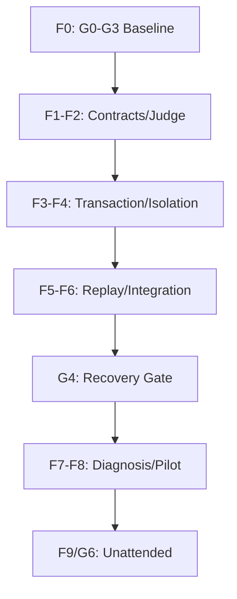
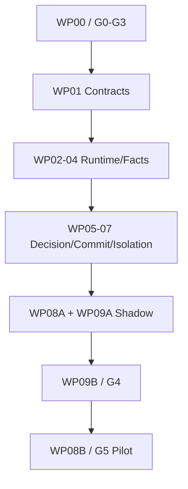

# AutoResearch MVD V3.0 完整交付执行计划 V1.1

**文档编号：** ADR24X7-MVD-DELIVERY-PLAN-V1.1  
**替代对象：** `MVD_Delivery_Plan_GL1_G3_TechLead_20260816.md`  
**唯一技术设计输入：** `ADR24X7-MVD-FINAL-V3.0`  
**上位治理输入：** `ADR24X7-SDD-CONTRACT-V0.1`、`ADR24X7-SDD-CONSTRAINTS-V0.1`、`ADR24X7-SDD-ROLES-V0.1`、`ADR24X7-SDD-GATES-QA-V0.1`  
**编制角色：** ARCH-01／Delivery Tech Lead  
**日期：** 2026-08-16  
**文档性质：** 可执行交付规划；本轮不编码  
**状态：** `READY_FOR_OWNER_AND_QA_REVIEW`  

```text
DOCUMENT=ADR24X7-MVD-DELIVERY-PLAN-V1.1
BASE_DESIGN=ADR24X7-MVD-FINAL-V3.0
PLAN_COMPLETE=YES
DESIGN_ABSORBED=YES
CURRENT_GATE=G0_EVIDENCE_CLOSURE
G0_STATUS=PARTIAL_EVIDENCE_AVAILABLE
OWNER_SIGNED=NO
CODE_WRITTEN_THIS_ROUND=NO
TEST_SPEC_DEFINED=YES
TEST_EXECUTED=NO
RUNTIME_ACL_VERIFIED=NO
IMPLEMENTED_PROFILE=NONE
IMPLEMENTATION_AUTHORIZED=NO
MAIN_WRITE_PATH_CHANGE_AUTHORIZED=NO
SINGLE_WRITER_CUTOVER_AUTHORIZED=NO
AUTO_KEEP_AUTHORIZED=NO
PILOT_AUTHORIZED=NO
UNATTENDED_24X7_AUTHORIZED=NO
PRODUCTION_READY=NO
FROZEN=NO
```

> 本计划已经把原 V1.0 评审中发现的 Gate 授权循环、P0 单点映射、QA“无依赖”误解、WP/F 阶段冲突、single-writer 回滚不足和代码基线不可复现问题全部纳入结构设计。所有未知事实显式标记为 `PENDING_G0/G1`，不得由开发 Agent 猜测。

---

## 0. 执行摘要

### 0.1 本计划的目标

本计划把 V3.0 最终架构转化为一条可由技术经理、开发角色、SEC-01 和 QA-01 共同执行的交付主链：

```text
G0 证据闭合
→ G1 合同基线
→ G2 HLD 批准
→ G3 BUILD_READY/编码授权
→ F1-F7 实现、回放、集成与恢复
→ G4 集成恢复门禁
→ G5 受控试点
→ G6 有限 24x7
```

核心原则：

- G3 以前只允许证据、合同、设计、任务、测试与权限准备，禁止编码；
- G3 通过后才允许实现新增模块和集成分支；
- G4 以前不得在真实试点运行中切换 writer；
- G5 Owner 授权后才允许单 Study 真实受控试点；
- G6 前禁止无人值守自动晋级；
- 任一阶段都不得让旧 `_machine_judge` 和新 Committer 同时写 champion。

### 0.2 Owner 决策在本计划中的安全默认

在 HUMAN_OWNER 尚未签署前，规划采用以下**不生效但可安全推进设计**的默认：

```text
OB-1=PROPOSED_APPROVAL_FOR_V3.0
FIRST_IMPLEMENTATION_PROFILE=supervised_holdout
SDD_GOVERNANCE_PACKAGE=ADR24X7-SDD-GOVERNANCE-V0.1
SDD_GOVERNANCE_DECISION=PROPOSED_APPROVAL_FOR_MVD_SCOPE

OB-2=DEFERRED
CYCLE1_PROVISIONAL_STATUS=DRAFT
CYCLE1_PROVISIONAL_EFFECTIVE=NO

OB-3=NOT_APPROVED
FALLBACK_BAR_ENABLED=NO
INSUFFICIENT_EVIDENCE_ACTION=HUMAN_REVIEW
```

在 OB-1—3 中，只有 OB-1 的正式批准是 G1 必需条件；此外仍须批准 MVD 范围的 SDD 治理包并冻结首个 Study Contract。OB-2 的 DRAFT 和 OB-3 的 disabled 都是 fail-safe 终态，不构成 Gate blocker。

### 0.3 当前真实状态

已有证据支持以下判断：

- 当前 loop 已有 execute/monitor/reflect/ledger 雏形；
- Monitor 正常路径为零 LLM；
- 当前配置未形成统一 active training time Budget Contract；
- 当前 ledger 记录实验但没有完整 candidate/champion 事务；
- 当前证据未提供可复核的 repository commit、branch、git status、dependency lock hash 和基线测试报告；
- 因此不能把项目状态写成 G1，也不能宣称“现有 288 tests”已由本计划审计确认。

当前从 `G0_EVIDENCE_CLOSURE` 开始，Tech Lead 必须先把代码基线固定下来。

---

## 1. 权威基线、冲突规则与版本状态

### 1.1 权威层级

| 层级 | 权威输入 | 本计划的处理 |
|---|---|---|
| L0 | HUMAN_OWNER Decision Record | 任何 Owner 未签署项均不得写成已批准 |
| L1 | SDD 总契约、约束、角色、Gate 0—6、Study Contract | 定义唯一授权语义和职责分离 |
| L2 | `ADR24X7-MVD-FINAL-V3.0` | 定义 MVD 架构、不变量、数据合同与实现路线 |
| L3 | 已批准 Study/Experiment Contract、Change Request | 定义单 Study 与单实验可执行范围 |
| L4 | schema、代码、policy、测试、CI | 必须实现上层基线，不得反向改写 |
| L5 | events、ledger、artifacts、QA evidence | 证明事实，不替代授权 |
| L6 | prompt、Agent memory、自述 | 仅参考，不可决定 verdict/champion |

发生冲突时 fail closed，并创建 Finding/ADR；不得由 Code Agent静默选择。

### 1.2 V3.0 吸收与废止

批准 OB-1 后：

```text
IMPLEMENTATION_DESIGN_SSOT=ADR24X7-MVD-FINAL-V3.0
V1_IMPLEMENTATION_STATUS=SUPERSEDED
V2_IMPLEMENTATION_STATUS=SUPERSEDED
V2.1_IMPLEMENTATION_STATUS=SUPERSEDED
V2.2_IMPLEMENTATION_STATUS=SUPERSEDED
```

旧设计和历史结果只用于：设计演进审计、C1—C7 replay、legacy adapter 兼容和 shadow diff 解释。

### 1.3 首期范围

```text
AUTHORIZED_FIRST_PROFILE=supervised_holdout
MAX_PARALLEL=1
HARDWARE_COHORT=fixed_per_study
PRIMARY_OBJECTIVE=single_primary_metric
HARD_CONSTRAINTS=complete_set_required
SOFT_SECONDARY=display_and_diagnostics_only
TEST_FEEDBACK_TO_ITERATIVE_LOOP=FORBIDDEN
```

cross-validation、time-series、RL、unsupervised 和 Pareto 多目标均不在首期自动晋级范围。

---

## 2. Gate 0—6 唯一授权模型

### 2.1 Gate 总表

| Gate | 名称 | 必需结论 | PASS 后允许 | 仍然禁止 |
|---|---|---|---|---|
| G0 | Evidence Closure | 当前源码、配置、依赖、测试和试点事实可复核 | 编制/修订正式 Study、HLD 和 ADR | 编码、改主写路径、运行新 MVD |
| G1 | Contract Baseline | V3.0、Study、数据/预算/评估/统计/权限合同冻结 | 完成 HLD、schema 示例、Tool Policy | 编码、writer 切换、pilot |
| G2 | HLD Approval | P0 设计闭合，职责、状态、接口和恢复无冲突 | 拆分任务、准备 CI/fixture/开发隔离环境 | 编码、真实 loop 集成 |
| G3 | Build Readiness | 任务、schema、失败测试、fixtures、权限和环境可执行 | **开始 P0 编码和集成分支建设** | 真实 champion writer 切换、pilot、24x7 |
| G4 | Integration & Recovery | F1—F7 的集成、replay/shadow、单写者演练和恢复通过 | 形成 `PASS_FOR_PILOT_CANDIDATE` | 未经 G5 Owner 决定的真实试点 |
| G5 | Controlled Pilot | 单 Study、单 cohort、单并发真实试点安全可复现 | 申请 G6 | 扩域、跨 profile、24x7 |
| G6 | Unattended 24x7 | 配额、熔断、通知、kill switch、恢复和撤销成熟 | 批准范围内有限无人值守 | 超范围运行、生产就绪宣称 |

### 2.2 授权变量

| 状态变量 | 何时可置为 YES | 批准角色 |
|---|---|---|
| `OWNER_APPROVED_V3` | OB-1 签署 | HUMAN_OWNER |
| `IMPLEMENTATION_AUTHORIZED` | G3 PASS | MAIN-00＋ARCH-01＋QA-01；依据 Owner 已批准基线 |
| `SOURCE_MERGE_AUTHORIZED` | G4 集成分支测试和 QA 通过 | MAIN-00＋QA-01 |
| `PILOT_WRITER_CUTOVER_AUTHORIZED` | G5 Start Decision | HUMAN_OWNER＋QA-01＋SEC-01 |
| `AUTO_KEEP_AUTHORIZED` | G5 Start Decision 且仅限批准 Study | HUMAN_OWNER |
| `UNATTENDED_24X7_AUTHORIZED` | G6 PASS | HUMAN_OWNER＋QA-01＋SEC-01 |
| `PRODUCTION_READY` | 另行生产门禁 | 不在本计划范围 |

### 2.3 Gate 不允许的语义混用

- `G3 BUILD_READY` 是编码开始门槛，不是“代码已经完成”的门槛；
- G3 输入是已批准设计、版本化 schema、测试计划/fixtures、任务和可执行 Tool Policy；
- 代码、运行测试、replay/shadow 和恢复证据在 G3 之后产生，并由 G4 审核；
- “修改源码”与“在真实试点中切换 writer”是不同授权；
- G4 集成环境允许验证新 writer，但不允许把它当成真实 pilot writer；
- Gate 通过不自动产生下一 Gate 的 Owner 授权。

---

## 3. F0—F9 实施阶段与 Gate Crosswalk

| 阶段 | 主要工作 | 代码动作 | 退出条件 | 对应 Gate |
|---|---|---:|---|---|
| F0 | 证据闭合、Owner/合同/HLD/任务/测试与权限准备 | 否 | G0、G1、G2、G3 依次 PASS | G0—G3 |
| F1 | Strict Contracts | 是 | schema/JSON rejection、pyright strict 全绿 | G4 输入 |
| F2 | Facts/Gates/Router/Comparison/Judge | 是 | unit/property/golden 全绿 | G4 输入 |
| F3 | Worktree/Artifact/Ledger/Committer | 是 | fault injection、CAS、idempotency 全绿 | G4 输入 |
| F4 | selection/test 物理与权限隔离、typed views | 是 | ACL denial、noninterference 全绿 | G4 输入 |
| F5 | C1—C7 replay、shadow、diff 归因 | 是 | shadow 无写权；差异 100% 归因 | G4 输入 |
| F6 | 集成环境 single-writer、legacy adapter、runback 演练 | 是 | fencing/drain/reconcile 恢复通过 | G4 PASS |
| F7 | 诊断/Advice/Memory 分层与校准 | 是 | 不改 verdict、不读 test、版本传播通过 | G5 Start 输入 |
| F8 | 单 Study 受控 pilot | 受控运行 | KEEP/DISCARD/失败/恢复真实证据 | G5 PASS |
| F9 | 配额、熔断、通知、kill switch、保留与撤销 | 是＋演练 | SEC/QA/Owner 全部通过 | G6 PASS |

### 3.1 高层关键路径



---

## 4. G0 证据闭合计划

### 4.1 已有证据

| Evidence ID | 已有材料 | 当前可支持结论 |
|---|---|---|
| EVD-G0-001 | `handover_autoresearch_analysis.md` | 对比结论与原始证据索引 |
| EVD-G0-002 | `current_config_no_time_budget.yaml` | 抽取配置未见固定 active-time Budget Contract |
| EVD-G0-003 | `current_loop_execute_reflect.py` | execute/monitor/reflect 现状，reflect 只写建议/记忆 |
| EVD-G0-004 | `current_loop_ledger.py` | ledger 雏形无完整 champion 事务 |
| EVD-G0-005 | `ar_train_time_budget.py` | autoresearch active time 预算参考 |
| EVD-G0-006 | `ar_prepare_bpb.py` | BPB evaluator 参考 |
| EVD-G0-007 | `ar_program_md.md` | Git 闭环、simplicity 和修改边界参考 |

以上是抽取证据，不等于完整仓库基线。

### 4.2 G0 必须新增的证据

| Evidence ID | Owner | 必须记录 | 计划证据位置 |
|---|---|---|---|
| EVD-G0-010 | MAIN-00 | repo identity、absolute path、remote、branch、HEAD SHA、tag | `evidence/mvd/g0/repository-baseline.json` |
| EVD-G0-011 | MAIN-00 | `git status --porcelain=v1`、用户未提交修改清单及 hash | `evidence/mvd/g0/worktree-baseline.txt` |
| EVD-G0-012 | SEC-01 | dependency manifest/lockfile SHA、Python/runtime 版本 | `evidence/mvd/g0/dependency-baseline.json` |
| EVD-G0-013 | QA-01 | 全量测试命令、收集数、pass/fail/skip、duration | `evidence/mvd/g0/test-baseline.json` |
| EVD-G0-014 | ARCH-01 | `core/loop.py`、runner、monitor、ledger、git_vcs、config loader 完整版本 | `evidence/mvd/g0/source-index.json` |
| EVD-G0-015 | ARCH-01 | 全仓 time/budget/git/reset/test/evaluator/champion 检索命令和原始输出 | `evidence/mvd/g0/repository-search.log` |
| EVD-G0-016 | DEV-EVAL-01 | selection/test 数据、evaluator、metric 输出和可见性链路 | `evidence/mvd/g0/evaluation-flow.md` |
| EVD-G0-017 | DEV-RUN-01 | local/ssh/slurm 终态、clock、timeout 和 process-tree 行为 | `evidence/mvd/g0/runner-flow.md` |
| EVD-G0-018 | DEV-VCS-01 | current branch/worktree/artifact/ledger mutation map | `evidence/mvd/g0/mutation-map.md` |
| EVD-G0-019 | MAIN-00 | C1—C7 immutable fixture inventory 和 cut-off | `evidence/mvd/g0/replay-fixture-manifest.json` |
| EVD-G0-020 | QA-01 | G0 独立报告 | `evidence/mvd/g0/QA-G0-report.md` |

### 4.3 G0 退出条件

```text
REPOSITORY_BASE_COMMIT=<40_HEX_SHA>
WORKTREE_USER_CHANGES_PROTECTED=YES
DEPENDENCY_LOCK_HASH=<SHA256>
BASELINE_TEST_RESULT=<PASS|KNOWN_FAILURES_BASELINED>
CURRENT_CODE_FACTS=<CONFIRMED|REFUTED|UNKNOWN_PER_ITEM>
REPLAY_FIXTURE_CUTOFF=<ISO8601>
QA_G0=<PASS>
```

任何值为空、使用浮动行号却无 commit，或把 UNKNOWN 写成 CONFIRMED，G0 不得通过。

---

## 5. 目标代码与制品布局

```text
core/mvd/
  contracts/{base,enums,models,registry}.py
  contracts/schemas/
  facts/{builder,provenance}.py
  gates/{integrity,eligibility,execution,artifact,metric,constraints}.py
  decision/{champion_router,baseline_policy,comparison,decision_bar,promotion_judge}.py
  commit/{promotion_committer,optimistic_lock}.py
  diagnostics/{engine,detectors/}.py
  advice/{policy,adapters/}.py
  publish/{views,memory_writer}.py
  events/{ledger,schemas/}.py
  migration/{legacy_adapter,replay,shadow,cutover}.py

specs/mvd/
  contracts/
  schemas/
  policies/
  adr/
  traceability/

tests/mvd/
  contract/
  unit/
  property/
  fault/
  security/
  migration/
  e2e/

tests/qa/mvd/
  gate0/ ... gate6/

evidence/mvd/
  g0/ ... g6/
```

现有 `core/loop.py`、`core/execution.py`、`core/git_vcs.py` 只有在 G3 后的集成分支中才能改动。`_machine_judge` 最终只保留 orchestration/compat adapter，不保留 outcome、bar、baseline 或 champion mutation 业务分支。

---

## 6. 工作包总览、Owner 与依赖

| WP | Accountable | Responsible | 主要范围 | 关键依赖 | Gate 证据 |
|---|---|---|---|---|---|
| WP-00 Evidence/Baseline | MAIN-00 | ARCH/DEV/SEC/QA | G0 代码与事实基线 | 无 | G0 |
| WP-01 Contract Runtime | ARCH-01 | DEV-CORE-01 | strict models、schema、registry、policy bundle | G3 PASS 后开工 | G4 |
| WP-02 Runner/Budget | ARCH-01 | DEV-RUN-01 | ExecutionResult、active time、hard timeout、timings | WP-01 interface | G4 |
| WP-03 Evaluation/Stats | ARCH-01 | DEV-EVAL-01 | metric identity、paired delta、uncertainty、bar、constraints | WP-01 | G4 |
| WP-04 Workspace/Artifact | ARCH-01 | DEV-VCS-01 | worktree、protected refs、atomic manifest | WP-01 | G4 |
| WP-05 Decision | ARCH-01 | DEV-CORE-01＋DEV-EVAL-01 | router、baseline、comparison、Judge | WP-01—04 | G4 |
| WP-06 Commit/Ledger | ARCH-01 | DEV-VCS-01＋DEV-CORE-01 | Committer、CAS、idempotency、append-only ledger | WP-04/05 | G4 |
| WP-07 Isolation/Security | SEC-01 | DEV-EVAL-01＋DEV-CORE-01 | namespace、principal、ACL、no-mount、typed DTO | WP-01；跨切面 | G4 |
| WP-08A Diagnostic Boundary | ARCH-01 | DEV-CORE-01 | finding/advice/memory schema、no-write/no-test views | WP-01/05/07 | G4 |
| WP-08B Calibrated Diagnostics | ARCH-01 | DEV-OBS-01＋DEV-EVAL-01 | detector、evidence strength、AdvicePolicy、memory governance | G4 core ready | G5 |
| WP-09A Replay/Shadow | ARCH-01 | DEV-CORE-01＋DEV-VCS-01 | C1—C7 replay、shadow diff，无写权 | WP-01—08A | G4 |
| WP-09B Integration/Cutover | ARCH-01 | DEV-VCS-01＋DEV-CORE-01 | integration writer、legacy adapter、fencing/runback | WP-09A | G4 |
| WP-09C Retirement | MAIN-00 | DEV-CORE-01＋DEV-VCS-01 | 删除旧业务分支、adapter 到期 | G5 稳定期 | G5/G6 |
| WP-10 Independent QA | QA-01 | QA-01 | QA-G0—G6 独立门禁 | 依赖每 Gate 输入，但独立签署 | 全程 |

### 6.1 依赖图



WP-10 在每个 Gate 对相应输入进行独立审查。独立性指 QA-01 不担任被审实现的主要作者、不接受开发自证、不与开发共享签署权限；不代表它不读取 WP 产物。

---

## 7. MVD-P0-001—020 一对多闭合矩阵

> `实现 WP` 负责产生功能；`强制/迁移 WP` 负责运行时权限、唯一写者或旧路径消除。只有所有列的证据都存在，P0 才能关闭。

| P0 | 不变量摘要 | 实现 WP | 强制/迁移 WP | 精确测试 ID | 失败关闭结果 | 证据包 |
|---|---|---|---|---|---|---|
| 001 | 仅 Judge 产生 FinalDecision | WP-01/05 | WP-07/09B/09C | CTR-010、JDG-013、SEC-007、MIG-006 | BLOCKED | `evidence/mvd/g4/p0/MVD-P0-001.json` |
| 002 | 仅 Committer 写 champion/transaction | WP-06 | WP-07/09B/09C | COM-001/002、SEC-006、MIG-007 | COMMIT_BLOCKED | `evidence/mvd/g4/p0/MVD-P0-002.json` |
| 003 | KEEP 仅 formal＋全门禁＋IMPROVED | WP-01/02/03/04/05 | WP-07/09A | JDG-001—005、PROP-001/002、E2E-001 | 非 KEEP | `evidence/mvd/g4/p0/MVD-P0-003.json` |
| 004 | 失败/取消/超预算永不 KEEP | WP-02/05 | WP-09A | RUN-001—004、JDG-010/014、PROP-003 | DISCARD | `evidence/mvd/g4/p0/MVD-P0-004.json` |
| 005 | 无 champion 不构 comparison | WP-05 | WP-09A | BSL-001/002、JDG-015、PROP-004 | BASELINE_REQUIRED/ESTABLISHED | `evidence/mvd/g4/p0/MVD-P0-005.json` |
| 006 | direction 只归一一次 | WP-03/05 | WP-09A | EVL-001/002、PROP-005、MIG-003 | BLOCKED | `evidence/mvd/g4/p0/MVD-P0-006.json` |
| 007 | 0/负值合法；缺失不占位 | WP-01/03 | WP-09A | CTR-003/004、EVL-003/004、JDG-016 | DISCARD/BLOCKED | `evidence/mvd/g4/p0/MVD-P0-007.json` |
| 008 | identity 不同不得排序 | WP-03/05 | WP-09A | EVL-005—008、JDG-008 | INCOMPARABLE | `evidence/mvd/g4/p0/MVD-P0-008.json` |
| 009 | hard constraint 完整且全 PASS | WP-01/03/05 | WP-09A | CTR-007/008、EVL-009/010、JDG-009 | BLOCKED/DISCARD_CONSTRAINT | `evidence/mvd/g4/p0/MVD-P0-009.json` |
| 010 | manifest 原子完成后才判定 | WP-04/05 | WP-06/09B | ART-001—004、FAULT-001/002 | BLOCKED/ARCHIVE_FAILED | `evidence/mvd/g4/p0/MVD-P0-010.json` |
| 011 | test 不进入 iterative 任何输出 | WP-07 | WP-08A/08B/09B | SEC-001—005、PROP-006、E2E-010 | BLOCKED/QUARANTINED | `evidence/mvd/g4/p0/MVD-P0-011.json` |
| 012 | provisional 仅 exact APPROVED | WP-01/05 | WP-06/09A | CTR-009、BSL-002—004 | BASELINE_REQUIRED | `evidence/mvd/g4/p0/MVD-P0-012.json` |
| 013 | provisional 不作为自动 KEEP 基准 | WP-05 | WP-09A | BSL-005/006、PROP-007 | BASELINE_REQUIRED/ESTABLISHED | `evidence/mvd/g4/p0/MVD-P0-013.json` |
| 014 | uncertainty 不足且无 fallback→HR | WP-03/05 | WP-09A | EVL-011/012、JDG-006/007、PROP-008 | HUMAN_REVIEW | `evidence/mvd/g4/p0/MVD-P0-014.json` |
| 015 | 非法 policy/schema/enum→BLOCKED | WP-01/05 | WP-09B | CTR-001/002/005/006/011/012、MIG-008 | BLOCKED | `evidence/mvd/g4/p0/MVD-P0-015.json` |
| 016 | diagnostics/advice 不改历史 verdict | WP-08A/08B | WP-06/07/09B | DIA-001—005、PROP-009 | 权限拒绝/历史不变 | `evidence/mvd/g4/p0/MVD-P0-016.json` |
| 017 | 非 mutation verdict 不改 champion | WP-05/06 | WP-07/09B | COM-003/004、PROP-010、E2E-002—007 | NOOP | `evidence/mvd/g4/p0/MVD-P0-017.json` |
| 018 | parent SHA 过期→STALE | WP-05/06 | WP-09B | COM-005/006、FAULT-006、E2E-008 | STALE_CANDIDATE | `evidence/mvd/g4/p0/MVD-P0-018.json` |
| 019 | protected actors/paths 不可修改 | WP-07 | WP-04/09B | SEC-006—010、E2E-010 | BLOCKED/QUARANTINED | `evidence/mvd/g4/p0/MVD-P0-019.json` |
| 020 | 状态可解释、重放、恢复 | WP-04/06 | WP-09A/09B | COM-007—010、FAULT-001—010、E2E-009 | RECOVERY_REQUIRED | `evidence/mvd/g4/p0/MVD-P0-020.json` |

### 7.1 P0 证据 JSON 的最低字段

```text
p0_id
design_clauses[]
spec_ids[]
base_commit_sha
implementation_commits[]
enforcing_components[]
service_principals[]
test_results[{test_id,status,report_sha256}]
negative_or_fault_result
code_review_refs[]
qa_finding_refs[]
qa_status
residual_risk
gate_id
```

代码路径不是证据；代码提交、测试结果、配置/ACL 审计和 QA 签署的可校验组合才是证据。

---

## 8. 工作包详细契约

### 8.1 WP-00｜Evidence/Baseline

- **A/R：** MAIN-00；ARCH-01、SEC-01、QA-01 各自提供责任域证据。
- **输入：** 当前仓库、既有 evidence 包、C1—C7 运行制品。
- **输出：** §4 的 EVD-G0-010—020、现状差距矩阵、fixture manifest。
- **禁止：** 修改源代码或把未确认行号当成固定事实。
- **退出：** QA-G0 PASS。
- **回滚：** 证据只追加新版本；发现错误以 superseding record 纠正，不改写旧证据。

### 8.2 WP-01｜Contract Runtime

- **A：** ARCH-01；**R：** DEV-CORE-01。
- **输入：** V3.0 §5/6/15、批准 Study/HLD/ADR。
- **输出：** Pydantic v2 strict/frozen base、Enum、discriminated unions、JSON Schema、Registry、PolicyBundle、version/hash rules。
- **代码：** `core/mvd/contracts/`；**规格：** `specs/mvd/contracts/`、`specs/mvd/schemas/`。
- **测试：** CTR-001—012；pyright strict；禁止 `model_construct()` 静态扫描。
- **证据：** `evidence/mvd/g4/wp01/` 下 schema diff、rejection report、typecheck report。
- **依赖：** G3 PASS；Pydantic/pyright/lockfile 已批准。
- **退出：** 所有非法构造/JSON/未知 variant fail closed；每个 schema/version 可追踪。
- **回滚：** G4 前为独立模块；schema 一旦持久化只允许兼容 reader 或显式迁移，不可简单删除依赖。

### 8.3 WP-02｜Runner/Budget

- **A：** ARCH-01；**R：** DEV-RUN-01。
- **输入：** ExecutionResult、Budget Contract、backend 接口。
- **输出：** active training monotonic timer、hard wall timeout、process-tree kill、结构化 terminal event、分项 timings。
- **代码：** 新增 `core/mvd/gates/execution.py`；受控扩展 `core/execution.py` 和 backend adapters。
- **测试：** RUN-001—008、FAULT-003。
- **证据：** `evidence/mvd/g4/wp02/runner-contract-report.json` 及 backend traces。
- **退出：** BUDGET_REACHED、EARLY_STOP、HARD_TIMEOUT、BUDGET_EXCEEDED、OOM、CRASH、CANCELLED 无非法组合。
- **回滚：** 旧 `contract_status` 只经版本化 adapter 读取；不得在异常时回退为日志关键词猜测。

### 8.4 WP-03｜Evaluation/Statistics/Constraints

- **A：** ARCH-01；**R：** DEV-EVAL-01。
- **输入：** Study metric/statistics/constraints、selection evaluator、profile registry。
- **输出：** MetricObservation、identity/comparability、Candidate/Champion metric states、paired delta、UncertaintyEstimate、BarResolution、ConstraintEvaluation。
- **代码：** `core/mvd/gates/{metric,constraints}.py`、`core/mvd/decision/{comparison,decision_bar}.py`。
- **测试：** EVL-001—012、PROP-005/008。
- **退出：** direction 仅在 ComparisonBuilder 归一一次；0/负值有效；missing 非 0；identity 与 constraint complete 精确校验。
- **回滚：** policy 以 bundle hash 固定；旧运行按原 policy replay，不能套最新阈值。

### 8.5 WP-04｜Workspace/Artifact

- **A：** ARCH-01；**R：** DEV-VCS-01；**C：** SEC-01。
- **输入：** champion/candidate Git 策略、allowlist、protected paths、artifact policy。
- **输出：** 独立 worktree、candidate commit、protected refs、atomic finalized manifest、retention refs。
- **代码：** `core/mvd/commit/` artifact 部分；受控扩展 `core/git_vcs.py`。
- **测试：** ART-001—008、VCS/dirty-tree 场景、FAULT-001/002。
- **退出：** dirty user changes hash 不变；半写 manifest 不可见；大制品不进 Git。
- **回滚：** 候选 worktree 可回收，但 candidate SHA/patch、manifest、ledger 必须先保留。

### 8.6 WP-05｜Decision

- **A：** ARCH-01；**R：** DEV-CORE-01；**C：** DEV-EVAL-01。
- **输入：** validated facts、gates、ChampionState、PolicyBundle。
- **输出：** ChampionRouter、BaselinePolicy、PromotionJudge 纯函数、FinalDecision。
- **代码：** `core/mvd/decision/{champion_router,baseline_policy,promotion_judge}.py`。
- **测试：** BSL-001—006、JDG-001—016、PROP-001—005/007/008。
- **退出：** 所有合法 union variants 穷尽；无自由 bool 资格；不存在“或”；Judge 不做 I/O。
- **回滚：** G4 前不接真实 loop；异常只返回 BLOCKED/INCOMPARABLE/HUMAN_REVIEW 等受控结果，不调用旧 Judge 兜底。

### 8.7 WP-06｜Commit/Ledger

- **A：** ARCH-01；**R：** DEV-VCS-01＋DEV-CORE-01。
- **输入：** immutable FinalDecision、candidate/champion refs、manifest、fencing epoch。
- **输出：** PromotionCommitter、CAS、idempotency、PromotionResult、append-only transaction ledger、recovery。
- **代码：** `core/mvd/commit/{promotion_committer,optimistic_lock}.py`、`core/mvd/events/`。
- **测试：** COM-001—010、FAULT-004—008。
- **退出：** 只有 Committer principal 能写；重复 key 返回原结果；CAS/event 各崩溃点唯一恢复。
- **回滚：** champion ref 以新事务恢复至已验证 SHA；ledger 追加 compensating/revocation event，严禁删除历史。

### 8.8 WP-07｜Isolation/Security

- **A：** SEC-01；**R：** DEV-EVAL-01＋DEV-CORE-01。
- **输入：** V3.0 两平面、Tool Policy、Protected Paths、credential plan。
- **输出：** selection/final-test 独立 DTO、namespace、principal、ACL、topic/table/object prefix、no-mount、access audit。
- **测试：** SEC-001—010、PROP-006、E2E-010。
- **退出：** 只变 test 时 iterative 全输出字节/语义不变；Access Audit 不可用即 fail closed。
- **回滚：** 不允许降级为 prompt/filter 隔离；若基础设施失败，暂停运行而不是合并 namespace。

### 8.9 WP-08A｜Diagnostic Boundary

- **A：** ARCH-01；**R：** DEV-CORE-01。
- **输入：** FinalDecision/PromotionResult、selection facts、view 权限。
- **输出：** DiagnosticFinding、ActionRecommendation、MemoryEvent、typed views、no-op detector adapter。
- **测试：** DIA-001—005、PROP-009。
- **退出：** diagnosis/advice/memory 不能调用 Judge/Committer，不能读取 test，policy 变化不改历史 decision。
- **回滚：** 可关闭发布和 memory 写入；不影响 Judge/Committer 事务。

### 8.10 WP-08B｜Calibrated Diagnostics/Advice

- **A：** ARCH-01；**R：** DEV-OBS-01＋DEV-EVAL-01。
- **输入：** profile-specific calibration/replay、detector registry、AdvicePolicy。
- **输出：** 首期 detector、fact reliability、diagnostic evidence strength、risk-gated advice、memory invalidation/supersession。
- **测试：** DIA-006—010、replay calibration、false-positive/false-negative report。
- **退出：** HIGH evidence 具备 profile 校准证据；未校准 detector=UNAVAILABLE/LOW；Advice 只输出 action code。
- **回滚：** 按 detector/advice policy version 关闭或 supersede，不追溯改 verdict。

### 8.11 WP-09A｜Replay/Shadow

- **A：** ARCH-01；**R：** DEV-CORE-01＋DEV-VCS-01。
- **输入：** immutable C1—C7 bundle、历史 ledger、旧 Judge 输出、新 Judge。
- **输出：** replay report、shadow decisions、diff taxonomy、input/policy hashes。
- **测试：** MIG-001—005、真实 C1—C4 golden、扩展 C5—C7。
- **退出：** shadow principal 无 decision/champion 写权；所有差异有 reason code；未解释差异=BLOCKER。
- **回滚：** 关闭 shadow consumer；不影响旧唯一 writer。

### 8.12 WP-09B｜Integration/Cutover

- **A：** ARCH-01；**R：** DEV-VCS-01＋DEV-CORE-01；**C：** SEC-01。
- **输入：** WP-09A PASS、runbook、fencing token、drain/reconcile 方案。
- **输出：** integration harness single writer、legacy adapter、writer switch/runback、probe/reconcile evidence。
- **测试：** MIG-006—010、FAULT-009/010、E2E-001—010。
- **退出：** 集成环境永不双写；旧函数只转译；writer/runback 演练通过；G4 QA PASS。
- **回滚：** §15 runback；禁止只靠普通 feature flag 切换凭证/写权。

### 8.13 WP-09C｜Legacy Retirement

- **A：** MAIN-00；**R：** DEV-CORE-01＋DEV-VCS-01。
- **输入：** G5 稳定期、无 legacy caller、compat usage report。
- **输出：** 删除旧业务分支、adapter deprecation/removal、CI banned-pattern rule。
- **测试：** MIG-011/012、调用方 inventory、backward-compat negative test。
- **退出：** `_machine_judge` 无 delta/bar/baseline/promotion 业务逻辑；旧 writer credential 已撤销。
- **回滚：** 只能恢复 adapter 签名，不恢复第二套 writer；必要时进入 Change Request。

### 8.14 WP-10｜Independent QA

- **A/R：** QA-01。
- **分段输出：** QA-G0、QA-G1、QA-G2、QA-G3、QA-G4、QA-G5、QA-G6。
- **输入依赖：** 对应 Gate 的合同、代码、配置、测试、运行和安全证据。
- **独立性：** 不作为 WP-01—09 主要作者；使用独立 fixtures/negative cases；不接受 DEV_SELF_CHECK 代替 QA。
- **退出：** 无开放 BLOCKER；影响 P0 的 MAJOR=0；每 Gate 使用规范状态头签署。

---

## 9. 精确测试目录与预期结果

本节表内采用短写 `CTR-001`、`JDG-001` 等；持久化、代码标记、报告和证据中的**规范 Test ID** 必须加 `MVD-` 前缀，例如 `MVD-CTR-001`、`MVD-JDG-001`。范围表达为闭区间，不能用“JDG 系列”等无法枚举的名称替代。

### 9.1 Contract Rejection｜MVD-CTR

| ID | 场景 | 唯一预期 |
|---|---|---|
| CTR-001 | unknown schema/enum/direction | construction/parse rejected；BLOCKED |
| CTR-002 | execution status 与 termination reason 非法组合 | rejected |
| CTR-003 | `MISSING + value=0` | rejected |
| CTR-004 | `OBSERVED + value=0/negative finite` | accepted |
| CTR-005 | Decision 与 transition/champion_after 矛盾 | rejected |
| CTR-006 | policy bundle hash/effective time 不匹配 | BLOCKED |
| CTR-007 | hard constraint missing/extra | IncompleteConstraintSet |
| CTR-008 | duplicate constraint ID/unit mismatch | IncompleteConstraintSet |
| CTR-009 | Owner record DRAFT/expired/scope/facts hash 不匹配 | not ApprovedAuthorization |
| CTR-010 | 非 Judge producer 构造外部 FinalDecision | signature/principal rejected |
| CTR-011 | unsupported profile 或 forbidden capability | BLOCKED at contract |
| CTR-012 | `model_construct()`/extra field/非 strict coercion | CI/runtime rejected |

### 9.2 Runner/Budget｜MVD-RUN

| ID | 场景 | 唯一预期 |
|---|---|---|
| RUN-001 | adapter 达到 active budget 并完成 finalization | Completed/BUDGET_REACHED |
| RUN-002 | 进程拒绝退出并超过 hard limit | Failed/HARD_TIMEOUT；进程树终止 |
| RUN-003 | 资源超约束 | Failed/BUDGET_EXCEEDED 或对应结构化失败 |
| RUN-004 | OOM/CRASH/CANCELLED 有残留 improved metric | 永不 KEEP |
| RUN-005 | 系统墙钟跳变 | monotonic active time 不倒退 |
| RUN-006 | 改变 monitor poll interval | budget 不变，仅发现延迟变化 |
| RUN-007 | queue/setup/compile/warmup/eval | 分项记录，不错误计入 active budget |
| RUN-008 | local/SSH/Slurm 相同 terminal reason | 统一 ExecutionResult 语义 |

### 9.3 Evaluation/Statistics/Constraints｜MVD-EVL

| ID | 场景 | 唯一预期 |
|---|---|---|
| EVL-001 | minimize cand 1.0128/champ 1.1466 | normalized delta=+0.1338 |
| EVL-002 | maximize cand 0.82/champ 0.70 | normalized delta=+0.12 |
| EVL-003 | OBSERVED value=0 | valid |
| EVL-004 | negative finite metric | valid |
| EVL-005 | evaluator/dataset/preprocess hash mismatch | INCOMPARABLE |
| EVL-006 | metric/unit/direction mismatch | INCOMPARABLE 或 policy invalid |
| EVL-007 | wrong split/checkpoint/selection policy | candidate invalid/incomparable |
| EVL-008 | hardware cohort/seed pair mismatch | INCOMPARABLE/insufficient evidence |
| EVL-009 | hard all PASS 且 ID set exact | CompleteConstraintSet |
| EVL-010 | hard NOT_EVALUATED/VIOLATED | BLOCKED/DISCARD_CONSTRAINT |
| EVL-011 | repeats 达标、paired SE 可计算 | BarReady positive finite |
| EVL-012 | repeats 不足、无 fallback / policy NaN | InsufficientEvidence / PolicyInvalid |

### 9.4 Baseline Policy｜MVD-BSL

| ID | 场景 | 唯一预期 |
|---|---|---|
| BSL-001 | absent＋COMPLETED＋CompleteValid | BASELINE_ESTABLISHED；不构 comparison |
| BSL-002 | absent＋HARD_TIMEOUT＋PartialValid＋DRAFT | BASELINE_REQUIRED；NO_CHANGE |
| BSL-003 | 同上＋exact APPROVED | PROVISIONAL_BASELINE_ESTABLISHED |
| BSL-004 | APPROVED 但 scope/hash/expiry 错 | BASELINE_REQUIRED |
| BSL-005 | provisional＋下一完整合法 run | SET_FORMAL_BASELINE |
| BSL-006 | provisional＋另一个 partial/failed run | BASELINE_REQUIRED；不替换 provisional |

### 9.5 PromotionJudge｜MVD-JDG

| ID | 场景 | 唯一预期 |
|---|---|---|
| JDG-001 | normalized delta > +bar | IMPROVED→KEEP（全门禁通过） |
| JDG-002 | normalized delta = +bar | IMPROVED |
| JDG-003 | normalized delta = -bar | REGRESSION |
| JDG-004 | normalized delta < -bar | REGRESSION→DISCARD |
| JDG-005 | `-bar < delta < +bar` | EQUIVALENT_OR_INCONCLUSIVE |
| JDG-006 | bar=0/negative/NaN/Inf | BLOCKED |
| JDG-007 | InsufficientEvidence 无 fallback | HUMAN_REVIEW |
| JDG-008 | identity/cohort 不可交换 | INCOMPARABLE |
| JDG-009 | hard incomplete/not-evaluated/violated | BLOCKED 或 DISCARD_CONSTRAINT |
| JDG-010 | Failed/Cancelled＋残留改善指标 | DISCARD |
| JDG-011 | test/protected/security violation | BLOCKED＋QUARANTINED |
| JDG-012 | EQUIVALENT＋显著简化 | HUMAN_REVIEW；不自动 KEEP |
| JDG-013 | 非 Judge producer 请求 decision | rejected |
| JDG-014 | BUDGET_EXCEEDED/OOM/CRASH/HARD_TIMEOUT | 永不 KEEP |
| JDG-015 | ChampionAbsent 路径 | Comparator invocation count=0 |
| JDG-016 | missing/non-finite/parse error | DISCARD；0/负值不误判 missing |

### 9.6 Commit/Ledger｜MVD-COM

| ID | 场景 | 唯一预期 |
|---|---|---|
| COM-001 | Committer principal＋valid mutation decision | 可进入 CAS |
| COM-002 | 其他 principal/组件调用 champion mutation | denied |
| COM-003 | DISCARD/BLOCKED/INCOMPARABLE/HR | NOOP；champion 不变 |
| COM-004 | BASELINE_REQUIRED/STALE | NOOP |
| COM-005 | expected parent != current champion | STALE_CANDIDATE |
| COM-006 | candidate/manifest/policy 在提交前变化 | COMMIT_BLOCKED |
| COM-007 | duplicate idempotency key | 返回原 PromotionResult |
| COM-008 | ledger event 写前/后崩溃 | 恢复唯一结果 |
| COM-009 | CAS 前/后崩溃 | 不重复更新，恢复 result |
| COM-010 | ledger/ref 不一致 | RECOVERY_REQUIRED；暂停新 promotion |

### 9.7 Artifact/Workspace｜MVD-ART

| ID | 场景 | 唯一预期 |
|---|---|---|
| ART-001 | manifest INCOMPLETE | 不得进入 Judge |
| ART-002 | temp write 崩溃 | 半成品不可见 |
| ART-003 | hash/required artifact 错 | BLOCKED/ARCHIVE_FAILED |
| ART-004 | finalized manifest | fsync＋atomic rename＋self hash 可验证 |
| ART-005 | dirty shared tree | 用户修改 hash 不变、候选仍隔离 |
| ART-006 | shared reset/clean/force push | tool policy denied |
| ART-007 | checkpoint/log 进入 Git | commit denied |
| ART-008 | 清理失败候选前缺 patch/manifest/ledger | cleanup denied |

### 9.8 Isolation/Security｜MVD-SEC

| ID | 场景 | 唯一预期 |
|---|---|---|
| SEC-001 | Leader/Code/Reflect 请求 test | ACL denied＋security event |
| SEC-002 | test envelope 注入 selection builder | schema/namespace rejected |
| SEC-003 | 仅改变 test facts | iterative decision/diagnosis/advice/memory/views 不变 |
| SEC-004 | test mount/topic/table 对 iterative principal | 不可见 |
| SEC-005 | access audit 不可用 | fail closed |
| SEC-006 | Code/Reflect/Evaluator 调 Committer | denied |
| SEC-007 | Publisher/legacy adapter 伪造 FinalDecision | denied |
| SEC-008 | protected path/test oracle/evaluator 变更 | QUARANTINED |
| SEC-009 | dependency/network/credential 越权 | denied＋finding |
| SEC-010 | fake secret/credential 提交 | secret scan blocked |

### 9.9 Diagnostics/Advice/Memory｜MVD-DIA

| ID | 场景 | 唯一预期 |
|---|---|---|
| DIA-001 | DiagnosticEngine 尝试改 decision | type/ACL denied |
| DIA-002 | AdvicePolicy 尝试调用 Committer | denied |
| DIA-003 | detector/advice policy 升级 | 历史 FinalDecision hash 不变 |
| DIA-004 | test facts 改变 | findings/advice/memory 不变 |
| DIA-005 | provisional revoked | 相关 hypothesis/memory invalidated；正式 baseline 不变 |
| DIA-006 | 无 profile calibration | evidence strength 不得 HIGH |
| DIA-007 | HIGH_VARIANCE 单次运行 | UNAVAILABLE |
| DIA-008 | OVERFIT 不具可比 train/validation | NOT_APPLICABLE/UNAVAILABLE |
| DIA-009 | risk action 涉及 protected scope | Change Request/HUMAN_REVIEW |
| DIA-010 | dead end 多参数变化 | 不拆成单参数因果结论 |

### 9.10 Migration/E2E/Fault/Property

#### Migration｜MVD-MIG

| ID | 场景 | 唯一预期 |
|---|---|---|
| MIG-001 | C1 DRAFT replay | BASELINE_REQUIRED；champion 不变 |
| MIG-002 | C2 complete replay | BASELINE_ESTABLISHED；target SHA 与历史有效 champion 一致 |
| MIG-003 | C3/C4 minimize fixture | 方向、delta、bar、decision 与 golden 一致 |
| MIG-004 | C5—C7＋maximize/best-vs-last 扩展 fixture | 按 frozen input/policy 唯一重放 |
| MIG-005 | legacy/new shadow diff | 100% 分类；UNEXPLAINED=0 |
| MIG-006 | legacy adapter | 只转译；不算 delta/bar、不构 decision、不写 champion |
| MIG-007 | 新旧 writer credential | 任一时刻仅一个可写 |
| MIG-008 | 新路径 schema/policy invalid | BLOCKED；不得回退旧 Judge 猜测 |
| MIG-009 | writer fencing/drain/probe/reconcile | single-writer proof |
| MIG-010 | runback | 新 epoch、状态一致、无历史改写 |
| MIG-011 | legacy caller inventory | 所有 caller 有迁移状态和 owner |
| MIG-012 | retirement banned pattern | CI 阻断旧业务分支复活 |

#### End-to-End｜MVD-E2E

| ID | 场景 | 唯一预期 |
|---|---|---|
| E2E-001 | formal＋completed＋comparable＋improved | KEEP→APPLIED |
| E2E-002 | formal＋regression | DISCARD→NOOP |
| E2E-003 | crash/OOM＋残留 metric | DISCARD→NOOP |
| E2E-004 | HARD_TIMEOUT＋partial＋C1 DRAFT | BASELINE_REQUIRED→NOOP |
| E2E-005 | identity/cohort mismatch | INCOMPARABLE→NOOP |
| E2E-006 | insufficient evidence | HUMAN_REVIEW→NOOP |
| E2E-007 | hard violated/incomplete | DISCARD_CONSTRAINT/BLOCKED→NOOP |
| E2E-008 | parent race | STALE_CANDIDATE→NOOP |
| E2E-009 | artifact/ledger/CAS interruption | 唯一恢复、可 replay |
| E2E-010 | test/protected access attempt | BLOCKED＋QUARANTINED；iterative outputs invalidated |

#### Fault Injection｜MVD-FAULT

| ID | 故障点 | 唯一预期 |
|---|---|---|
| FAULT-001 | manifest temp write 中断 | 半成品不可见 |
| FAULT-002 | manifest publish 后 self-hash 错 | BLOCKED/ARCHIVE_FAILED |
| FAULT-003 | runner 拒绝退出/子进程残留 | HARD_TIMEOUT；进程树清理 |
| FAULT-004 | decision event 写前/后崩溃 | 相同 idempotency key 恢复 |
| FAULT-005 | CAS 前/后崩溃 | champion 最多更新一次 |
| FAULT-006 | candidate 运行中 champion 变化 | STALE_CANDIDATE |
| FAULT-007 | ledger append partial/IO error | RECOVERY_REQUIRED；暂停 promotion |
| FAULT-008 | credential 缺失/伪造 | deny；champion 不变 |
| FAULT-009 | writer cutover 中对账失败 | fence all writers＋runback |
| FAULT-010 | access audit/test namespace unavailable | fail closed＋QUARANTINED |

#### Property Tests｜MVD-PROP

| ID | 性质 | 必须恒真 |
|---|---|---|
| PROP-001 | KEEP implication | formal champion＋completed＋valid comparable＋finalized＋hard PASS |
| PROP-002 | KEEP/bar | normalized delta ≥ positive finite bar |
| PROP-003 | failed/cancelled | 永不 KEEP |
| PROP-004 | absent/provisional | Comparator 不被调用 |
| PROP-005 | direction transform | 等价 minimize/maximize 变换保持 outcome |
| PROP-006 | test noninterference | 只变 test，iterative 全输出不变 |
| PROP-007 | provisional | 永不直接成为自动 KEEP 基准 |
| PROP-008 | bar monotonicity | 增大 bar 不会把等价/回归变成改进 |
| PROP-009 | diagnostics/advice | policy 变化不改历史 FinalDecision |
| PROP-010 | NO_CHANGE | PromotionResult.champion_after == before |

每项测试输出标准 JSON/JUnit 结果、环境/commit/policy hash 和 evidence SHA；仅日志文本不得作为唯一 PASS 证据。

---

## 10. G1 Study Contract 与策略冻结计划

### 10.1 Study Contract 模板必须升级的字段

现有 `STUDY_CONTRACT_TEMPLATE.yaml` 作为 V0.1 候选保留，但首个 MVD Study 必须升级到 `study-contract/v1` 并补齐：

- `profile_id` 与 Profile Registry version；
- `policy_bundle_hash`；
- validation/test 独立 schema、namespace 和 principal；
- `primary_metric_id`、`unit_registry_id`、`direction`、evaluator/dataset/preprocess/checkpoint policy hash；
- `minimum_repeats`、`uncertainty_method`、`confidence_policy_id`、`min_practical_delta`；
- `fallback_bar` 明确为 null/disabled；
- hard constraints 使用 explicit empty 或完整列表，禁止缺省；
- provisional policy 与 exact Owner record requirement；
- protected paths、dependency policy、artifact/ledger policy；
- schema/policy/Owner decision 的生效和到期时间。

### 10.2 首个 Study 合同草案

以下为结构完整的 Gate 1 草案；`PENDING_G0/G1` 值必须从真实仓库和环境收集，不得由 Agent 猜测。

```yaml
schema_version: study-contract/v1
study_id: STUDY-MVD-SH-QWEN-001
study_version: 0.1-draft
status: DRAFT
project_id: auto-deep-researcher-24x7
profile_id: supervised_holdout

authority:
  owner_decision_id: PENDING_G1
  repository_base_commit: PENDING_G0
  contract_hash: CALCULATE_AFTER_APPROVAL
  policy_bundle_hash: CALCULATE_AFTER_APPROVAL

research:
  objective: "在固定 Study 合同下验证机器判定、baseline、事务、隔离与恢复闭环"
  model_task: "Qwen fine-tuning supervised holdout regression fixture"
  non_goals:
    - cross_study_ranking
    - cross_hardware_ranking
    - reinforcement_learning
    - time_series
    - automatic_causal_attribution

budget:
  mode: active_train_seconds
  limit_seconds: PENDING_G1
  hard_wall_clock_limit_seconds: PENDING_G1
  timing_policy_id: MONOTONIC_ACTIVE_TRAIN_V1
  hardware_cohort_id: PENDING_G1
  queue_in_active_budget: false
  setup_in_active_budget: false
  compile_in_active_budget: false
  required_events:
    - queue_seconds
    - setup_seconds
    - compile_seconds
    - warmup_seconds
    - active_train_seconds
    - evaluation_seconds
    - artifact_finalize_seconds
    - total_wall_seconds

data:
  dataset_fingerprint: PENDING_G1
  train_split_fingerprint: PENDING_G1
  validation_split_fingerprint: PENDING_G1
  preprocess_hash: PENDING_G1
  tokenizer_hash: PENDING_G1_OR_ADAPTER_NA

evaluation:
  primary_metric_id: validation_loss
  direction: MINIMIZE
  unit_registry_id: PENDING_G1_EXACT_UNIT
  evaluator_hash: PENDING_G1
  aggregation_policy_id: PAIRED_MEAN_V1
  checkpoint_selection_policy_id: PENDING_G1
  validation_schema_id: selection-metric/v1
  test_schema_id: final-test-metric/v1

statistics:
  seeds: [17, 29, 43]
  minimum_repeats: 3
  uncertainty_method: PAIRED_SE_V1
  confidence_policy_id: PENDING_G1
  min_practical_delta: PENDING_G1_POSITIVE_FINITE
  fallback_bar: null
  fallback_bar_enabled: false
  insufficient_evidence_action: HUMAN_REVIEW

constraints:
  hard: PENDING_G1_EXPLICIT_LIST_OR_EMPTY
  soft: []
  completeness_required: true

baseline:
  allow_provisional: true
  allowed_partial_reason: [HARD_TIMEOUT]
  provisional_requires_exact_owner_record: true
  historical_cycle1_owner_record_status: DRAFT
  historical_cycle1_effective: false
  provisional_auto_keep_allowed: false

change_scope:
  allowlist: PENDING_G1
  protected_paths: PENDING_G1
  dependency_change_allowed: false
  max_changed_files: PENDING_G1
  max_diff_lines: PENDING_G1

access:
  selection_namespace: PENDING_G1
  final_test_namespace: PENDING_G1_SEPARATE
  iterative_principal: PENDING_G1
  final_eval_principal: PENDING_G1_SEPARATE
  committer_principal: PENDING_G1_SEPARATE
  test_feedback_to_iterative_loop: false

artifact:
  root: PENDING_G1
  manifest_schema_id: artifact-manifest/v1
  atomic_publish_required: true
  sha256_required: true

ledger:
  path: PENDING_G1
  schema_id: mvd-ledger/v1
  append_only: true
  replay_required: true

runtime:
  max_parallel: 1
  zero_llm_monitor: true
  auto_keep_enabled: false
  pilot_enabled: false
```

### 10.3 G1 必须冻结的 ADR

| ADR | 主题 | Owner |
|---|---|---|
| ADR-MVD-001 | strict Pydantic v2/pyright/JSON Schema/versioning | ARCH-01 |
| ADR-MVD-002 | active training time、hard timeout、timing events | ARCH-01＋DEV-RUN-01 |
| ADR-MVD-003 | validation/test 两平面、namespace/principal/ACL | ARCH-01＋SEC-01 |
| ADR-MVD-004 | metric identity、direction、checkpoint、paired statistics | ARCH-01＋DEV-EVAL-01 |
| ADR-MVD-005 | hard constraints complete set 和 fail-closed | ARCH-01 |
| ADR-MVD-006 | worktree、manifest、ledger、CAS、fencing | ARCH-01＋DEV-VCS-01 |
| ADR-MVD-007 | OwnerDecisionRecord、provisional 与 HUMAN_REVIEW | HUMAN_OWNER＋ARCH-01 |
| ADR-MVD-008 | diagnostics/advice/memory 版本与权限 | ARCH-01 |
| ADR-MVD-009 | G0—G6 授权语义与 F0—F9 crosswalk | MAIN-00＋ARCH-01＋QA-01 |

### 10.4 G1 Owner 需要填写的业务/风险值

| 字段 | 技术建议 | 最终决定人 |
|---|---|---|
| OB-1 V3.0 | APPROVE | HUMAN_OWNER |
| C1 provisional | DEFERRED/DRAFT/NOT_EFFECTIVE | HUMAN_OWNER |
| fallback bar | DISABLED | HUMAN_OWNER |
| active budget/hard timeout | 由 G0 环境测量提出，不直接照搬历史 300/420 | HUMAN_OWNER＋ARCH-01 |
| min practical delta | 由 DEV-EVAL 校准，正且有限 | HUMAN_OWNER＋DEV-EVAL-01 |
| seeds/repeats | 建议 3 个配对 seed；不足进入 HR | HUMAN_OWNER＋DEV-EVAL-01 |
| hard constraints | explicit list 或 explicit empty | HUMAN_OWNER＋ARCH-01 |
| protected paths/tool policy | 强隔离，不按成本降级 | SEC-01＋HUMAN_OWNER |

历史 `bar=0.05`、模板中的 `300/420` 和 `[17,29,43]` 只能作为提案/fixture，不能在缺少 G1 决定时成为生产事实。

---

## 11. G2 HLD 与 G3 BUILD_READY 交付包

### 11.1 G2 HLD 必须包含

1. 八阶段 selection pipeline 组件图和接口；
2. 两平面数据/权限拓扑；
3. 全部 discriminated union 代数及 unknown fail-closed；
4. OutcomeFacts/Metric/Constraint/OwnerDecision/FinalDecision/PromotionResult schema；
5. ChampionAbsent/Provisional/Formal 分支；
6. Judge 纯函数与 Committer single writer；
7. manifest/ledger/CAS 事务和崩溃恢复状态机；
8. test noninterference 和 access audit；
9. diagnostics/advice/memory 分层与版本传播；
10. legacy migration、shadow、writer fencing 和 retirement；
11. §7 P0 追踪矩阵；
12. §9 测试目录与 evidence contract。

G2 退出：QA-G2 PASS，无职责混写、无 Gate 循环、无自由 bool 资格、无旧 Judge fallback。

### 11.2 G3 BUILD_READY 必须包含

- G0/G1/G2 已批准记录；
- 版本化 schema 文件与合法/非法示例；
- WP-01—10 任务卡，每卡绑定 spec/test/evidence/rollback；
- 所有失败测试的可运行骨架和 fixture manifest；
- pyright/pytest/property/fault/secret/dependency/ACL CI job 定义；
- 隔离开发 worktree、protected path/tool policy 演练；
- repo baseline 和用户 dirty changes 保护验证；
- QA-G3 `BUILD_READY` 签署。

G3 PASS 才将：

```text
IMPLEMENTATION_AUTHORIZED=YES
MAIN_WRITE_PATH_CHANGE_AUTHORIZED=NO
PILOT_AUTHORIZED=NO
```

---

## 12. C1—C7 Replay 与 Shadow 计划

### 12.1 Fixture 治理

每个 Cycle fixture 必须含：

```text
cycle_id
fixture_version
cutoff_time
source_event_ids
study/experiment/contract/policy hashes
champion_before_sha
candidate_sha
ExecutionResult
selection metrics and identity
constraint set
artifact manifest hash
legacy verdict/mutation
expected V3 decision/transition
fixture_sha256
```

C1—C7 数据必须复制为 immutable bundle；后台 legacy trial 的新 Cycle 使用新 bundle version，不能修改已有 fixture。

### 12.2 规范预期

| Cycle | 已知事实/用途 | V3.0 golden |
|---|---|---|
| C1 | FAILED/HARD_TIMEOUT＋partial val_loss=1.1466＋DRAFT | BASELINE_REQUIRED＋NO_CHANGE |
| C2 | 若 COMPLETED＋CompleteValid val_loss=1.0128 | BASELINE_ESTABLISHED＋SET_FORMAL_BASELINE |
| C3 | 1.1557 vs C2；fixture bar=0.05 | REGRESSION→DISCARD |
| C4 | 1.0105 vs C2；fixture bar=0.05 | EQUIVALENT→DISCARD |
| C5—C7 | `PENDING_G0` 真实包 | 在 G0 捕获事实后冻结唯一预期；不得由自然语言补全 |

`bar=0.05` 仅用于历史 replay，不能写入新 Study 的 fallback policy。

### 12.3 Shadow diff 分类

每个 legacy/new 差异必须归入唯一类别：

- `EXPECTED_SEMANTIC_CHANGE`：V3.0 明确修复旧语义；
- `LEGACY_LABEL_COMPATIBILITY_ONLY`：如 C2 legacy KEEP vs V3 baseline established，但 champion SHA 相同；
- `INPUT_QUALITY_DIFFERENCE`：新合同拒绝旧缺失字段；
- `POLICY_VERSION_DIFFERENCE`：必须有 policy hash；
- `IMPLEMENTATION_DEFECT`：BLOCKER；
- `UNEXPLAINED`：BLOCKER。

Shadow principal 无 verdict/champion 写权；shadow report 不能被 legacy path 读取为运行输入。

---

## 13. Integration、Single Writer 与 Legacy Retirement

### 13.1 F6 集成环境切换前置

只有以下条件全部满足，才允许在隔离 integration harness 演练切换：

- WP-01—08A 完成并通过 DEV_SELF_CHECK；
- WP-09A replay/shadow 无 `UNEXPLAINED`；
- Committer principal 和 legacy writer principal 可独立撤销；
- writer fencing epoch、lease/token 和 CAS 机制可执行；
- pending experiment/transaction 可枚举；
- champion ref/ledger head/manifest store 可一致性快照；
- runback 脚本和人工操作步骤已审阅；
- QA-01/SEC-01 仅批准 integration 演练，不等于 pilot。

### 13.2 标准切换步骤

```text
1. 禁止创建新 Experiment；记录 maintenance event。
2. 排空或取消运行中候选；全部进入明确终态并归档。
3. 获取新的 writer fencing epoch，阻止旧 epoch 写入。
4. 快照 champion ref、ledger head、pending transactions、policy bundle。
5. 运行 ref↔ledger↔manifest 三向一致性扫描。
6. 撤销 legacy writer credential；验证旧写调用必定 denied。
7. 启用新 PromotionCommitter credential，仅允许一个 principal。
8. 运行 NOOP probe、STALE probe、idempotency replay。
9. 在 integration fixture 执行一次允许 mutation 的 probe transaction。
10. 再次对账 champion ref、PromotionResult、ledger 和 manifest。
11. 启用 legacy read/translate adapter；保持无业务判断、无写权。
12. 生成 `single-writer-proof.json` 和 `cutover-report.md`。
13. QA-01 复核；发现不一致立即进入 RECOVERY_REQUIRED。
14. 只有 G4 PASS 后才能形成 pilot candidate。
```

### 13.3 Runback 步骤

Runback 不是普通 feature flag 切换，必须：

1. 暂停新实验和 promotion；
2. 获取**新的** fencing epoch，使当前 writer 失效；
3. 对账并完成/撤销 pending transaction；
4. 将 champion ref 恢复到最后一个 ref/ledger/manifest 三方一致的已验证 SHA；
5. 追加 `writer_runback` 和必要的 compensating/revocation event；
6. 不删除或覆盖原 FinalDecision/PromotionResult；
7. 仅在明确批准下恢复 adapter/service，禁止恢复第二套并行 writer；
8. 完成 root cause、回归和 QA 重新签署前保持 promotion disabled。

### 13.4 Legacy 退役条件

- 连续稳定观察期由 G5 Study 冻结；
- 无 legacy business branch 调用；
- legacy adapter usage=0 或全部调用方已迁移；
- 旧 writer credential 已永久撤销；
- CI 扫描禁止旧 delta/bar/baseline/promotion 分支；
- MAIN-00 批准删除版本，QA-01 验证。

---

## 14. Test 隔离与运行时权限实施表

| Principal | Selection read | Final-test read | FinalDecision write | Champion write | Advice/Memory write |
|---|---:|---:|---:|---:|---:|
| `mvd-facts-selection` | yes | no | no | no | no |
| `mvd-evaluator-selection` | yes/write metric | no | no | no | no |
| `mvd-promotion-judge` | validated bundle only | no | yes | no | no |
| `mvd-promotion-committer` | no raw metric | no | no | yes | no |
| `mvd-diagnostics` | approved selection view | no | no | no | no |
| `mvd-advice-memory` | typed findings/view | no | no | no | limited yes |
| `mvd-final-evaluator` | no | yes | no | no | no iterative write |
| `leader/code/reflect` | typed iterative view | no | no | no | no direct write |
| `qa-owner-report` | approved read | approved read | no | no | no iterative write |

安全实现要求：

- 不同 DTO/schema ID；
- 不同 namespace/topic/table/object prefix；
- 不同 credential/service principal；
- iterative container 不挂载 test 数据或最终报告；
- principal 字符串不是身份，必须由认证上下文绑定；
- Access Audit 不可用时禁止 verdict/promotion；
- test 泄漏进入 QUARANTINED，并 invalidates affected iterative facts/findings/advice/memory。

---

## 15. 四层回滚与故障恢复矩阵

### 15.1 四层策略

| 层 | 可恢复对象 | 正确机制 | 禁止做法 |
|---|---|---|---|
| 代码 | feature branch、adapter、schema reader | rollback commit/tag、兼容 reader、显式 migration | shared reset/clean、丢用户修改 |
| 判定/权限 | writer principal、fencing epoch、promotion enable | drain＋fence＋reconcile＋runback | 双 writer、仅靠普通 flag |
| 数据/状态 | champion ref、ledger、manifest、memory validity | CAS 恢复、compensating/revocation/invalidation event | 删除/覆盖 append-only 历史 |
| 依赖/环境 | Pydantic、pyright、lockfile、image | lock/version rollback、兼容测试、security scan | 删除依赖后无法读历史 schema |

### 15.2 故障恢复矩阵

| 故障点 | 预期状态 | 自动动作 | 人工/Gate 动作 |
|---|---|---|---|
| manifest temp write 前/中 | ARCHIVE_FAILED | 清理不可见 temp；不 Judge | 查制品完整性 |
| terminal event 后 manifest 未完成 | ARCHIVING/RECOVERY_REQUIRED | 恢复 finalize 或标记失败 | QA fault evidence |
| decision event 写前崩溃 | FACTS_READY | 以 idempotency key 重算相同 decision | 无 champion 变化 |
| decision 后、CAS 前 | COMMITTING | 重放 Committer | 校验 policy/input hash |
| CAS 后、result event 前 | RECOVERY_REQUIRED | 从 CAS transaction 恢复 result | 暂停新 promotion |
| ledger event 后、CAS 未发生 | COMMITTING/NOOP | 根据 transaction state 恢复 | 不重复 mutation |
| parent 在运行中变化 | STALE_CANDIDATE | NO_CHANGE | 重新基于新 champion 建实验 |
| credential 缺失/伪造 | BLOCKED | deny | SEC finding |
| test access/audit 不可用 | QUARANTINED/BLOCKED | invalidate affected outputs | SEC＋QA BLOCKER |
| writer cutover 对账失败 | RECOVERY_REQUIRED | fence all writers | 执行 §13.3 runback |

---

## 16. 角色、RACI 与职责分离

### 16.1 交付 RACI

R=执行，A=唯一最终负责，C=协商，I=知会。

| 活动 | OWNER | MAIN | ARCH | CORE | RUN | EVAL | VCS | OBS | SEC | QA |
|---|---|---|---|---|---|---|---|---|---|---|
| OB-1—3 决策 | A | R | C | I | I | C | I | I | C | C |
| G0 evidence | I | A | R | R | R | R | R | C | R | C |
| Study Contract | A | C | R | C | C | C | C | I | C | C |
| HLD/ADR/P0 matrix | I | C | A/R | C | C | C | C | C | C | C |
| WP-01/05 | I | I | A | R | I | C | I | I | C | C |
| WP-02 | I | I | A | C | R | I | I | C | C | C |
| WP-03 | I | I | A | C | C | R | I | C | C | C |
| WP-04/06 | I | I | A | C | I | C | R | I | C | C |
| WP-07 | I | I | C | R | I | R | C | I | A | C |
| WP-08 | I | I | A | R | I | C | I | R | C | C |
| WP-09 | I | C | A | R | C | C | R | C | C | C |
| G0—G6 QA | I/A at required gates | I | C | I | I | I | I | I/C | C | A/R |
| G5 Pilot start | A | R | C | I | I | C | C | I | C | C |
| G6 24x7 | A | R | C | I | I | C | C | C | A/C | A/C |

### 16.2 硬性职责分离

- HUMAN_OWNER 批准不可由 Agent 模拟；
- QA-01 不得成为被审 WP 的主要作者；
- Code/Reflect/Evaluator 不持有 Committer credential；
- PromotionJudge 与 PromotionCommitter 运行 principal 分离；
- final-test principal 不进入 iterative container；
- MAIN-00、ARCH-01、SEC-01、QA-01 状态分别记录；
- 小团队可以由同一人承担多个开发角色，但 runtime principal、模块边界和 QA 签署不得合并。

---

## 17. 交付节奏、里程碑与关键路径

> 以下为 AI 辅助开发的规划估算，不是承诺工期。人类 Gate 审阅、基础设施权限和真实训练时长另计。

| 周期 | 主要交付 | Gate/里程碑 | 预计工作日 |
|---|---|---|---:|
| W0 | WP-00 repo/test/fixture evidence | G0 | 2—3 |
| W1 | Owner/Study/ADR/HLD/P0 matrix/任务/CI 设计 | G1—G3 | 4—6＋人类审阅 |
| W2 | WP-01—03 contracts/runner/eval | F1/F2 | 5 |
| W3 | WP-04—07 artifact/decision/commit/isolation | F2—F4 | 5—7 |
| W4 | WP-08A、WP-09A replay/shadow | F5 | 4—5 |
| W5 | WP-09B integration/runback、E2E/fault | F6/G4 | 5—7 |
| W6 | WP-08B diagnostics/advice calibration | F7 | 3—5 |
| W7 | 单 Study 受控 pilot | F8/G5 | 5—10 个真实运行日 |
| W8+ | unattended safeguards、演练、Owner 决策 | F9/G6 | 5—7＋观察期 |

关键路径：

```text
WP-00 → G1/G2/G3 → WP-01 → WP-03 → WP-05 → WP-06
→ WP-07/WP-08A → WP-09A → WP-09B → QA-G4 → G5 Pilot
```

WP-02、WP-04 可在 WP-01 接口冻结后并行；任何并行不得绕过 shared schema review。

---

## 18. 风险登记与控制

| ID | 风险 | 等级 | 触发信号 | 控制/处置 | Owner |
|---|---|---|---|---|---|
| R-001 | repo baseline 未固定 | HIGH | 行号/测试数漂移 | G0 base commit＋test baseline | MAIN-00 |
| R-002 | Gate 语义再次混用 | HIGH | G3 前出现代码提交 | CI/Gate 状态阻断、ADR-MVD-009 | MAIN/ARCH |
| R-003 | constraints 空缺被当 PASS | HIGH | expected IDs 缺失 | explicit empty/complete union | ARCH/EVAL |
| R-004 | test 旁路泄漏 | CRITICAL | iterative principal 可见 test | namespace/principal/no-mount/audit | SEC |
| R-005 | uncertainty 不足误 KEEP | HIGH | repeats < minimum | fallback disabled→HR | EVAL/OWNER |
| R-006 | historical bar 反向成为 policy | HIGH | 0.05 出现在新 Study | policy review/fixture label | ARCH/QA |
| R-007 | schema 持久化后依赖回退失败 | HIGH | 旧事件无法读取 | compat reader＋migration | CORE |
| R-008 | legacy/new 双 writer | CRITICAL | 两 credential 可写 | fencing、credential revoke、single-writer proof | VCS/SEC |
| R-009 | cutover/runback 状态分叉 | CRITICAL | ref/ledger/manifest 不一致 | drain/reconcile/RECOVERY_REQUIRED | VCS/CORE |
| R-010 | diagnostics 被当因果 | MEDIUM | 未校准 HIGH finding | evidence strength/calibration/limits | OBS/EVAL |
| R-011 | Agent 扩大 change scope | HIGH | protected diff/dependency delta | tool policy、CR、quarantine | SEC |
| R-012 | fixed wall time 跨 cohort 不公平 | HIGH | hardware/software mismatch | exact cohort、active time、timing split | RUN/EVAL |
| R-013 | 后台 legacy trial 改变 fixture | HIGH | C1—C7 文件被覆盖 | immutable bundle/cutoff/version | MAIN |
| R-014 | 大制品污染 Git/磁盘 | MEDIUM | checkpoint commit/retention 超限 | manifest/ignore/retention/quota | VCS/OBS |
| R-015 | QA 被开发自证替代 | HIGH | 只有 DEV_SELF_CHECK | staged QA-G0—G6 | QA |
| R-016 | C1 retroactive approval | MEDIUM | 已见 C2 后签 provisional | 保持 DRAFT；exact new record only | OWNER |
| R-017 | unsupported profile 被误标实现 | HIGH | RL/CV flag=implemented | Registry fail closed＋QA | ARCH |
| R-018 | 正常 monitor 调用 LLM | MEDIUM | LLM call count >0 | zero-LLM assertion/telemetry | OBS |

---

## 19. Gate 退出清单与状态头

### 19.1 QA Gate 标准状态头

```text
GATE_ID=<G0..G6>
REVIEW_OBJECT=<package/commit/study/run>
BASELINE_VERSION=<version>
BASE_COMMIT_SHA=<sha>
QA_GATE=<PASS|CONDITIONAL_PASS|BLOCKED>
BLOCKER_COUNT=<n>
MAJOR_COUNT=<n>
MINOR_COUNT=<n>
RESIDUAL_RISK=<LOW|MEDIUM|HIGH>
NEXT_AUTHORIZED_ACTION=<single explicit action>
IMPLEMENTATION_AUTHORIZED=<YES|NO>
PILOT_AUTHORIZED=<YES|NO>
UNATTENDED_24X7_AUTHORIZED=<YES|NO>
PRODUCTION_READY=NO
FROZEN=<YES|NO>
```

### 19.2 G4 必须通过的 E2E

- KEEP：formal champion＋完整门禁＋IMPROVED；
- BASELINE_ESTABLISHED：无 champion，不构 comparison；
- DISCARD：champion 不变；
- CRASH/OOM/HARD_TIMEOUT/CANCELLED：残留指标不能 KEEP；
- INCOMPARABLE：identity/cohort mismatch；
- HUMAN_REVIEW：uncertainty 不足；
- DISCARD_CONSTRAINT/BLOCKED：constraint violated/incomplete；
- STALE_CANDIDATE：parent 变化；
- artifact/ledger/CAS 各崩溃点恢复；
- test access attempt：QUARANTINED；
- writer cutover/runback：始终只有一个 writer。

### 19.3 G5/G6 人类必须介入

G5 Start 前由 HUMAN_OWNER 明确：Study、cohort、预算、运行窗口、最大 cycle、停止条件、auto KEEP 范围、test 里程碑和撤销方式。

G6 前由 HUMAN_OWNER＋QA-01＋SEC-01 明确：总/日/单实验配额、连续失败/重复假设/无提升熔断、kill switch、暂停/排空/恢复、通知、retention、credential 和授权期限。

---

## 20. 交付物索引与完成定义

### 20.1 必交文档/规格

| 交付物 | 计划位置 | Gate |
|---|---|---|
| Repo/Evidence baseline | `evidence/mvd/g0/` | G0 |
| Owner Decision Record | `specs/mvd/decisions/` | G1 |
| Study Contract/Policy Bundle | `specs/mvd/contracts/`、`policies/` | G1 |
| HLD＋ADR-MVD-001—009 | `specs/mvd/adr/` | G2 |
| P0 Traceability | `specs/mvd/traceability/p0-matrix.yaml` | G2/G3 |
| Test/Fixture plan | `tests/mvd/fixtures/manifest.yaml` | G3 |
| Tool/ACL/Protected Paths | `specs/mvd/security/` | G3 |
| Implementation/evidence | `core/mvd/`、`evidence/mvd/g4/` | G4 |
| Replay/Shadow/Cutover | `evidence/mvd/g4/migration/` | G4 |
| Pilot report | `evidence/mvd/g5/` | G5 |
| Unattended readiness | `evidence/mvd/g6/` | G6 |

### 20.2 P0 DONE 定义

任一 P0 只有同时具备以下内容才能标记 DONE：

```text
approved spec/design
implementation commit
positive test
negative or property/fault test
runtime principal/config evidence where applicable
migration/legacy evidence where applicable
P0 evidence JSON with hashes
QA-01 PASS
no open BLOCKER/P0 MAJOR
```

### 20.3 项目状态不可越级

- `PLAN_COMPLETE=YES` 不等于 `G0_PASS`；
- `DESIGN_APPROVED=YES` 不等于 `IMPLEMENTATION_AUTHORIZED=YES`；
- `DEV_SELF_CHECK_PASS` 不等于 `QA_GATE=PASS`；
- `G4 PASS` 不等于 `PILOT_AUTHORIZED`；
- `G5 PASS` 不等于 `UNATTENDED_24X7_AUTHORIZED`；
- `G6 PASS` 仍不等于 `PRODUCTION_READY`。

---

## 21. Owner 决策记录草案

HUMAN_OWNER 如接受 V3.0 方向和本计划，可签署：

```text
OWNER_DECISION=APPROVE_V3_AND_DELIVERY_PLAN_FOR_GATE_EXECUTION

OB-1=APPROVED
DOCUMENT_ID=ADR24X7-MVD-FINAL-V3.0
DELIVERY_PLAN_ID=ADR24X7-MVD-DELIVERY-PLAN-V1.1
FIRST_IMPLEMENTATION_PROFILE=supervised_holdout
SUPERSEDED_IMPLEMENTATION_INPUTS=V1,V2,V2.1,V2.2

SDD_GOVERNANCE_PACKAGE=ADR24X7-SDD-GOVERNANCE-V0.1
SDD_GOVERNANCE_DECISION=APPROVED_FOR_MVD_SCOPE

OB-2=DEFERRED
CYCLE1_PROVISIONAL_AUTHORIZATION_STATUS=DRAFT
CYCLE1_PROVISIONAL_AUTHORIZATION_EFFECTIVE=NO
CYCLE1_EXECUTION_FACT=FAILED/HARD_TIMEOUT
CYCLE1_PARTIAL_METRIC_USAGE=DIAGNOSTIC_AND_REPLAY_ONLY

OB-3=NOT_APPROVED
FALLBACK_BAR_ENABLED=NO
FALLBACK_BAR_VALUE=NULL
INSUFFICIENT_EVIDENCE_ACTION=HUMAN_REVIEW

CURRENT_GATE=G0_EVIDENCE_CLOSURE
NEXT_AUTHORIZED_ACTION=EXECUTE_G0_EVIDENCE_CLOSURE_ONLY
IMPLEMENTATION_AUTHORIZED=NO
MAIN_WRITE_PATH_CHANGE_AUTHORIZED=NO
SINGLE_WRITER_CUTOVER_AUTHORIZED=NO
AUTO_KEEP_AUTHORIZED=NO
PILOT_AUTHORIZED=NO
UNATTENDED_24X7_AUTHORIZED=NO
PRODUCTION_READY=NO
FROZEN=NO
```

该签署只授权执行 G0 证据闭合和后续 Gate 材料准备，不授权编码。编码授权必须由 G3 `BUILD_READY` 独立门禁产生。

---

## 22. 可直接下达给项目技术经理的执行指令

```text
【角色】
你是 auto-deep-researcher-24x7 项目的 ARCH-01 / Delivery Tech Lead。

【唯一输入】
1. ADR24X7-MVD-FINAL-V3.0
2. ADR24X7-MVD-DELIVERY-PLAN-V1.1
3. 已批准的 SDD Contract / Constraints / Roles / Gates
4. HUMAN_OWNER Decision Record

【当前动作】
只执行 WP-00 / G0 Evidence Closure：
- 固定 repository、branch、base commit、git status；
- 固定 dependency lock 和基线测试；
- 获取完整 source/config/evaluation/runner/VCS mutation map；
- 冻结 C1—C7 immutable replay fixture 和 cut-off；
- 提交 QA-G0。

【禁止】
- G3 BUILD_READY 前编码；
- 修改 _machine_judge 或真实主判定写路径；
- 让新旧路径双写；
- 批准 C1 provisional；
- 启用 fallback bar；
- 开启 auto KEEP、pilot 或 24x7；
- 用浮动行号、Agent 自述或自然语言日志替代代码/事件/hash 证据。

【状态纪律】
每次交付必须写 CURRENT_GATE、BASE_COMMIT_SHA、QA_GATE、
NEXT_AUTHORIZED_ACTION、IMPLEMENTATION_AUTHORIZED、PILOT_AUTHORIZED、
UNATTENDED_24X7_AUTHORIZED 和 PRODUCTION_READY。
```

---

## 23. 最终交付结论

本 V1.1 已形成完整、无循环的交付计划：

- 20 项 P0 均有跨 WP、权限、迁移、精确测试和证据映射；
- Gate 0—6 与 F0—F9、WP-01—10 已对齐；
- QA 独立性与输入依赖已正确区分；
- C1 DRAFT 和 fallback disabled 被定义为安全默认，不再伪装成推进 blocker；
- Study Contract、replay、shadow、single-writer、runback、legacy retirement 已定义；
- 当前缺失的真实 repository/lock/test 信息被收敛为 G0 硬交付，而不是被编造；
- 本轮未编码，且未产生任何运行、pilot 或 production 授权。

```text
PLAN_STATUS=READY_FOR_OWNER_AND_QA_REVIEW
CURRENT_GATE=G0_EVIDENCE_CLOSURE
NEXT_ACTION=OWNER_DECISION_THEN_WP00_G0
IMPLEMENTATION_AUTHORIZED=NO
```
