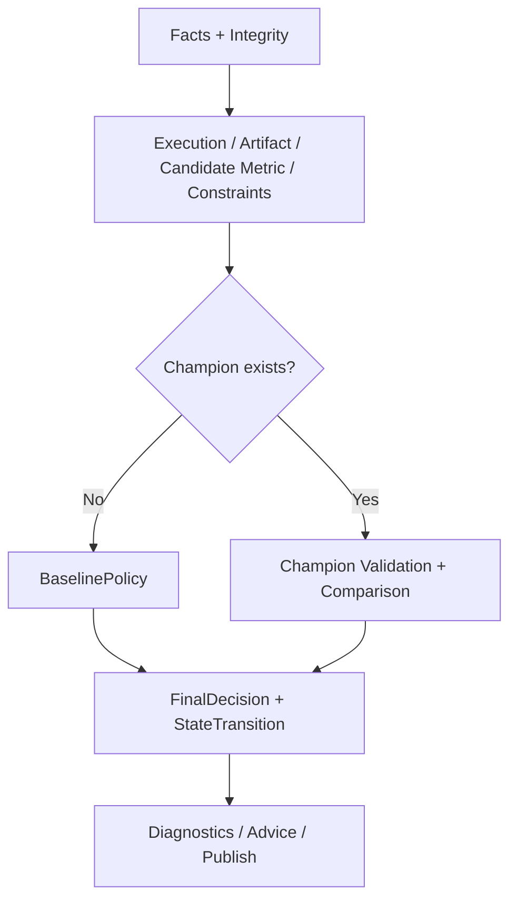

# AutoDL 机器判定诊断设计 V2.2 第三审评审报告

**报告版本：** V1.0  
**评审对象：** `Machine_Verdict_Diagnosis_Design_V2.2_20260816.md`  
**输入文件 SHA-256：** `b63a246727b66fc1e3876c664eca6d7a4b72635c528035e2f01302808fd538b6`  
**对照基准：** `Machine_Verdict_Diagnosis_Design_V2.1_Continued_Second_Review_V1.0_20260816.md`  
**评审角色：** AutoDL 高级架构评审专家  
**评审日期：** 2026-08-16  

---

## 1. 第三审结论

```text
THIRD_REVIEW=BLOCKED_FOR_REMEDIATION
DESIGN_DIRECTION=APPROVED
P0_FULLY_CLOSED=NO
IMPLEMENTATION_AUTHORIZED=NO
PRODUCTION_READY=NO
NEXT_REVIEW_TARGET=V2.3
```

V2.2 的设计方法比 V2.1 再前进了一步：它开始用不可变 DTO、状态迁移、运行时写权限、信息流隔离和枚举穷举表达安全要求。以下方向值得保留：

- `state_transition` 取代单一 `promotion_allowed`，baseline 与 champion 替换可以统一建模；
- `ConstraintEvaluation` 开始表达预期集合与结果集合的完整性；
- test 隔离从输出过滤推进到独立 DTO、命名空间和服务身份；
- shadow、single writer、idempotency、legacy retirement 的迁移原则正确；
- 回放 fixture 与真实 Owner 决策开始区分；
- 多领域范围继续收缩，未实现 profile 明确 fail closed。

但 V2.2 仍不能通过。原因不是“实现尚未完成”，而是设计正文中的核心伪代码与其声称的不可构造证明彼此冲突，已经存在可直接复现的错误判定：

1. minimize 指标被重新用 `candidate_estimate - champion_estimate` 计算，真实 C2 的 loss 改善会被判成 `REGRESSION`；
2. 无 champion 时在进入 BaselinePolicy 前先检查 `comparison.comparable`，baseline 仍被截断；
3. partial metric 在 BaselinePolicy 前已被 candidate metric 门禁 `DISCARD`，provisional baseline 不可达；
4. Python `dataclass(frozen=True)`、`Literal` 和类型注解并不会自动产生“编译期不可构造”保证；
5. PromotionJudge 使用了 DTO 中不存在的 `comparison.outcome`，调用 BaselinePolicy 又缺少 `owner_record` 参数，函数不是可执行全函数；
6. uncertainty unavailable 的声明是 `HUMAN_REVIEW`，实际代码却走 `POLICY_INVALID → BLOCKED`；
7. HARD `NOT_EVALUATED` 的测试期望 `BLOCKED`，实际函数与 VIOLATED 一起返回 `DISCARD`。

这些问题会造成错误晋级/淘汰、首轮状态机停滞或安全证明失效，因此必须继续整改。

---

## 2. V2.1 十个反例的 V2.2 闭环复核

| 反例 | V2.2 状态 | 第三审结论 |
|---|---|---|
| CE1 合同无效仍返回 COMPARABLE | **PARTIAL** | 工厂不变量方向正确，但 `EligibilityResult` 未实际定义；Judge 只检查未定义的 `eligibility.valid`，没有对 `INCOMPARABLE/BASELINE_REQUIRED` 做穷尽分支。Python 类型注解也不阻止直接构造。 |
| CE2 CANCELLED 绕过失败门禁 | **PARTIAL** | Judge 已改查 `eligible_for_promotion`；但合法组合表和受控构造没有给出，调用方仍可构造 `CANCELLED + eligible=true`。需要运行时验证而非只依赖 frozen。 |
| CE3 硬约束缺失/NOT_EVALUATED 可 KEEP | **PARTIAL** | complete aggregate 方向正确，缺失结果可被阻断；但 `complete` 仍是可直接传入的 bool，`⊇` 与 `==` 两种规则冲突，NOT_EVALUATED 的最终决策也与测试不一致。 |
| CE4 baseline 建立不可达 | **NOT_CLOSED** | Judge 在 baseline 分支前检查 `comparison.comparable`；无 champion 时无法合法构造 comparison，仍先返回 INCOMPARABLE。 |
| CE5 FinalDecision/状态迁移矛盾 | **PARTIAL** | transition 映射已修正，nullable SHA 已补；但 FinalDecision 工厂未定义，BaselinePolicy 又用不完整参数直接构造 FinalDecision，仍无法证明三元一致。 |
| CE6 decision_bar 校验不完备 | **PARTIAL** | 规则已写，但 `DecisionBar` DTO/工厂没有实际定义；UNAVAILABLE、fallback、POLICY_INVALID 与 HUMAN_REVIEW 的映射冲突。 |
| CE7 MetricComparison 接口不可执行 | **NOT_CLOSED** | 单对象签名已修，但 comparator 对 raw estimate 重新做 maximize 方向差值，minimize 结果反向；它也没有使用已归一的 paired deltas。 |
| CE8 test 仅检测后阻断 | **PARTIAL** | 独立 DTO/存储/身份是正确目标；但实际 DTO 未定义，通用 MetricIdentity 仍含 test split，且 Python 类型提示不提供编译期拒绝。服务 ACL 也只有矩阵声明。 |
| CE9 Cycle 1 依赖未批准 DR | **PARTIAL** | 真实/fixture 已分离且 C1 默认不 mutation，方向通过；但 provisional 分支在 Judge 和 BaselinePolicy 中仍不可达，approved fixture 也无法触发期望结果。 |
| CE10 决策表非全函数 | **NOT_CLOSED** | 文本不再写“或”，但函数遗漏 eligibility status、HUMAN_REVIEW、champion metric status、baseline 前置分支，并引用不存在字段；尚不是全函数。 |

**统计：0 项无条件闭合，7 项部分闭合，3 项未闭合。**

> 注：CE4/CE5 在原稿中合并成一节，本报告仍按十个反例分别统计。

---

## 3. 阻断第三审的 P0 问题

### P0-R1｜“不可构造证明”在当前 Python 技术合同下不成立

V2.2 多次以以下组合证明非法状态不可构造：

```python
@dataclass(frozen=True)
Literal[...] / 类型注解
通过工厂函数构造
```

这不等于运行时或编译期安全：

- Python 默认不会在运行时检查函数参数注解；
- `Literal` 主要供静态检查器使用，不会自动拒绝非法字符串；
- `dataclass(frozen=True)` 只阻止构造后的普通赋值，不阻止用非法参数直接调用公开构造器；
- 文档未规定 mypy/pyright strict 为强制 CI 门禁；
- 文档未使用 `init=False`、私有构造、`__post_init__`、Pydantic strict validator 或同等运行时机制；
- 服务间通过 JSON/event 传输时，Python 静态类型完全不能保护反序列化边界。

例如下列对象在普通 dataclass 下仍可直接构造：

```python
ExecutionGateResult(
    valid_pair=True,
    eligible_for_promotion=True,
    process_status=CANCELLED,
    termination_reason=USER_CANCELLED,
    source_event_id="x",
)
```

`frozen=True` 不会阻止该对象进入 Judge。

同理，“`TestMetricObservation` 传给 `SelectionMetricObservation` 参数会在编译期拒绝”也不符合 Python 默认执行模型。没有强制静态检查和运行时校验时，函数照常接收对象。

**P0 整改要求：** V2.3 必须明确采用“双重合同”：

1. 静态层：Enum/discriminated union + pyright 或 mypy strict，CI 零错误；
2. 运行时层：Pydantic v2 strict model、受控 `__post_init__` 或私有构造器，所有 API/event 反序列化强制验证；
3. 权限层：服务身份和存储 ACL，不能由 Python 类型代替；
4. 测试层：非法直接构造、非法 JSON、跨 DTO 注入均必须失败。

在上述机制落入设计前，只能称为“预期不变量”，不能称为“不可构造证明”。

### P0-R2｜minimize 指标方向再次反转

V2.2 §2.3 第 138 行：

```python
delta = comparison.candidate_estimate - comparison.champion_estimate
```

该公式只适用于 maximize。对试点中的 validation loss：

```text
champion = 1.1466
candidate = 1.0128
bar = 0.05
delta = 1.0128 - 1.1466 = -0.1338
```

V2.2 会命中：

```text
delta <= -bar → REGRESSION
```

实际候选 loss 更低，应为 `IMPROVED`。这是最初评审所防止的方向性 P0 再次出现。

文本声称 paired deltas 已归一，但 comparator 没有使用 `paired_deltas`，而是对未说明已归一的 raw estimates 再做差。`MetricIdentity.direction` 也完全没有参与公式。

**P0 整改要求：** 方向归一只能在 MetricComparisonBuilder 中发生一次：

```python
def signed_pair_delta(candidate_value, champion_value, direction):
    if direction is MINIMIZE:
        return champion_value - candidate_value
    if direction is MAXIMIZE:
        return candidate_value - champion_value
    raise ContractInvalid

normalized_delta = aggregate(pair.signed_delta for pair in paired_deltas)
```

Comparator 只能消费 `normalized_delta`，不得对 raw estimates 再减一次。必须补 C2 minimize、maximize 对称测试和 direction 变形测试。

### P0-R3｜baseline 分支仍被 comparison 前置条件截断

当前 Judge 顺序为：

```text
candidate metric valid
→ comparison.comparable
→ constraints
→ baseline.is_required()
```

无 champion 时不能构造合法 candidate/champion comparison。若 `comparison.comparable=false`，第 6 行先返回 `INCOMPARABLE`；若人为构造 `comparable=true`，又违反 MetricComparison 的事实语义。

所以 `BASELINE_ESTABLISHED` 仍不可达，CE4 实际没有关闭。

**P0 整改要求：** champion presence 必须在 comparison 之前分流：

```text
integrity/profile/execution/artifact/candidate metric/constraints
                         │
                         ├─ champion absent → BaselinePolicy
                         └─ champion present
                              → validate champion metric
                              → build MetricComparison
                              → build DecisionBar
                              → OutcomeComparator
                              → PromotionJudge outcome branch
```

`comparison` 应只存在于 `ChampionPresent` 分支，不能作为所有 Judge 调用的必填参数。

### P0-R4｜provisional baseline 仍不可达且 BaselinePolicy 逻辑错误

当前存在四重断裂：

1. `MetricStatus` 没有 `PRESENT_PARTIAL`；
2. Judge 第 5 行把任何非 `PRESENT_VALID` candidate 直接 `DISCARD`；
3. Judge 调用 `baseline_policy.decide(...)` 时遗漏其必需的 `owner_record`；
4. BaselinePolicy 对 partial + approved 最终返回的是 `BASELINE_ESTABLISHED`，而不是 `PROVISIONAL_BASELINE_ESTABLISHED`。

此外，C1 的 execution 是 `FAILED/HARD_TIMEOUT`，Judge 第 4 行会在 baseline 分流前 `DISCARD`。即使 Owner 正式批准，也永远到不了 provisional 分支。

**P0 整改要求：** 对无 champion 场景建立独立、显式的 baseline 决策表：

| candidate execution/metric | Owner record | FinalDecision | transition |
|---|---|---|---|
| COMPLETED + COMPLETE_VALID | 不需要 | BASELINE_ESTABLISHED | SET_BASELINE |
| FAILED/HARD_TIMEOUT + PARTIAL_VALID | APPROVED 且精确匹配 run/facts/policy | PROVISIONAL_BASELINE_ESTABLISHED | SET_PROVISIONAL_BASELINE |
| FAILED/HARD_TIMEOUT + PARTIAL_VALID | 缺失/DRAFT/过期/不匹配 | DISCARD 或 BASELINE_REQUIRED，必须由政策固定一个 | NO_CHANGE |
| COMPLETED + metric missing/invalid | 任意 | DISCARD | NO_CHANGE |
| integrity/artifact/hard constraint 失败 | 任意 | BLOCKED/DISCARD_CONSTRAINT，按原因固定 | NO_CHANGE |

如果保留 `BASELINE_REQUIRED`，应精确定义其业务含义，例如“当前 study 尚无可用 champion，需要安排合法 baseline run”，并与当前 experiment 的 `DISCARD` 区分。

### P0-R5｜PromotionJudge 不是可执行的确定全函数

当前函数存在以下合同错误：

- `eligibility.valid` 没有在 EligibilityResult 中定义；
- `eligibility.status=INCOMPARABLE` 应返回 INCOMPARABLE，但代码没有该分支；
- `comparison` 的静态类型未说明，函数同时使用 `comparison.comparable` 与 `comparison.outcome`；
- §2.3 的 `MetricComparison` 没有 `outcome` 字段，OutcomeComparator 返回的是另一个 `OutcomeResult`；
- 无 champion 时 comparison 应为空，但签名没有 `None` 或 union；
- `metric.candidate_status` 所属的 MetricGateResult 没有定义；
- `artifact`、`integrity`、`eligibility`、`baseline`、`policy` 均没有完整强类型合同；
- BaselinePolicy 调用参数与定义不一致；
- `HUMAN_REVIEW` 没有任何可达返回路径；
- 未知/新增 outcome 会落到默认 `DISCARD`，这不是 fail closed，而是把 schema 演进错误伪装成普通淘汰。

因此不能用“优先级链”本身证明函数完备。顺序 if/return 只有在输入代数、每个 variant 和默认行为都严格定义后才是全函数。

**P0 整改要求：** 使用 discriminated union/pattern matching，使每种合法状态在结构上分离，并禁止 catch-all 静默吞掉未知枚举。建议：

```python
JudgeInput = (
    BlockedInput
    | FailedExecutionInput
    | BaselineCandidateInput
    | ComparableCandidateInput
)

ComparisonAssessment = (
    Improved
    | Regression
    | Equivalent
    | UncertaintyUnavailable
    | PolicyInvalid
)
```

每个 variant 只携带其分支所需字段。启用 exhaustiveness check；未知 variant 必须抛出 schema/policy error 并 BLOCKED，不得落到普通 DISCARD。

### P0-R6｜硬约束完整性与终态仍不一致

V2.2 同时出现三套规则：

- CE3 文本：`VIOLATED/NOT_EVALUATED → DISCARD/BLOCKED`，仍含“或”；
- Judge：两者均返回 `DISCARD`；
- 测试：`HARD NOT_EVALUATED → BLOCKED`。

另外：

- CE3 的“不可构造证明”使用 `result_ids ⊇ expected_ids`；DTO 注释使用 `result_ids == expected_ids`；
- `complete` 是可被调用者直接填入的 bool，而非真正派生属性；
- 未处理重复 constraint ID、额外未知 ID、contract hash 不匹配；
- ConstraintResult 缺 `metric_id/unit/policy_version/source_event_id`，无法证明 observed value 与 threshold 可比较；
- `threshold`、`observed_value` 的 finite 和缺失不变量未定义；
- `hardness`、`direction` 仍是开放字符串。

**P0 整改要求：** 固定唯一规则：

```text
expected IDs 与 unique result IDs 不完全相等 → BLOCKED
contract hash/policy/unit 不一致 → BLOCKED
HARD NOT_EVALUATED → BLOCKED
HARD VIOLATED → DISCARD_CONSTRAINT
所有 HARD PASS → 可继续
SOFT → 首期只展示，不进入自动晋级
```

`complete` 不应作为输入字段，而应为只读派生属性或工厂返回的 union：`CompleteConstraintSet | IncompleteConstraintSet`。

### P0-R7｜uncertainty unavailable 的终态自相矛盾

V2.2 §1 CE10 和 §11 明确：

```text
uncertainty unavailable + 无 approved fallback → HUMAN_REVIEW
```

但实际路径是：

```text
valid_uncertainty(UNAVAILABLE) 失败
→ OutcomeResult.POLICY_INVALID
→ PromotionJudge BLOCKED
```

`HUMAN_REVIEW` 在 Judge 中没有返回点。因此同一输入同时有两个规范结果。

**P0 整改要求：** 将“有效但信息不足”和“政策本身无效”拆开：

```text
UNAVAILABLE + no fallback        → UNCERTAINTY_UNAVAILABLE → HUMAN_REVIEW
UNAVAILABLE + approved fallback  → BarReady(fallback)
NaN/negative/method mismatch     → POLICY_INVALID → BLOCKED
valid estimate                   → BarReady(derived)
```

DecisionBar 必须补齐真实 DTO 与 factory，并绑定 `metric_id/unit/policy_bundle_hash/source`。fallback approval 也必须有 scope、approver、effective time 和 audit event。

### P0-R8｜test 隔离目标正确，但执行边界尚未形成合同

V2.2 的能力矩阵方向正确，但仍有四个缺口：

1. 文档没有实际定义 `SelectionMetricObservation` 与 `TestMetricObservation`，§2.1 仍只有通用 `MetricObservation`，其 identity 的 split 允许 validation/test；
2. Python 参数注解不会“编译期拒绝”错误对象；
3. `SelectionOnly` capability、服务 principal、存储 namespace 和 ACL enforcement point 没有 schema/接口；
4. 非干扰性质只写了证明文字和测试计划，没有覆盖通过日志、error message、timing、artifact name、recommendation rationale 等旁路泄漏。

**P0 整改要求：**

- selection/test 使用不同事件 schema、topic/table/bucket prefix 和服务访问策略；
- FactsBuilder 的运行时 validator 拒绝 `source_namespace != selection` 或 test schema ID；
- 连接凭证绑定服务 principal，不能只信请求里的 capability 字符串；
- iterative pipeline 进程/容器不挂载 test namespace；
- test Access Audit 不可用时 fail closed；
- 非干扰测试覆盖 verdict、finding、advice、memory、所有 iterative view、日志摘要、错误码与发布事件；
- 最终 test 报告另走冻结后的 FinalEvaluation pipeline，不能回流自动研究 memory。

---

## 4. 八阶段架构复核

### 4.1 总体评价

V2.2 的职责意图已经接近正确目标，但实现接口仍把 baseline 与 comparison 两条互斥路径揉在同一个 Judge 入参中，导致阶段顺序不成立。建议把原“八阶段线性流水线”改为“前置门禁 + champion 分支 + 汇合裁决”，仍可维持八类职责，但不能强求所有运行都经过 Comparator。



### 4.2 阶段职责结论

| 职责 | 第三审状态 | 说明 |
|---|---|---|
| Facts/Integrity | PARTIAL | 权威来源方向保留，但 V2.2 没有补完整字段血缘和运行时 schema validation。 |
| Eligibility | BLOCKING | valid/status 模型缺失，INCOMPARABLE 与 BASELINE_REQUIRED 未被 Judge 穷尽消费。 |
| Execution/Artifact/Metric | PARTIAL | gate 顺序合理，但 partial baseline 和无 champion 例外被过早淘汰。 |
| Comparison | BLOCKING | minimize 方向错误；无 champion 仍被要求 comparison。 |
| Constraints | BLOCKING | completeness 和 NOT_EVALUATED 规则冲突。 |
| BaselinePolicy | BLOCKING | 分支不可达、调用签名不匹配、approved partial 返回错误 decision。 |
| PromotionJudge | BLOCKING | 输入代数不完整，使用不存在字段，HUMAN_REVIEW 不可达。 |
| Diagnostic/Advice/Publish | CONDITIONAL | 不改 verdict 原则通过；test 侧信道和 Advice/Memory 治理仍待阶段门禁。 |

### 4.3 唯一权威复核

V2.2 没有重新引入独立 verdict 函数，唯一逻辑权威方向可以保留。但“PromotionJudge 可写 champion/ledger”的矩阵容易把纯决策与状态提交耦合。更稳妥的职责是：

- PromotionJudge：纯函数，只产生签名化/不可变 FinalDecision；
- PromotionCommitter：唯一持有 champion/ledger 写权限，只机械执行 `state_transition`；
- ledger：验证 producer principal、decision schema、input hash 与 idempotency；
- 任何诊断、建议、publisher、legacy adapter 都没有 Committer capability。

这仍然只有一个裁决权威和一个状态写者，但便于重试、审计与事务处理。

---

## 5. 判定逻辑边界专项复核

### 5.1 互斥分区

`delta >= bar / delta <= -bar / 中间区间` 的数学分区在 `delta` 有限且 `bar > 0` 时仍正确。V2.2 的失败点是 `delta` 的方向和来源，而不是区间公式本身。

正确合同应为：

```text
normalized_delta = aggregate(normalized paired deltas)
bar = validated positive finite threshold in same metric/unit/policy

normalized_delta >= bar  → IMPROVED
normalized_delta <= -bar → REGRESSION
otherwise                → EQUIVALENT_OR_INCONCLUSIVE
```

### 5.2 best-vs-last 与 metric identity

V2.2 的 MetricIdentity 反而移除了 V2.1 已有的部分信息：checkpoint policy、selection event、aggregation、sample policy 不在 identity 中，只在 observation 或 comparison 的外围字段里。第三审要求：

- candidate/champion 各自通过同一 `ValidatedMetricBundle` 工厂；
- identity 至少绑定 metric、unit、direction、split、evaluator、dataset、aggregation policy、checkpoint selection policy；
- observation 绑定 checkpoint ID、artifact digest、evaluation event 和 freshness；
- compare 前验证双方 contract hash 与 profile ID；
- best-vs-last 不只比较字符串，还校验 selected artifact digest 与 manifest lineage。

### 5.3 零值与缺失

`value: float | None` 是正确修订。但“不变量：非 PRESENT_VALID 时 value 必须 None”过于粗糙：

- `STALE` 或 `INCOMMENSURATE` 可能有真实有限数值，只是无资格用于比较；
- 强制清空会损失诊断和审计事实。

建议把“观测值是否存在”与“是否具备晋级资格”拆开：

```text
observation_status = OBSERVED / MISSING / PARSE_ERROR / NON_FINITE
eligibility_status = VALID / STALE / INCOMMENSURATE / WRONG_CHECKPOINT / WRONG_SPLIT
```

合法 `0` 与负值都可以是 `OBSERVED + VALID`；缺失不得用 `0` 占位。

---

## 6. V2.3 推荐的可执行核心合同

### 6.1 不使用可伪造布尔表达资格

应避免这些可矛盾组合：

```text
valid_pair=true + CANCELLED
complete=true + 缺少 hard constraint
comparable=true + champion absent
mutation_authorized=true + NO_CHANGE
```

推荐使用 discriminated union：

```python
class CompletedExecution(BaseModel):
    kind: Literal["completed"]
    reason: CompletedReason

class FailedExecution(BaseModel):
    kind: Literal["failed"]
    reason: FailedReason

class CancelledExecution(BaseModel):
    kind: Literal["cancelled"]
    reason: CancelReason

ExecutionResult = CompletedExecution | FailedExecution | CancelledExecution
```

同理：

```python
EligibilityResult = Comparable | Incomparable | BaselineRequired | BlockedEligibility
ConstraintEvaluation = CompleteConstraints | IncompleteConstraints
ChampionState = ChampionAbsent | ChampionPresent
BarResult = BarReady | UncertaintyUnavailable | PolicyInvalid
```

不同 variant 不携带不适用字段，避免用 caller-supplied bool 派生关键资格。

### 6.2 修订后的编排顺序

```python
def adjudicate(facts: SelectionFacts, policies: PolicyBundle) -> FinalDecision:
    integrity = integrity_gate(facts)
    if isinstance(integrity, Blocked):
        return blocked_decision(integrity)

    eligibility = eligibility_gate(facts, policies.profile)
    if isinstance(eligibility, BlockedEligibility):
        return blocked_decision(eligibility)
    if isinstance(eligibility, Incomparable):
        return incomparable_decision(eligibility)

    artifact = artifact_gate(facts)
    if not artifact.finalized:
        return blocked_decision(artifact)

    execution = execution_gate(facts)
    candidate = candidate_metric_gate(facts)
    constraints = constraint_gate(facts, policies.constraints)

    if isinstance(constraints, IncompleteConstraints):
        return blocked_decision(constraints)
    if constraints.has_hard_not_evaluated:
        return blocked_decision(constraints)
    if constraints.has_hard_violation:
        return discard_constraint_decision(constraints)

    champion = champion_state(facts)
    if isinstance(champion, ChampionAbsent):
        return baseline_policy.decide(
            champion, execution, candidate, artifact,
            constraints, facts.owner_decision, policies.baseline
        )

    if not isinstance(execution, CompletedExecution):
        return discard_execution_decision(execution)
    if not isinstance(candidate, ValidCandidateMetric):
        return discard_metric_decision(candidate)

    champion_metric = champion_metric_gate(champion, facts)
    if not isinstance(champion_metric, ValidChampionMetric):
        return incomparable_decision(champion_metric)

    comparison = comparison_builder.build(candidate, champion_metric, policies.metric)
    bar_result = decision_bar_factory.build(comparison, policies.promotion)
    if isinstance(bar_result, UncertaintyUnavailable):
        return human_review_decision(bar_result)
    if isinstance(bar_result, PolicyInvalid):
        return blocked_decision(bar_result)

    outcome = outcome_comparator.compare(comparison, bar_result.bar)
    return promotion_judge.decide_comparable(outcome, facts, policies)
```

该顺序保证：

- 无 champion 永远不需要伪造 comparison；
- C1 provisional 由 BaselinePolicy 独立判定；
- champion 存在时，失败 execution 绝不进入 compare；
- uncertainty unavailable 与 policy invalid 不混淆；
- PromotionJudge 只处理合法的可比 outcome，不接收一堆相互矛盾的布尔状态。

### 6.3 BaselinePolicy 唯一决策表

建议 V2.3 固定以下语义：

| 条件 | decision | transition |
|---|---|---|
| integrity/artifact/constraint 不合格 | 由前置门禁结束 | NO_CHANGE |
| COMPLETED + COMPLETE_VALID | BASELINE_ESTABLISHED | SET_BASELINE |
| HARD_TIMEOUT + PARTIAL_VALID + APPROVED exact-scope DR | PROVISIONAL_BASELINE_ESTABLISHED | SET_PROVISIONAL_BASELINE |
| HARD_TIMEOUT + PARTIAL_VALID + 无有效 DR | BASELINE_REQUIRED | NO_CHANGE |
| FAILED/OOM/CRASH/BUDGET_EXCEEDED | DISCARD | NO_CHANGE |
| CANCELLED | DISCARD | NO_CHANGE |
| metric missing/non-finite/parse error | DISCARD | NO_CHANGE |

如 Owner 不希望 `BASELINE_REQUIRED` 表示本轮终态，可改为 `DISCARD` + reason `NO_ELIGIBLE_BASELINE`，但全系统只能保留一个定义。

### 6.4 正确的 MetricComparison

```python
@dataclass(frozen=True)
class PairedDelta:
    pair_key: str
    candidate_value: float
    champion_value: float
    normalized_delta: float  # positive = candidate better

@dataclass(frozen=True)
class MetricComparison:
    identity: ComparableMetricIdentity
    paired_deltas: tuple[PairedDelta, ...]
    normalized_delta: float
    candidate_raw_estimate: float
    champion_raw_estimate: float
    uncertainty: UncertaintyEstimate
```

Builder 必须验证：pair key 一致、无重复、数量满足 profile、双方 metric identity 完全一致、每个值有限。`normalized_delta` 必须等于按 contract aggregation 从 `paired_deltas` 派生的值，不能由调用者自由填写。

### 6.5 明确运行时 contract enforcement

V2.3 需要选定一套实现策略，推荐：

```text
内部 Python DTO：frozen dataclass/Enum + __post_init__
服务/API/event 边界：Pydantic v2 strict + JSON Schema version
静态检查：pyright --strict 或 mypy --strict
CI：schema compatibility + illegal construction + exhaustive match
持久化：只保存已通过 runtime validation 的 canonical JSON
```

若项目不希望引入 Pydantic，可用 attrs/dataclass + 自建 validator，但必须达到同等运行时保障。单纯写类型提示不算门禁。

### 6.6 Test 隔离合同

建议形成两条完全分离的输入合同：

```text
SelectionFactsEnvelope
  schema_id=selection-facts/v1
  namespace=selection
  producer=evaluator-selection

FinalTestFactsEnvelope
  schema_id=final-test-facts/v1
  namespace=final-test
  producer=evaluator-final
```

Selection pipeline 的 service account 只允许读 `selection`；test store 不对该身份挂载。FactsBuilder 同时验证 schema ID、namespace、producer principal、dataset role 和 contract hash。类型、运行时 schema、ACL 三层均通过后，才能宣称输入侧隔离闭合。

---

## 7. 数据模型与字段血缘复核

V2.2 尚未完成上一轮要求的“字段级来源—权威—质量—冲突—fallback”矩阵。以下字段仍需补齐：

| 字段/对象 | 必须补充的权威与不变量 |
|---|---|
| process/termination | runner event ID、状态组合表版本、terminal event 唯一性、冲突处理 |
| candidate/champion metric | evaluator event、dataset/evaluator/artifact/checkpoint identity、freshness |
| paired delta | pair key 来源、缺 seed 规则、duplicate 规则、aggregation policy |
| uncertainty | 方法版本、重复数、confidence、bootstrap seed、fallback approval |
| constraint result | constraint contract、metric/unit、evidence event、完整性与重复 ID |
| Owner decision | status enum、scope、facts hash、签署身份、有效期、撤销事件 |
| policy bundle | promotion/metric/baseline/constraint/advice 各版本与整体 hash |
| state transition | before/after SHA、transaction ID、idempotency、commit event |
| access evidence | authenticated principal、namespace、decision、audit event |

还需继续移除参与 P0 决策的开放 `str/dict`：direction、hardness、Owner status/payload、profile support state、policy versions 等应使用 Enum/typed schema。

---

## 8. Profile、Advice、Memory 与 evidence 复核

### 8.1 Profile 状态语义

V2.2 写 `IMPLEMENTED_PROFILE={supervised_holdout}`，但当前仍处于设计审查且没有实现及测试证据。这违反上一轮范围门禁。

建议改为：

```text
IMPLEMENTED_PROFILE=NONE
AUTHORIZED_FIRST_IMPLEMENTATION_PROFILE=supervised_holdout  # 仅在设计通过后
DESIGN_ONLY=cross_validation,time_series,language_modeling,reinforcement_learning
NOT_DESIGNED=unsupervised
```

代码、replay 和 P0 gate 真正通过后，才能把 supervised_holdout 改为 IMPLEMENTED。

### 8.2 evidence_strength

V2.2 没有实质补充校准治理。需继续区分：

- 事实可靠性：结构化 runner/evaluator/audit event 是否可信、完整、未冲突；
- 诊断证据强度：某个 detector 对 overfit/instability 等判断的校准表现。

结构化来源最多证明事实可靠，不自动证明诊断为 HIGH。HIGH 需要 profile-specific replay/calibration、版本、已知误报/漏报和适用边界。

### 8.3 Advice 与 Memory

V2.2 仅在阶段计划中保留治理方向，尚未给出：

- Advice schema/hash/approver/effective time；
- action code 到 allowed change scope 的运行时 enforcement；
- high-risk action 人工审批；
- Memory 各层 writer/read ACL；
- provisional lineage 撤销后的递归 invalidation；
- detector/advice policy 升级后的 supersession；
- test 派生信息永不进入 iterative memory 的审计证明。

这些可作为 P1 阶段门禁，但不得在 V2.2 中标记为已经完成。

---

## 9. 测试计划整改

### 9.1 必须新增或修正的 P0 测试

| 测试 | 输入 | 唯一期望 |
|---|---|---|
| Minimize C2 | champion loss=1.1466，candidate=1.0128，bar=0.05 | IMPROVED |
| Maximize 对称 | champion score=0.70，candidate=0.82，bar=0.05 | IMPROVED |
| Direction 单次归一 | raw estimates 与 paired delta 同时存在 | comparator 只用 normalized delta，不二次翻转 |
| 无 champion 正式 baseline | COMPLETED + COMPLETE_VALID | BASELINE_ESTABLISHED，不构造 comparison |
| C1 未批准 | FAILED/HARD_TIMEOUT + PARTIAL_VALID + DRAFT DR | NO_CHANGE，按政策固定 BASELINE_REQUIRED |
| C1 已批准 fixture | 同事实 + exact-scope APPROVED DR | PROVISIONAL_BASELINE_ESTABLISHED |
| Baseline 调用接口 | owner_record=None/DRAFT/APPROVED/EXPIRED/REVOKED | 每个 variant 有唯一结果，无参数缺失 |
| Eligibility incomparable | status=INCOMPARABLE | INCOMPARABLE，不变为 BLOCKED 或继续比较 |
| Constraint incomplete | 缺 ID、重复 ID、多余 ID、contract hash 错 | BLOCKED |
| Hard not evaluated | HARD + NOT_EVALUATED | BLOCKED |
| Hard violated | HARD + VIOLATED | DISCARD_CONSTRAINT |
| Uncertainty unavailable | 无 fallback | HUMAN_REVIEW |
| Invalid uncertainty | NaN/负/方法不匹配 | BLOCKED |
| Unknown outcome | 新增/非法 enum | schema reject/BLOCKED，不默认 DISCARD |
| Python 直接非法构造 | CANCELLED + eligible=true 等 | 构造失败 |
| 非法 JSON | 值类型、enum、hash、schema version 错 | 反序列化失败 |
| Test DTO 注入 | test envelope 进入 selection builder | schema + ACL 双重拒绝 |
| Test 旁路非干扰 | 只改 test 数值/日志/artifact 名 | 所有 iterative 输出及日志摘要不变 |
| Profile 状态 | DESIGN_ONLY profile 发起 study | 合同入口拒绝 |

### 9.2 穷举测试的正确范围

不建议直接对一组可互相矛盾的 bool/enum 做笛卡尔积，然后由测试自行判定哪些组合“合法”。应先用 union 工厂生成全部合法 variant，再对合法 variant 组合做 exhaustive decision test；对非法组合做独立 construction rejection test。

需要机械证明：

```text
KEEP ⇒ champion present
KEEP ⇒ normalized_delta >= validated_bar
KEEP ⇒ execution completed
KEEP ⇒ candidate/champion metric identity valid and comparable
KEEP ⇒ artifact finalized
KEEP ⇒ complete hard constraints and all PASS

SET_BASELINE ⇒ champion absent and complete legitimate candidate
SET_PROVISIONAL_BASELINE ⇒ champion absent and exact approved Owner decision
NO_CHANGE ⇒ champion_after_sha == champion_before_sha

test facts change only ⇒ all iterative outputs unchanged
```

### 9.3 门禁状态必须区分“已设计”和“已执行”

V2.2 §10 把测试计划和架构声明直接标记为 ✅。设计文档只能写：

```text
TEST_SPEC_DEFINED=YES
TEST_EXECUTED=NO
RUNTIME_ACL_VERIFIED=NO
PROFILE_IMPLEMENTED=NONE
```

只有实施后附 CI report、replay artifact、ACL denial evidence 和 ledger/champion diff，才能标记逻辑/迁移门禁 PASS。

---

## 10. V2.3 分阶段整改建议

| 优先级 | 阶段 | 整改任务 | 退出标准 |
|---|---|---|---|
| P0 | 0A-1 | 选定 Python 双层合同 enforcement；定义 Enum/union/runtime validator | 非法直接构造与非法 JSON 均被拒绝 |
| P0 | 0A-2 | 重写 champion 分支编排和 BaselinePolicy | 正式/provisional baseline 均可达且 comparison 不参与无 champion 分支 |
| P0 | 0A-3 | 修复 normalized delta；补 minimize/maximize golden cases | C2 正确 IMPROVED；方向只归一一次 |
| P0 | 0A-4 | 补齐 JudgeInput/ComparisonAssessment/BarResult 全部 variant | exhaustiveness check，无未定义字段/缺参/默认吞错 |
| P0 | 0A-5 | 固定 constraint、uncertainty、eligibility 的唯一终态 | 文档、代码、测试三者一致 |
| P0 | 0A-6 | 定义 selection/test schema、principal 和 ACL enforcement | DTO 注入与越权读取双重拒绝 |
| P1 | 0B | 固化 C1-C5 facts/policy/DR golden bundle | fixture 与真实审批严格分离，hash 可追溯 |
| P1 | 1A | shadow/replay | 新流水线只读，所有 diff 有原因码 |
| P1 | 1B | 性质、穷举、非干扰、idempotency | 测试报告和证据包可审计 |
| P1 | 1C | PromotionCommitter single writer | runtime ACL 证明只有唯一 principal 可提交 |
| P1 | 1D | legacy retirement | 明确版本/日期，无旧逻辑回流 |

---

## 11. V2.3 通过第三审的门禁条件

### 11.1 P0 文档与合同门禁

- 删除“仅凭 frozen/Literal 即编译期不可构造”的错误证明，明确静态、运行时、权限三层 enforcement。
- 修复 minimize/maximize 方向，Comparator 只消费已归一 delta。
- champion absent 在 comparison 前分支，正式 baseline 可达。
- partial + approved Owner record 的 provisional baseline 可达；DRAFT/过期/不匹配均不 mutation。
- PromotionJudge/BaselinePolicy 的所有参数、DTO 字段和返回类型一致，无未定义字段、缺参或 placeholder 函数。
- Eligibility、Constraint、Bar/Uncertainty、Comparison 使用穷尽 variant，不依赖可伪造资格 bool。
- HARD NOT_EVALUATED、HARD VIOLATED、uncertainty unavailable、policy invalid 各有唯一且一致的终态。
- test 有真实 schema/namespace/principal/ACL 设计，而非只写类型名和矩阵。
- `IMPLEMENTED_PROFILE=NONE`，只声明首个拟实现 profile。

### 11.2 P0 逻辑门禁

- §9.1 的全部用例具有唯一预期，且设计伪代码逐项可追踪。
- 无 champion 分支不构造 MetricComparison。
- C2 minimize replay 产生 `IMPROVED`，C3/C4 仍符合回归/等价预期。
- `HUMAN_REVIEW` 至少有一个明确可达条件，或从枚举中删除；不得声明与代码不一致。
- 未知 enum/schema 失败关闭，不能落入默认 DISCARD。
- FinalDecision → state_transition → champion SHA 不变量完整。

### 11.3 架构与范围门禁

- PromotionJudge 是唯一决策逻辑；PromotionCommitter 是唯一运行时状态写者。
- diagnostics/advice/publisher/memory/shadow/legacy 无 champion/ledger 写权限。
- selection pipeline 对 test namespace 无读取能力；最终 test pipeline 不回流 iterative memory。
- 首期仅允许 supervised_holdout 进入实施；其他 profile 合同入口拒绝。

满足上述条件后，才可将结论调整为：

```text
THIRD_REVIEW=APPROVED
DESIGN_GATE=PASS_FOR_IMPLEMENTATION
IMPLEMENTATION_AUTHORIZED=SUBJECT_TO_SDD_GATE
TEST_EXECUTED=NO
PRODUCTION_READY=NO
```

---

## 12. 最关键的待决策点

1. **Python 合同实现机制：** 采用 Pydantic v2 strict，还是 dataclass/attrs + 强制运行时 validator；必须选定，不能继续把类型提示当安全边界。
2. **C1 未批准时的唯一终态：** 建议 `BASELINE_REQUIRED + NO_CHANGE`；如选择 DISCARD，应全局统一原因码和后续调度语义。
3. **uncertainty unavailable：** 文档倾向 HUMAN_REVIEW；需正式冻结，不能同时映射 BLOCKED。
4. **状态提交职责：** 建议 Judge 保持纯函数，由唯一 PromotionCommitter 机械执行 transition。
5. **test 隔离部署边界：** 确认独立 namespace + 独立 principal + 不挂载 test store 为强制方案。
6. **Cycle 1 Owner 决策：** 当前仍为 DRAFT；不阻止实现安全默认路径，但阻止真实 C1 provisional lineage 生效。

---

## 13. 最终裁决

V2.2 的“反例驱动 + 强类型 + 信息流隔离”方法论值得保留，但当前文档把“打算通过工厂和类型约束实现”提前写成了“已经不可构造”，且实际决策函数仍存在方向反转、不可达 baseline、缺参和状态冲突。

当前最严重的三个问题是：

1. **C2 minimize 改善会被判 REGRESSION；**
2. **正式 baseline 和 provisional baseline 均无法按声明到达；**
3. **Python 类型提示被错误当作安全执行边界。**

最终结论：

```text
BLOCKED_FOR_REMEDIATION
```

建议先完成 V2.3 的输入代数、方向归一、baseline 分支和运行时合同，再进入 SDD 实施门禁。不要基于 V2.2 当前伪代码开始主链路开发。
